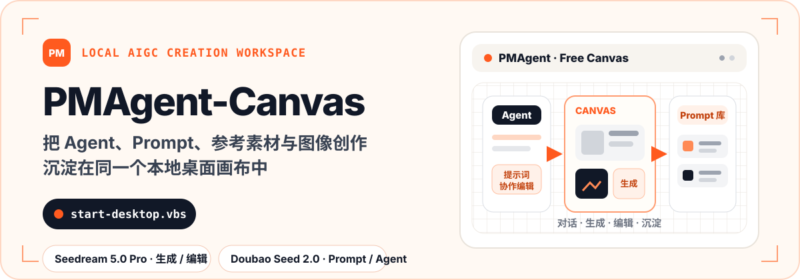
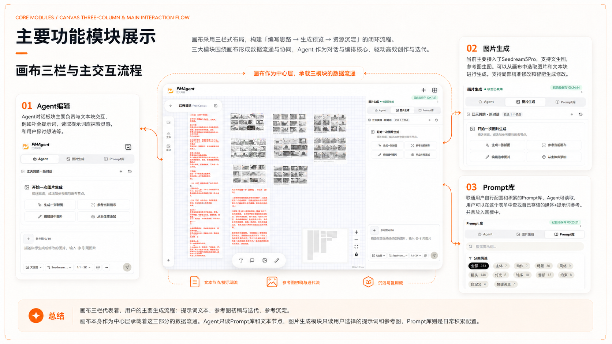
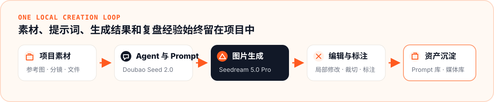
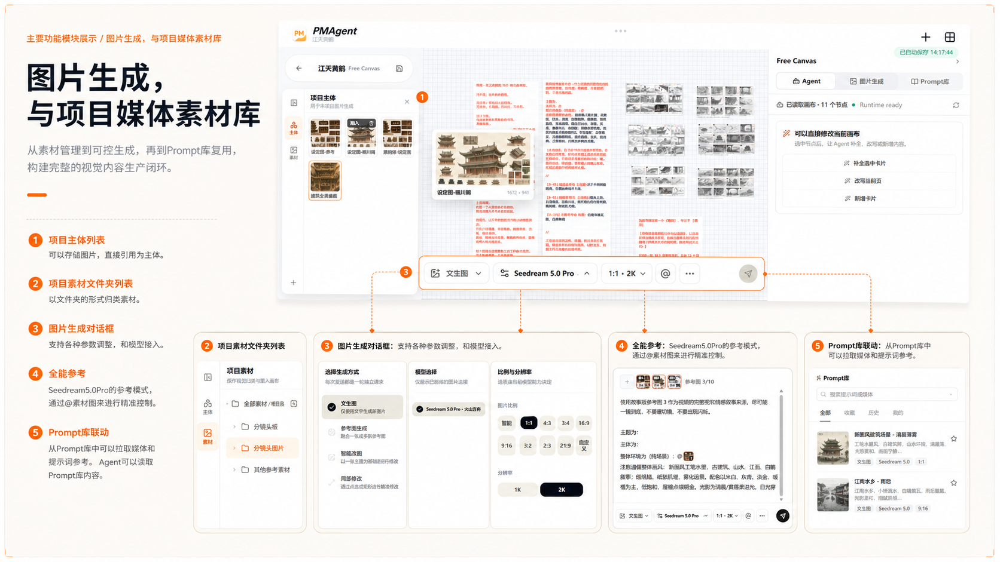
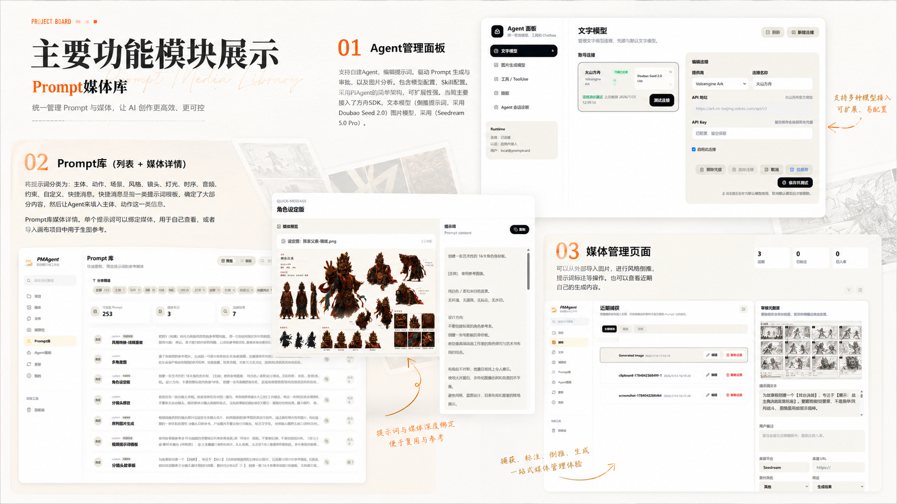
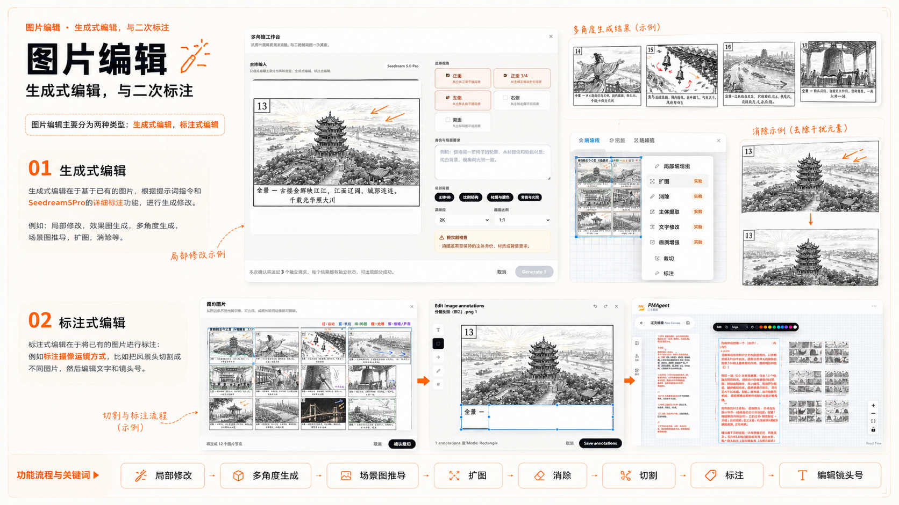
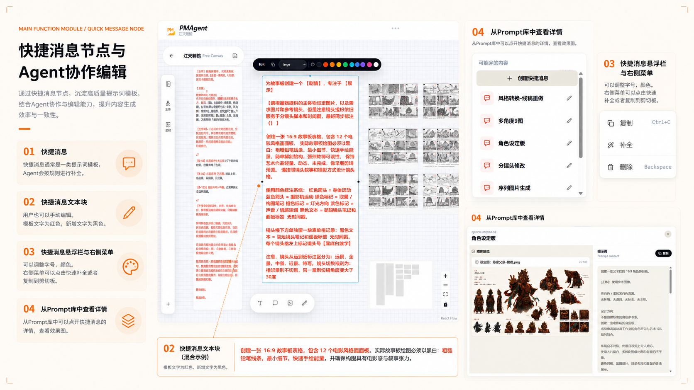
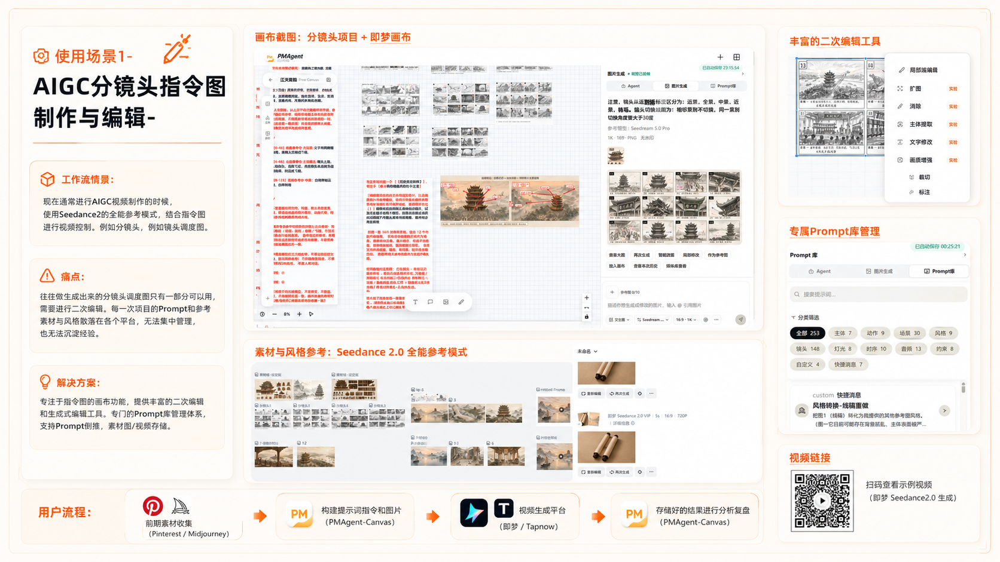
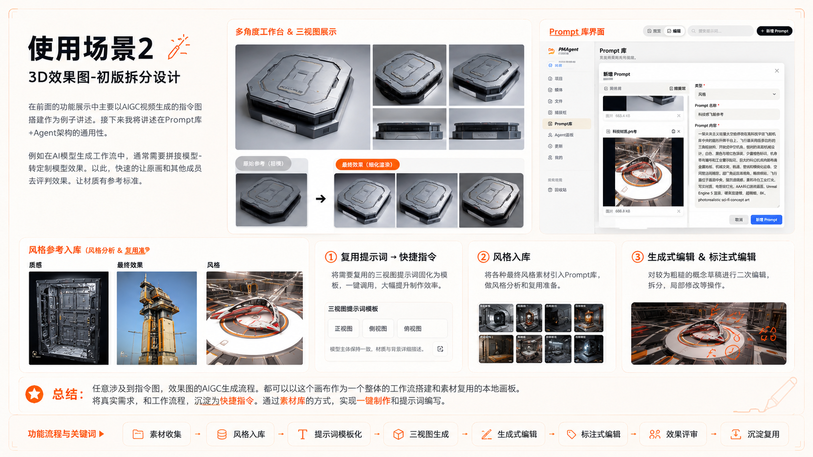

<p align="center">
  
</p>

<p align="center">
  
</p>

<p align="center">
  <a href="#产品总览">产品总览</a> ·
  <a href="#一条完整的本地创作链路">创作链路</a> ·
  <a href="#核心功能">核心功能</a> ·
  <a href="#快速启动">快速启动</a> ·
  <a href="#技术架构">技术架构</a>
</p>

PMAgent-Canvas 是面向 AIGC 创作者的本地桌面 Agent 画布。它把参考素材、Prompt、Agent 对话、图片生成、二次编辑和复盘结果放进同一个项目，让创作资料不再散落在聊天记录、生成平台和临时文件夹中。

当前核心模型：

- **Seedream 5.0 Pro**：图片生成、参考图生成与图片编辑。
- **Doubao Seed 2.0**：提示词生成、Prompt 优化与 Agent 对话。

> [!IMPORTANT]
> 当前仓库提供的是 **Windows 桌面开发预览**。双击 `start-desktop.vbs` 可以启动可编辑源码对应的桌面壳；它不是已签名的免环境安装包。

## 产品总览

画布是 PMAgent-Canvas 的中心层。左侧管理项目主体与素材，中间组织文本、参考图和生成结果，右侧在 Agent、图片生成与 Prompt 库之间切换。三部分围绕同一个项目上下文协作，而不是各自保存一份孤立数据。

<p align="center">
  
</p>

## 一条完整的本地创作链路

从参考素材进入项目，到 Agent 辅助编写提示词，再到图片生成、二次编辑和资产归档，所有关键上下文都留在本地项目中。

<p align="center">
  
</p>

PMAgent-Canvas 不试图替代每一个外部生成或剪辑平台。它更关注生成前后的生产资料：参考图、分镜、Prompt、模型参数、生成结果、修改方向和复盘经验，让这些内容可以被继续搜索、复用和交付。

## 核心功能

### 图片生成与项目媒体素材库

在画布中调用 Seedream 5.0 Pro 完成文生图、参考图生成和图片编辑。生成结果进入当前项目媒体库，可以继续加入画布、绑定参考关系或参与下一轮生成。

- 项目主体和项目素材分层管理。
- 支持多张参考图、比例与分辨率设置。
- 可从 Prompt 库拉取媒体和提示词上下文。
- 生成历史与项目资产持久化保存。

<p align="center">
  
</p>

### Prompt 库与媒体管理

Prompt 不再只是一次性的文本。PMAgent-Canvas 将提示词、参考媒体、分类、来源和项目用途放在一起，既可供用户检索，也可由 Agent 在明确权限范围内读取和提出新增建议。

- 按主体、动作、场景、风格、镜头、灯光等维度分类。
- Prompt 与参考媒体深度绑定，便于在项目中复用。
- 媒体管理页记录生成、截图和导入的项目素材。
- Agent 写入采用用户确认的提案边界。

<p align="center">
  
</p>

### 图片编辑、切割与二次标注

围绕已有图片继续创作，而不是在每次修改时丢失原始上下文。Seedream 5.0 Pro 负责生成式修改，画布工具负责裁切、拆分、文字和箭头标注。

- 局部修改、多角度生成、扩图、消除与场景图推导。
- 按辅助线切割分镜板或多图素材。
- 添加文字、箭头和区域标注。
- 编辑结果继续回到画布和项目素材中。

<p align="center">
  
</p>

### 快捷消息节点与 Agent 协作

快捷消息节点是一类可沉淀、可编辑的提示词模板。用户可以在画布中调整内容与样式，也可以从 Prompt 库查看完整上下文，再由 Agent 在规则范围内补全和改写。

<p align="center">
  
</p>

## 使用场景

### AIGC 分镜头指令图制作

把前期收集的素材、分镜 Prompt、参考图和生成结果放进同一块画布，完成从指令图搭建、外部平台生成到结果复盘的闭环。

<details>
  <summary><strong>查看完整案例：分镜头指令图制作与编辑</strong></summary>
  <br>
  
</details>

### 3D 效果图与初版拆分设计

将三视图、材质参考、风格样本和多角度生成结果组织为可复用模板，再通过生成式编辑与标注完成细化和评审。

<details>
  <summary><strong>查看完整案例：3D 效果图与初版拆分设计</strong></summary>
  <br>
  
</details>

## 快速启动

### 环境要求

当前一键启动路径面向 Windows 开发环境。首次启动前请确保以下工具可用：

- Node.js 与 npm
- `uv`（Python 运行时和依赖同步）
- Rust / Cargo（首次构建或 Tauri 源码发生变化时使用）

### 启动桌面壳

```powershell
git clone https://github.com/Aoye-3/PromptCard-Agent.git
cd PromptCard-Agent
```

然后在资源管理器中双击：

```text
start-desktop.vbs
```

启动器会在需要时安装前端依赖、初始化本地服务并打开 PMAgent-Canvas 桌面壳。正常启动会复用现有桌面进程；Rust 或 Tauri 源码变化时会触发重新构建。

如果启动失败，运行可见终端版本查看完整日志：

```powershell
.\start-desktop.bat
```

### 配置核心模型

打开桌面壳后，在 **Agent 面板 → 模型管理** 中配置连接并绑定模型：

| 能力槽位 | 当前核心模型 | 用途 |
| --- | --- | --- |
| 文本 / Agent | Doubao Seed 2.0 | Agent 对话、提示词生成与优化 |
| 图片生成 / 编辑 | Seedream 5.0 Pro | 文生图、参考图生成与图片编辑 |

模型凭据由后端写入操作系统密钥环，不进入浏览器存储、项目 JSON、生成历史或 API 响应。未配置凭据时，模型调用会返回 `credential_missing`。

## 本地项目与数据边界

- 项目数据、画布状态、Prompt、生成历史和素材索引保存在本地持久化存储中。
- 图片结果不会因为删除画布节点或项目视图而直接删除底层历史资产。
- Agent 面板、Prompt 库、画布与媒体分析使用隔离的会话上下文。
- Prompt 库和画布写入采用显式提案与用户确认，不让 Agent 静默覆盖生产资料。

## 技术架构

| 层级 | 当前实现 |
| --- | --- |
| 桌面壳 | Tauri 2 |
| 前端 | Vite、React、TypeScript、Tailwind CSS、Zustand |
| 画布 | React Flow + PMAgent 自有媒体层 |
| 本地存储 | SQLite + 项目资产目录 |
| Agent Runtime | Python PromptCard Gateway + pi text Agent |
| 模型管理 | Provider-neutral connection 与模型槽位绑定 |

更完整的工程资料：

- [技术文档入口](./docs/README.md)
- [系统架构](./docs/architecture/system-architecture.md)
- [Agent Runtime 边界](./docs/architecture/agent-runtime-boundary.md)
- [Agent Runtime API](./docs/api/agent-runtime-api.md)
- [前端应用结构](./docs/frontend/app-shell.md)
- [图片生成与模型管理](./docs/architecture/image-generation-and-model-management.md)

<details>
  <summary><strong>开发命令</strong></summary>

```powershell
npm.cmd run dev
npm.cmd run dev:with-agent
npm.cmd run agent:dev
npm.cmd run text-agent:dev
npm.cmd run agent:check
npm.cmd test -- --run
npm.cmd run build
```

Backend Agent Runtime tests:

```powershell
cd agent-runtime/backend
$env:UV_CACHE_DIR='F:\.Agent-PromptCardManager\.uv-cache'
uv run pytest tests -q -p no:cacheprovider
```

</details>

## 当前状态

PMAgent-Canvas 仍处于活跃开发阶段。当前重点是稳定自由画布、图片生成与编辑、Prompt/媒体资产沉淀、Agent 会话隔离和本地桌面启动链路。对外使用前请以仓库中的实际实现和技术文档为准。
