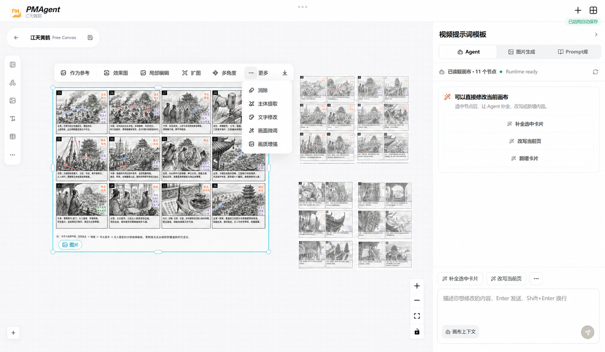
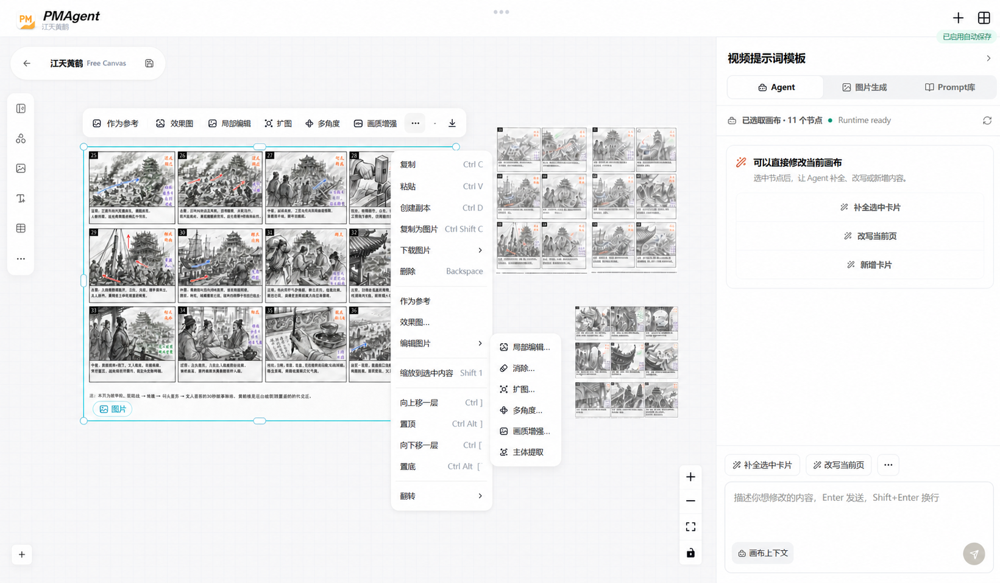
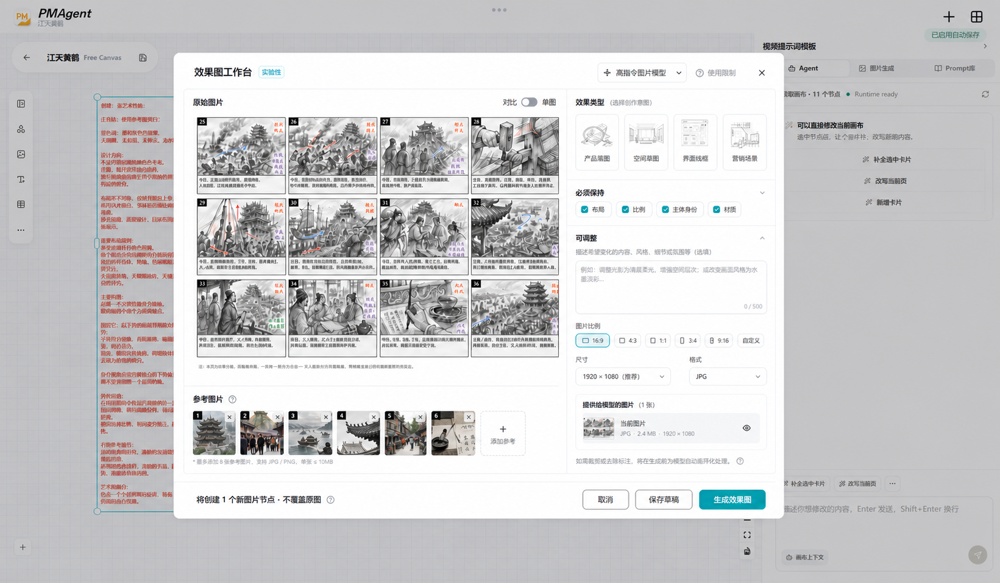
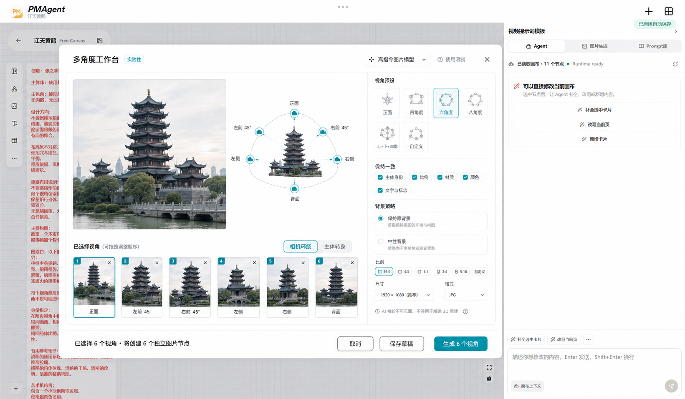
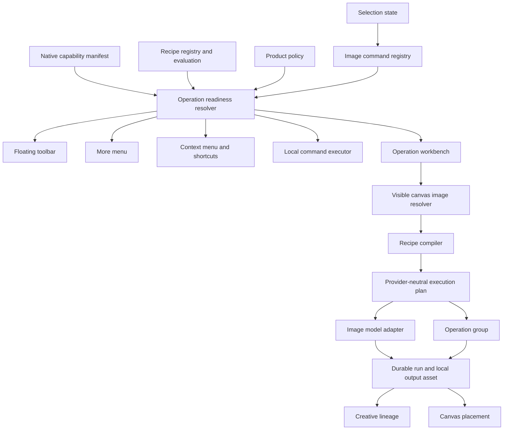
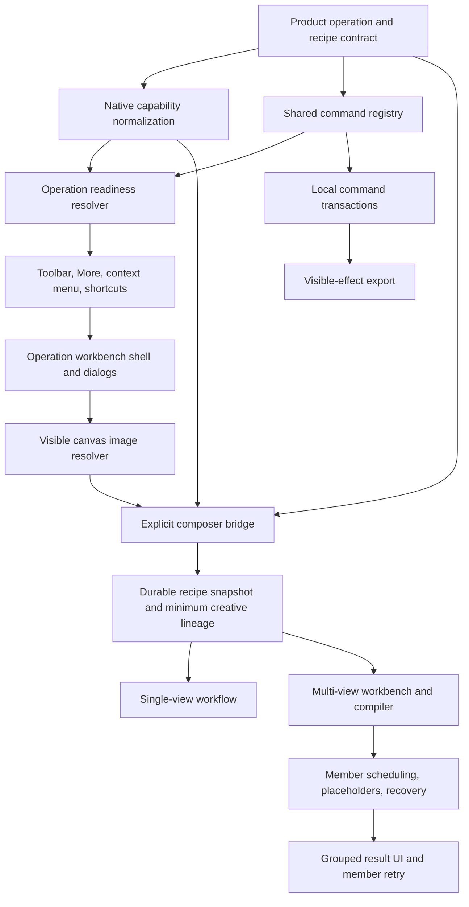

# Plan 007: Provider-Neutral Contextual Image Editing And Multi-View

## Status

- Status: `Active`
- Created: `2026-07-24`
- Last reviewed: `2026-07-28`
- Scope owner: Free Canvas, Image Generation, Agent Runtime, PromptCard Storage
- Current reference implementation: Seedream 5.0 Pro
- Explicit UI freeze: this plan must not change or repurpose the existing right-side `Agent / 图片生成 / Prompt库` structure; `作为参考` is the sole state-level bridge and may append to the existing 图片生成 Composer
- Staged backend acceptance: `B0/B1/B2/B7 automated zero-cost evidence ready; unified human approval pending; no live Provider used`
- Review trigger: before the first implementation task, after any model-catalog contract change, and before enabling multi-view outside development

## Implementation Ledger

Last implementation update: `2026-07-28`.

Status meanings:

- `Implemented + targeted verified`: the executable path exists and its focused unit/component/contract tests passed.
- `Implemented; frontend acceptance pending`: the frontend path exists, but the full frontend suite, browser E2E, accessibility/zoom matrix, or reload scenario still needs an uninterrupted run.
- `Implemented experimental; evaluation pending`: the operation is callable end to end with visible limitations, but the versioned live quality evaluation has not been run and it must not be promoted to `ready`.
- `Backend acceptance pending`: code and focused backend tests may exist, but the requested staged backend acceptance has not been completed as a final phase.

| Task | Current state | Evidence and remaining work |
| --- | --- | --- |
| 1. Product operations/readiness | Implemented + targeted verified | Provider-neutral operation/readiness types and fake non-Seedream tests exist. |
| 2. Native capability normalization | Implemented + targeted verified; backend acceptance pending | Frontend catalog normalization and current Seedream factual manifest exist; repeat staged backend acceptance later. |
| 3. Shared image-command registry | Implemented + targeted verified | Toolbar, More, context menu, shortcuts, local and generative actions resolve from one registry. `作为参考` is a local Composer bridge and is not gated by Runtime readiness. |
| 4. Floating/More/context surfaces | Implemented; frontend acceptance pending | Component placement, dismissal and keyboard tests pass. `作为参考` now directly appends the source asset to the existing 图片生成 Composer without a modal or provider request. The populated-canvas visibility regression is fixed with a focused 11-node Edge E2E; the full four-corner/25%–200% Playwright matrix remains. |
| 5. Reversible local commands | Implemented + targeted verified | Mutation/inverse history covers duplicate, delete, reorder and flip without replacing full project state. |
| 6. Visible image input resolver | Implemented + targeted verified | Crop, flip and annotations resolve to a persistent provider derivative when required. Pixel-fixture expansion remains. |
| 7. Shared operation workbench | Implemented + targeted verified | Reference, effect, region, erase, outpaint, text, enhance and subject configurations submit only from explicit Generate. |
| 8. Explicit durable recipe snapshots | Implemented + backend verified | Provider-neutral operation snapshots cross the browser/Runtime/Storage boundary and inconsistent context/source/mode/group requests are rejected before credentials or Provider access. |
| 9. Minimum creative lineage | Implemented + targeted verified | Source identities, recipe/version, preservation intent and optional group/item/view are immutable run metadata; no schema-v8 table added. |
| 10. Multi-view workbench | Implemented; frontend acceptance pending | Exact visible request count, 3×3 discrete camera positions, supplemental 3/4/rear views, the `正视 / 左视 / 俯视` model-three-view shortcut, focus behavior and 3D limitation have component and zero-cost browser E2E coverage; unified human visual acceptance remains. |
| 11. Multi-view persistence/scheduling | Implemented + backend verified | N stable placeholders are saved, then N queued runs are created atomically through batch prepare before the first independent Provider request. |
| 12. Group recovery/presentation | Implemented + targeted verified; final human acceptance pending | Queued authorized members rebuild the exact request from immutable snapshots at concurrency 1; running members only poll; active/scheduled run IDs prevent duplicate browser submission. The retry UI locks the failed member's original view, and submission rejects synchronous `viewSpec`/selection tampering. A valid retry reuses node/item/group/view identities, creates only a new Run, retains the failed Run in history, and finishes with the same three members and a succeeded group. Local Fake Provider E2E also covers geometry preservation, reload and project-switch deduplication. |
| 13. Visible export | Implemented; frontend acceptance pending | Copy/download rasterize crop, flip and annotations without creating an asset; original download remains separate. Clipboard/browser-error E2E remains. |
| 14. Subject extraction | Implemented experimental; evaluation pending | Executable solid-background redraw workbench; never described as transparent alpha extraction. |
| 15. Text edit | Implemented experimental; evaluation pending | Executable region-guided workbench with exact replacement instruction; CJK/Latin/layout live fixtures remain unrun. |
| 16. Quality enhancement/readiness | Implemented experimental; evaluation pending | Executable generative redraw workbench; explicitly not native pixel-preserving upscale. |

Backend-complete-then-human-acceptance order requested by the user:

1. keep the completed frontend behavior stable while closing B1, B2 and B7 in code and Fake Provider tests;
2. complete Runtime, Storage, frontend, build and static verification before asking for manual acceptance;
3. perform one unified human acceptance after the backend closure instead of stopping between implementation gates;
4. do not perform paid live Seedream evaluations without explicit cost authorization; record their absence rather than inferring a pass.

The complete frontend Vitest suite passed through `npm.cmd run test:frontend`: four bounded sequential shards completed 106 test files and 644 tests, including retry-integrity and exact-node binding defenses. At final reviewed code commit `37a7212` (including runner ownership in `2d372a0` and deterministic Fake Provider gating in `f6887b1`), the production build and `agent:check` passed; a direct shell invocation of bare `npm.cmd run test:e2e` completed 24/24 in 51.4 seconds (73.5 seconds shell elapsed) with exit code 0 and released its local service ports. The intentional no-match invocation returned exit code 1. Viewport/zoom, focus, accessibility and the remaining human observations remain separate gates.

The canonical human browser procedure is maintained in [Manual Frontend Acceptance](../quality/manual-frontend-acceptance.md). Complete its F1-F7 gates and retain the required evidence before changing any `Implemented; frontend acceptance pending` ledger entry to accepted. Paid live-provider evaluation remains a separate explicitly authorized gate.

### Zero-cost unified evidence (2026-07-28)

The F1/F4 browser capture originated at `997eb9f`; the evidence package and retry-specific assertions were reviewed and refreshed through final code fix `37a7212`. The sanitized request, Run, Storage, recovery, Console/Network and screenshot package is under [`output/playwright/plan-007/`](../../output/playwright/plan-007/); it contains no credentials, authorization headers, temporary Provider URLs, raw Provider responses, or local secrets.

| Evidence | Result |
| --- | --- |
| Existing browser baseline | Direct shell bare `npm.cmd run test:e2e` passed 24/24 in 51.4s (73.5s shell elapsed) with exit code 0; repository-local browser cache, port release, and no-match exit code 1 verified. |
| Multi-view image configuration | 3/3 passed in 52.6s (71.6s shell elapsed) with exit code 0; pipeline EOF multi-view also passed 2/2 in 45.1s with exit code 0. Ports were released. The retry UI locks the original failed view, submission rejects synchronous view/selection tampering, and a valid retry binds the exact failed node while reusing item/group/view with one new Run and retaining the failed Run; the same three-member group succeeded. |
| Frontend / Runtime / Storage | 106 frontend files and 644 tests, 96 Runtime image-generation tests, and 87 Storage tests passed. |
| Build and static gates | Production build, `agent:check`, `git diff --check`, and credential/URL/schema/test-route scans passed. |
| Browser evidence harness | 1/1 passed in 41.3s at Chromium 1280x720 and 100% browser text zoom. |

B0, B1, B2, and B7 are **automated evidence ready, not human accepted**. Unified human approval remains pending. F1 has open finding E-001, F4 is limited to the multi-view pre-submit boundary, and F2/F3/F5/F7 still require human observation. No live Provider request was made; B3-B6 and B8-B9 remain unexecuted and require separate paid-call authorization.

### Backend closure result (2026-07-26)

The code/Fake Provider completion standard for this implementation round is met:

- B1 uses one shared operation semantic validator for single generation and batch preparation. It rejects inconsistent node/conversation context, source/input lineage, operation mode/region, recipe namespace, and multi-view group fields before run creation.
- Storage exposes `POST /api/image-generation-runs/batch` and creates 1-11 queued runs in one SQLite transaction without changing schema v7.
- Gateway exposes `POST /agent-api/promptcard/runtime/image-generation-batches/prepare`. It validates one complete multi-view group, preserves member order, and persists all runs without reading credentials or invoking a Provider.
- `POST /image-generations` remains compatible. An already prepared run executes only when identity and immutable snapshot match exactly and state is still `queued`; conflicts use `run_conflict`, and duplicate starts use `run_already_started` without overwriting the existing run.
- The frontend saves all placeholders before batch prepare, starts independent members only after prepare succeeds, safely fails every placeholder when prepare fails, and resumes authorized queued members from immutable snapshots after interruption.
- Fake Provider coverage completes reference generation, effect render, global edit, outpaint, point/bbox region redraw, erase, text edit, upscale, subject extraction, and multi-view while proving result localization precedes terminal success and lineage remains intact.

No paid Seedream request was made. B3-B6 and B8-B9 live quality, cost, quota, and regional evidence remain deferred to the unified manual acceptance and separate cost authorization.

### Manual frontend acceptance finding: populated canvas becomes blank

Status: `Fixed + focused verified on 2026-07-25; broader frontend acceptance remains pending`.

Observed on `2026-07-24` while opening the 11-node `江天黄鹤` Free Canvas:

- canvas content appears briefly and then the canvas becomes visually empty;
- the right-side Agent context continues to report 11 nodes;
- persisted project data still contains all 11 nodes;
- all 11 `.react-flow__node` elements remain in the DOM with valid positions and loaded image resources;
- each node ends in React Flow's inline `visibility: hidden` state.

Confirmed cause:

1. the inline `onSelectionChange` handler receives a new function identity on each Builder render;
2. React Flow's selection listener invokes that changed handler even when the selected IDs are unchanged;
3. the handler always writes a new `selectedNodeIds` array;
4. `executeImageCommand` depends on that array, and the mapped `nodes` array depends on `executeImageCommand`;
5. `useEffect(() => setFlowNodes(nodes), [nodes])` replaces React Flow's measured node objects with newly mapped domain nodes that do not contain `measured.width` or `measured.height`;
6. React Flow v12 treats those nodes as unmeasured and renders them with `visibility: hidden`.

This is a render-state regression, not project-data loss, image-load failure, or a `fitView`/container-size failure. It was reproduced in Edge/Chromium at the desktop WebView viewport and device scale with the transition `hidden -> visible -> hidden`.

Implemented correction:

- `onSelectionChange` now has a stable identity and does not replace selection state when the ordered node IDs are unchanged;
- domain-to-React-Flow synchronization preserves existing `measured.width` and `measured.height` for nodes that React Flow has already measured;
- newly inserted nodes still enter without measurements and use the normal React Flow measurement path.

Focused verification completed on `2026-07-25`:

- component regression suite: 10/10 passed, including measured dimensions surviving a real selection-state change;
- system Edge E2E: a persisted 11-node canvas remained 11/11 visible after load and after selecting a node;
- current development project: 11/11 nodes remained visible after load, selection, and Fit View;
- production TypeScript/Vite build passed;
- lint passed for the changed implementation and regression-test files.

The original blank-canvas blocker is resolved. Broader frontend acceptance must still prove all of the following:

- opening a populated Free Canvas keeps every node visible after initial measurement and after at least one selection callback;
- an unchanged selection does not create a render/reset loop;
- selection, right-click, floating toolbar, model-catalog completion, autosave, and project reload do not discard React Flow measurements;
- the domain node count and rendered visible-node count remain aligned for text and image nodes;
- no change is made to the frozen right-side `Agent / 图片生成 / Prompt库` workspace.

## Staged Backend Integration And Human Acceptance Gates

### Purpose and current baseline

Backend integration must be accepted as a sequence of small vertical slices rather than one large handoff. The user reviews each gate before work continues. Existing code already contains catalog normalization, contextual operation snapshots, durable run metadata, one Seedream adapter, and independent multi-view member scheduling. These gates verify that baseline, close only the gaps discovered in the current gate, and do not authorize a rewrite.

The staged acceptance state is independent from implementation status:

- code marked `Implemented + targeted verified` is not automatically accepted for the backend rollout;
- a gate remains open until its automated evidence and human checks pass;
- fixes discovered during a gate stay inside that gate;
- one gate produces one reviewable commit and push;
- do not squash gate commits before the user finishes staged acceptance;
- stop after every gate and wait for explicit user approval.

Every gate inherits these invariants:

1. use the existing provider-neutral `POST /image-generations` boundary rather than adding Seedream-specific product endpoints;
2. keep product operation, recipe, source identity, preservation intent, and group/member/view metadata provider-neutral;
3. keep credentials inside the Gateway/keyring boundary and exclude them from browser responses, logs, snapshots, fixtures, and commits;
4. persist placeholders and immutable run identity before provider invocation;
5. localize provider URL/Base64 output into PromptCard Storage before terminal success;
6. keep original source assets unchanged and create new assets for creative results;
7. never change or repurpose the right-side `Agent / 图片生成 / Prompt库` workspace;
8. never perform a paid live-provider call without a separate user approval that states model, fixture, request count, size, watermark choice, and expected cost;
9. a model operation remains `experimental` until a dated evaluation record supports promotion;
10. disabling either rollout gate must stop new work while leaving existing assets, runs, and nodes readable.

### Evidence package for every gate

Before requesting human acceptance, provide:

- commit SHA and exact changed-file list;
- targeted automated test command and result;
- production build or backend health result when relevant;
- sanitized request, run, and Storage evidence for the accepted path;
- explicit confirmation that no credential, signed URL, local secret path, or raw provider body is present;
- known limitations and rollback action;
- live request count and cost record when a real provider was used.

### Gate summary

| Gate | Deliverable | Provider use | Human stop point |
| --- | --- | --- | --- |
| B0 | Runtime, Storage, connection, catalog, and rollout baseline | none | approve backend environment |
| B1 | contextual operation contract and immutable snapshot acceptance | fake/none | approve request meaning and compatibility |
| B2 | one fake-provider effect-render vertical slice | fake only | approve lifecycle and lineage |
| B3 | one real effect-render recipe | explicit paid approval | approve first useful real operation |
| B4 | outpaint recipe | explicit paid approval | approve expansion behavior |
| B5 | point/bbox region redraw | explicit paid approval | approve spatial-guidance behavior |
| B6 | generative erase | explicit paid approval | approve removal/fill behavior |
| B7 | durable multi-view scheduling and recovery | fake only | approve group/member semantics |
| B8 | two-view live multi-view smoke test | explicit paid approval | approve minimum real multi-view path |
| B9 | five-view Beta evaluation and readiness decision | explicit paid approval | approve, limit, or reject Beta rollout |

### Gate B0: Backend baseline without image generation

**Description:** Verify the current Gateway, PromptCard Storage, connection, credential, assignment, catalog, and rollout boundaries without submitting an image request. This gate may add or correct focused diagnostics/tests only when the existing evidence is insufficient.

**2026-07-27 status:** Automated zero-cost evidence is ready in `output/playwright/plan-007/b0-readiness.json`; this gate is not human accepted and its checkboxes remain open.

**Acceptance criteria:**

- [ ] Gateway and PromptCard Storage start and report health without a configured image credential.
- [ ] Storage schema v7 is readable and no schema migration is introduced.
- [ ] frontend and Runtime rollout flags are reported independently and fail closed.
- [ ] a tested, enabled image connection can be assigned to `image.primary`.
- [ ] catalog capabilities and disabled reasons agree and contain no frontend inference from a model ID.
- [ ] credentials never appear in catalog, status, connection, exception, or log responses.
- [ ] no provider request or image-generation run is created.

**Verification:**

- [ ] run backend health, model-connection, catalog, redaction, and Storage compatibility tests;
- [ ] run `npm.cmd run agent:check`;
- [ ] manually inspect the sanitized readiness response and connection state;
- [ ] confirm ordinary existing image generation remains unchanged.

**Human acceptance gate:** The user approves the backend environment and readiness evidence before B1.

**Dependencies:** completed frontend acceptance checkpoint.

**Likely files if a gap is found:** model-management diagnostics/catalog tests, image-generation status tests, and this Plan only.

**Estimated scope:** Small.

### Gate B1: Contextual operation request and immutable snapshot

**Description:** Accept the provider-neutral operation payload as durable product meaning without invoking a provider. Structural validation already exists; this gate proves or adds the semantic cross-field rules needed to reject inconsistent recipes, sources, and multi-view member metadata before credential access.

**2026-07-27 status:** Sanitized automated snapshot and reload evidence is ready in `output/playwright/plan-007/b1-snapshot.json`; this gate is not human accepted and its checkboxes remain open.

**Acceptance criteria:**

- [ ] operation, recipe ID/version, source identities, preservation intents, parameters, and optional group/item/view fields round-trip unchanged.
- [ ] invalid operations, recipes, identifiers, parameter shapes, and oversized values fail before credential access.
- [ ] multi-view members cannot proceed with an incomplete group/item/view tuple.
- [ ] operation meaning is not reconstructed by guessing from `generate`, `edit`, or `region-edit`.
- [ ] legacy snapshots without operation metadata remain readable.
- [ ] no Seedream-specific field enters the snapshot contract.

**Verification:**

- [ ] router contract tests cover valid and invalid single-operation snapshots;
- [ ] service/Storage tests prove the exact immutable request snapshot;
- [ ] fake credential/provider spies prove rejection happens before credential retrieval and invocation;
- [ ] legacy request and history fixtures remain green.

**Human acceptance gate:** The user inspects one sanitized single-operation snapshot and one multi-view member snapshot, then approves the contract before B2.

**Dependencies:** B0.

**Likely files if a gap is found:** `routers/image_generation.py`, `image_generation/service.py`, their focused tests, and frontend contract fixtures only when compatibility requires it.

**Estimated scope:** Medium.

### Gate B2: Fake-provider effect-render vertical slice

**Description:** Run one effect-render recipe from an already persisted placeholder through Gateway, fake provider, output localization, Storage, terminal run state, and in-place canvas hydration. This gate proves lifecycle and lineage without cost.

**2026-07-27 status:** Automated zero-cost lifecycle tests and the browser pre-submit boundary record in `output/playwright/plan-007/b2-lifecycle.json` are ready; this gate is not human accepted and its checkboxes remain open.

**Acceptance criteria:**

- [ ] the stable placeholder and run exist before fake-provider invocation.
- [ ] success creates a new local asset and fills the existing placeholder without replacing its frame.
- [ ] original, visible canvas input, provider-ready input, run, recipe, and result identities remain traceable.
- [ ] a normalized failure retains a terminal failed placeholder and safe retry metadata.
- [ ] retry creates a new run and leaves the historical failed run immutable.
- [ ] deleting a result does not delete or rewrite the source.
- [ ] right-workspace tab and drafts remain unchanged.

**Verification:**

- [ ] fake-provider success, retryable failure, non-retryable failure, localization failure, and Storage failure tests pass;
- [ ] reload/project-switch tests prove idempotent hydration and no duplicate placement;
- [ ] manual fake-provider run proves success, failure, retry, reload, and source preservation.

**Human acceptance gate:** The user accepts the complete fake effect-render lifecycle before any paid call is proposed.

**Dependencies:** B1.

**Likely files if a gap is found:** image-generation service/tests, Storage client/tests, contextual operation integration tests, and placement reconciliation tests.

**Estimated scope:** Medium.

### Gate B3: First live effect-render recipe

**Description:** Connect and accept one useful real recipe, initially a narrowly defined effect render such as product sketch to render. The product Recipe compiles intent; the provider adapter translates only normalized inputs and never becomes the product-operation registry.

**Acceptance criteria:**

- [ ] the user explicitly approves the named model, fixture, request count, output size, watermark choice, and expected cost before invocation.
- [ ] the adapter receives only the documented reference order, prompt, regions, size, and output options.
- [ ] one request produces at most one localized result.
- [ ] source silhouette, proportion, and requested material/style intent are reviewed against the fixture.
- [ ] provider request IDs are sanitized and temporary URLs are not persisted or logged.
- [ ] failure leaves a safe terminal run and does not corrupt the source or placeholder.

**Verification:**

- [ ] fake-adapter contract tests remain green;
- [ ] one explicitly authorized live smoke run is recorded in a dated evaluation result;
- [ ] the user reviews the source, output, lineage, run state, logs, and known limitations.

**Human acceptance gate:** The user accepts, requests Recipe-only iteration, or rejects the first real operation. B4 does not start until acceptance.

**Dependencies:** B2 and explicit cost authorization.

**Likely files if a gap is found:** Recipe registry/tests, provider adapter/tests, evaluation result file, and this Plan.

**Estimated scope:** Medium.

### Gate B4: Outpaint

**Description:** Accept outpaint as a separate recipe over the same neutral edit path. Test only expansion semantics and do not combine this gate with region redraw, erase, or multi-view.

**Acceptance criteria:**

- [ ] source input and requested expansion/aspect parameters are explicit and validated.
- [ ] the original visible area remains unchanged as an asset and acceptably stable in the generated result.
- [ ] invented unseen context and non-pixel-perfect limitations remain visible.
- [ ] result, failure, retry, localization, and lineage follow B2.

**Verification:**

- [ ] fake-adapter parameter/order tests pass;
- [ ] at least two user-approved expansion shapes are reviewed for seams, repeated structures, perspective continuity, and subject drift;
- [ ] request counts and cost are recorded.

**Human acceptance gate:** The user approves or rejects outpaint before B5.

**Dependencies:** B3 and separate cost authorization.

**Likely files if a gap is found:** outpaint Recipe/tests, adapter mapping tests, and dated evaluation results.

**Estimated scope:** Small.

### Gate B5: Point/bbox region redraw

**Description:** Accept region redraw through documented point and bounding-box guidance. It must not be described or transported as a native binary-mask workflow.

**Acceptance criteria:**

- [ ] reference identity and normalized point/bbox coordinates are validated before credential access.
- [ ] invalid, missing, reversed, or out-of-range regions are rejected before invocation.
- [ ] Recipe text distinguishes the requested target from protected content.
- [ ] UI, snapshot, backend, and evaluation language state that spatial guidance is soft generative guidance.

**Verification:**

- [ ] contract tests cover point, bbox, wrong reference, invalid coordinates, and exact prompt/reference ordering;
- [ ] one authorized point and one authorized bbox live run are reviewed for target selection and changes outside the requested region.

**Human acceptance gate:** The user approves the spatial-guidance behavior before B6.

**Dependencies:** B4 and separate cost authorization.

**Likely files if a gap is found:** region validation/compiler tests, adapter contract tests, and dated evaluation results.

**Estimated scope:** Small.

### Gate B6: Generative erase

**Description:** Accept erase as its own Recipe while reusing the B5 region infrastructure. Do not infer that B5 acceptance proves erase quality.

**Acceptance criteria:**

- [ ] the removal target and protected content are explicit in the immutable snapshot.
- [ ] the operation is described as generative removal/fill, not deterministic inpainting.
- [ ] result and retry behavior remain non-destructive and independently traceable.

**Verification:**

- [ ] fake-adapter tests prove Recipe identity and region order;
- [ ] authorized fixtures cover plain and textured backgrounds;
- [ ] the user reviews fill continuity, seams, duplicated objects, and collateral changes.

**Human acceptance gate:** The user approves or rejects erase before multi-view work begins.

**Dependencies:** B5 and separate cost authorization.

**Likely files if a gap is found:** erase Recipe/tests and dated evaluation results.

**Estimated scope:** Small.

### Gate B7: Fake-provider durable multi-view group

**Description:** Accept application-batch multi-view semantics with no live provider. Multi-view is N independent durable member runs linked by one group ID, not one provider-native multi-output request.

**2026-07-27 status:** Automated local Fake Provider recovery evidence is ready in `output/playwright/plan-007/b7-multiview.json`; this gate is not human accepted and its checkboxes remain open.

**Acceptance criteria:**

- [ ] N visible views create N stable member IDs, run IDs, immutable snapshots, and persisted placeholders before the first invocation.
- [ ] the displayed confirmation authorizes exactly N requests.
- [ ] initial scheduling uses bounded concurrency within Runtime limits.
- [ ] group state is derived from member runs and supports `queued`, `running`, `partial`, `succeeded`, and `failed`.
- [ ] retrying one failed member creates one new run and leaves successful siblings untouched.
- [ ] reload and project switching hydrate existing members without duplicate nodes.
- [ ] moving or resizing a running placeholder is preserved on completion.
- [ ] no schema v8 group table is added unless a separate accepted ADR proves it necessary.

**Verification:**

- [ ] fake-provider tests cover all-success, one failure, mixed terminal/running, bounded concurrency, one-member retry, reload, and project switching;
- [ ] manual acceptance uses three members for success, partial failure, retry, and recovery;
- [ ] right-workspace freeze assertions remain green.

**Human acceptance gate:** The user accepts group/member persistence and recovery before any live multi-view request.

**Dependencies:** B6 and ADR-015.

**Likely files if a gap is found:** multi-view Recipe/scheduler tests, image-generation service tests, run snapshot tests, and placement recovery tests.

**Estimated scope:** Medium.

### Gate B8: Two-view live multi-view smoke test

**Description:** Prove the minimum real multi-view path with exactly two explicitly approved independent requests. Keep the result experimental and do not treat two-view success as five-view readiness.

**Acceptance criteria:**

- [ ] the user approves the two named views, model, fixture, size, watermark choice, exact request count, and expected cost.
- [ ] two placeholders and two independent runs exist before invocation.
- [ ] each member localizes, succeeds, fails, and retries independently.
- [ ] a single failure produces `partial` without hiding the successful member.
- [ ] result language states that unseen areas are AI-inferred and not 3D reconstruction.

**Verification:**

- [ ] one authorized two-view run is recorded with member-level latency, cost, state, identity/proportion/material review, and contradictions;
- [ ] a failure may be injected with the fake provider if causing a paid failure is unnecessary;
- [ ] the user reviews both outputs and group evidence.

**Human acceptance gate:** The user approves the minimum real multi-view path before B9.

**Dependencies:** B7 and explicit cost authorization.

**Likely files if a gap is found:** adapter/Recipe tests, group presentation/recovery tests, dated evaluation result, and this Plan.

**Estimated scope:** Medium.

### Gate B9: Five-view Beta evaluation and readiness decision

**Description:** Run the agreed five-view set and create the first repeatable Beta evidence. A pass may still be limited by subject type, Recipe, model version, or background policy.

**Acceptance criteria:**

- [ ] product review chooses subject class, default view set, background policy, preservation constraints, fixture, and pass thresholds before invocation.
- [ ] the exact five independent requests and estimated cost are approved.
- [ ] evaluation records provider/model version, adapter/catalog revision, Recipe version, fixture identity, per-member result, latency, cost, retries, known failures, and reviewer/date.
- [ ] identity, proportion, color/material, essential text/logo, view compliance, and cross-view contradictions are scored.
- [ ] the final decision is explicitly `remain experimental`, `ready with limits`, or `ready`.
- [ ] rollout flags remain reversible and disabling them preserves all existing data.

**Verification:**

- [ ] run the versioned manifest in `docs/references/image-operation-evaluations/`;
- [ ] repeat reload, partial failure, single-view retry, and no-duplicate-placement checks against the accepted build;
- [ ] run the full relevant frontend, backend, build, and browser gates.

**Human acceptance gate:** The user approves the readiness decision and rollout boundary. This closes staged backend acceptance.

**Dependencies:** B8, completed product open questions, and explicit cost authorization.

**Likely files if a gap is found:** dated evaluation result, capability/readiness manifest, rollout documentation, and focused Recipe/adapter tests.

**Estimated scope:** Medium.

### Deferred operations

The first staged backend acceptance does not automatically include:

- exact text replacement;
- subject extraction;
- generative enhancement;
- transparent-alpha output;
- native mask upload;
- provider-native grouped output;
- video generation.

Text edit, subject extraction, and enhancement keep their current experimental status and require independent gates based on the evaluation manifest. They must not inherit readiness from effect-render, region redraw, erase, or multi-view.

## Goal

Add a contextual image-creation workflow to Free Canvas:

1. selecting one ready image exposes a compact floating action bar;
2. More and right-click menus expose the full image and canvas command set;
3. effect rendering, local editing, outpainting, and multi-view are expressed as provider-neutral product operations;
4. current Seedream capabilities remain the first implementation and evaluation baseline;
5. every generative operation creates durable, non-destructive results and never runs implicitly.

This plan is an execution plan, not a permanent architecture record. It extends the accepted provider, capability, conversation, asset, and placeholder boundaries in:

- [ADR-008: provider-neutral image generation](../decisions/ADR-008-provider-neutral-image-generation.md)
- [ADR-009: capability-driven readiness](../decisions/ADR-009-capability-driven-image-model-readiness.md)
- [ADR-010: project conversations and durable placements](../decisions/ADR-010-project-image-generation-conversations.md)
- [ADR-011: original and derived image assets](../decisions/ADR-011-original-and-derived-image-assets.md)
- [ADR-013: recoverable image-generation placeholders](../decisions/ADR-013-recoverable-image-generation-placeholders.md)
- [ADR-015: explicit multi-view request groups](../decisions/ADR-015-explicit-multi-view-request-groups.md)

If implementation requires a new durable group or creative-lineage schema, write and accept a new ADR before the migration lands.

Current implementation uses [ADR-015](../decisions/ADR-015-explicit-multi-view-request-groups.md) to derive a group from independently durable member runs and canvas metadata without adding a schema-v8 group table.

## Decision Summary

1. Seedream is the current adapter and benchmark, not the product abstraction.
2. The stable abstraction is a high-instruction-response image model capable of following image-editing instructions and references.
3. Product operations such as effect rendering and multi-view are recipes, not provider modes.
4. Catalog capabilities describe native provider primitives and execution constraints, not unverified product promises.
5. Product availability requires provider support, adapter implementation, evaluation evidence, product policy, and eligible selection state.
6. The floating toolbar, More menu, context menu, and shortcuts render one shared command registry.
7. A generative command prepares a draft or operation panel. Only an explicit Generate action may call the provider.
8. Generative edits create new assets and nodes. They never overwrite source bytes by default.
9. Multi-view uses one durable group with ordered member results. The reliable baseline is one stable run per requested view.
10. Native provider grouped output may become an execution optimization later, but must normalize to the same group and member contract.
11. Technical derivatives and creative lineage remain different concepts.
12. The existing React Flow canvas and `NodeToolbar` remain in place.
13. Document nodes, image nodes, image-operation drafts, and generation runs are separate state domains. Shared canvas selection must be narrowed by `nodeKind` before any command resolves.
14. This plan does not change or repurpose the existing right-side `Agent / 图片生成 / Prompt库` workspace.
15. Reference-image functionality is derived from official technical documentation and API contracts first; screenshots and competitor UI are interaction references only.
16. No production command may open a stub, empty panel, or knowingly unsupported workflow. Experimental still means end-to-end executable behind truthful limitations.

## Explicit Frontend Freeze Boundary

This plan changes only:

- the contextual toolbar attached to an eligible selected image node;
- the selected-image More menu;
- the image-node and eligible multi-selection context menus;
- dedicated modal image-operation workbenches;
- image placeholders, result groups, and image-operation history surfaces required by those workbenches.

The existing right-side workspace headed by the current project/template context and containing `Agent / 图片生成 / Prompt库` is frozen for this plan:

- do not add an image-operation inspector there;
- do not rename, reorder, remove, or automatically switch its tabs;
- do not replace its Agent actions or composer;
- do not bind its active tab or draft to canvas image selection;
- do not use it as the owner of image-operation draft, run, group, or error state;
- modal dimming is visual only and must not mutate or reset the right workspace.

Any future proposal to integrate selected-image operations into that workspace requires a separate Plan/ADR and explicit product approval. It is not a follow-on detail of this Plan.

## Research Evidence

### Current repository baseline

The repository already provides most of the required foundation:

- `FreeCanvasBuilderScreen.tsx` renders a `NodeResizer` and `NodeToolbar` for a single ready image.
- The existing image toolbar already opens annotation editing, crop, reference generation, smart edit, and region edit.
- `selectedNodeIds` already distinguishes the selection set from the primary selected node.
- copy and paste exist as keyboard paths, but their logic is embedded in the screen component.
- project image generation already supports text-to-image, reference generation, smart edit, and region edit.
- every foreground generation receives a stable `runId`, a persisted ordinary-image placeholder, a permanent run snapshot, and a durable placement.
- model controls already come from the provider-neutral catalog.
- uploaded originals, provider-safe derivatives, annotation-flattened derivatives, generated assets, Subjects, and Materials already have durable local identities.

Important current gaps:

- no `onNodeContextMenu` or `onSelectionContextMenu` integration;
- no shared image-command registry;
- the current toolbar exposes generative continuation only for nodes marked as generated results, although any ready image with a stable `assetId` can be a valid explicit input;
- production helpers in `src/domain/image-generation/regions.ts` and `src/domain/image-generation/size-validation.ts` still recognize the Seedream model ID directly; this is real drift from ADR-009 and must be removed before claiming complete provider neutrality;
- the current `continueImageCreation` path passes the node asset directly and does not consistently resolve crop, canvas annotations, original source identity, and provider-ready derivative identity; a user-visible image can therefore differ from the image sent to the model;
- no full-canvas command history;
- no creative asset-lineage record;
- no persisted operation-group/member metadata for multi-view;
- current history reconstructs workflow from provider mode, so a `generate` request with an input image becomes `reference-generate` after reload and would lose a `multi-view` or `effect-render` meaning;
- the current Seedream adapter is single-output and non-streaming;
- canvas placement currently records one asset for one run.
- the current `imageGenerationBusy` state is workbench-wide and cannot represent several concurrent multi-view members;
- existing crop, annotation, region, and Composer interfaces are separate implementations without a shared image-operation workbench shell.

Authoritative internal references:

- [Image Generation and Model Management](../architecture/image-generation-and-model-management.md)
- [Free Canvas](../frontend/free-canvas.md)
- [Seedream official reference index](../references/volcengine/seedream/README.md)
- [Plan 005 implementation baseline](./005-seedream-image-node-frontend-implementation-status.md)

### Official interaction evidence

- React Flow `NodeToolbar` keeps a stable screen size and normally hides for multiple selection, matching the desired selected-image action bar: [React Flow NodeToolbar](https://reactflow.dev/api-reference/components/node-toolbar).
- React Flow exposes `onNodeContextMenu` and demonstrates viewport clamping plus pane-click dismissal: [React Flow Context Menu](https://reactflow.dev/examples/interaction/context-menu).
- Figma places object isolation, erasing, background removal, and expansion in a selected-image toolbar, supporting in-context secondary creation: [Figma image editing toolbar](https://www.figma.com/blog/introducing-three-new-tools-for-precise-image-editing-in-figma/).
- Adobe uses contextual tasks, reference images, generated variations, and non-destructive generated results: [Photoshop Reference Image](https://helpx.adobe.com/photoshop/desktop/create-open-import-images/create-images/use-reference-images-for-consistent-results.html), [Firefly Generate Variations](https://helpx.adobe.com/firefly/web/create-mood-boards/firefly-boards/generate-image-variations.html), and [Firefly Generative Expand](https://helpx.adobe.com/firefly/web/work-with-images/edit-images/generative-expand.html).
- WAI-ARIA defines one tab stop plus arrow-key movement for a toolbar and standard menu-button state and keyboard behavior: [Toolbar Pattern](https://www.w3.org/WAI/ARIA/apg/patterns/toolbar/) and [Menu Button Pattern](https://www.w3.org/WAI/ARIA/apg/patterns/menu-button/).

### Official model evidence

The following providers are comparison samples that validate the abstraction. This plan does not require implementing them.

| Dimension | Current Seedream adapter | GPT Image | Gemini native image | FLUX.2 / Tools |
| --- | --- | --- | --- | --- |
| Main primitives | generate, edit, point/bbox region edit, ordered references | generate, edit, multiple inputs, mask-guided edit, multi-turn through Responses | generate, edit, multiple references, multi-turn, semantic region instructions | instruction edit, multiple references; dedicated erase/outpaint tools |
| Spatial guidance | structured point/bbox plus raster markup in the current adapter | mask is supported but remains prompt-guided | semantic masking through instruction | general semantic edit; dedicated tools may accept masks |
| Multiple images | ordered input references | multiple inputs and variations | model-dependent reference roles and limits | multiple input images |
| Delivery | URL or Base64 localized immediately | inline/Base64 and streaming partials | inline image output; separate batch workflow | asynchronous job and short-lived signed URL |
| Multi-view | recipe; no angle parameter | recipe; no angle parameter | official guidance describes iterative 360-view prompting | recipe; no angle parameter |

Primary sources:

- [Seedream 5.0 Pro tutorial](https://www.volcengine.com/docs/82379/2582774?lang=zh)
- [Seedream 5.0 Pro interactive editing](https://www.volcengine.com/docs/82379/2582775?lang=zh)
- [Seedream 4.0-5.0 prompt guide](https://www.volcengine.com/docs/82379/1829186)
- [Volcengine Ark ImageGenerations API](https://api.volcengine.com/api-docs/view?action=ImageGenerations&serviceCode=ark&version=2024-01-01)
- [OpenAI image generation and editing](https://developers.openai.com/api/docs/guides/image-generation)
- [Gemini image generation and editing](https://ai.google.dev/gemini-api/docs/image-generation)
- [FLUX.2 image editing](https://docs.bfl.ai/flux_2/flux2_image_editing)

Evidence boundary:

- official API reference, model technical documentation, and provider tutorials prove that a provider documents a primitive;
- adapter tests prove that PromptCard maps and persists that primitive correctly;
- product evaluation proves that a recipe is good enough to expose;
- none of those alone proves exact geometry, pixel-perfect masks, exact text layout, or consistent unseen surfaces.
- marketing copy, product screenshots, and competitor menus may inform interaction design but never prove that our selected model or adapter can execute an operation.

## Reference-Image Implementation Contract

Reference images are a real provider input, not a decorative attachment UI. Their product contract must follow official technical evidence and the current executable adapter.

### Evidence order

Use this order when deciding whether and how a reference-image control is exposed:

1. official provider API reference and model-specific technical documentation;
2. the current model-catalog native capabilities and limits;
3. an implemented adapter mapping with request/response contract tests;
4. PromptCard evaluation for the concrete product recipe;
5. product policy and rollout state.

Competitor screenshots and generated UI previews come after these five gates. They may suggest a chip, role selector, or ordering interaction, but they cannot introduce a provider field, supported reference count, hard preservation guarantee, or operation that the documented API does not provide.

### Officially supported baseline

The current Seedream technical documentation supports:

- text-plus-image editing and reference generation;
- extracting and preserving described information such as character identity, visual style, or product characteristics;
- multiple image inputs for replacement, composition, and transfer when the selected model/API supports that input shape;
- arrows, boxes, lines, or doodles as visual signals for applicable editing workflows;
- sketch, floor-plan, or hand-drawn prototype to higher-fidelity effect-image workflows;
- generated image sequences/group images through documented prompt/API behavior.

The official documentation does not by itself guarantee:

- that every Seedream version or deployment accepts the same number of inputs;
- that product roles such as `identity`, `style`, `material`, and `layout` exist as native API fields;
- exact identity, logo, text, geometry, layout, or unseen-surface preservation;
- that one grouped output can replace independently traceable multi-view member runs;
- that another provider exposes Seedream-specific point, bbox, sequence, or delivery semantics.

The same evidence rule applies to other high-instruction-response image models. OpenAI, Gemini, and FLUX documentation may establish their own edit/reference primitives, but each adapter must normalize only what that provider actually documents and implements.

### Product roles versus provider inputs

The frontend may label references with application-owned intent:

```ts
type ImageReferenceRole =
  | 'source'
  | 'identity'
  | 'style'
  | 'material'
  | 'layout'
  | 'content'
```

These roles help the recipe compiler build ordered inputs and an explicit instruction. They are not automatically native provider fields.

If the provider accepts only an ordered list of images:

- preserve the visible order;
- compile each role into provider-appropriate prompt language;
- record the role and order in the immutable recipe snapshot;
- do not describe the role as a hard model constraint;
- do not invent or transmit unsupported provider parameters.

If the provider has a documented native role or dedicated source/mask field, the adapter may map to it and declare that mapping in its capability contract.

### Frontend behavior

The reference-image UI must:

- distinguish the mandatory source image from optional supporting references;
- show thumbnails, order, role, source asset identity, and removal/reorder controls;
- derive maximum count, accepted formats, size limits, and ordering behavior from the active model catalog;
- prevent submission when the active model or adapter cannot accept the configured references;
- show which visible canvas image will be flattened into the actual source/provider input;
- preserve reference roles and order in drafts, run snapshots, retries, and history reopen;
- make preservation intent visible without promising exact preservation;
- reduce to the documented single-image workflow when multi-reference input is unavailable.

The six reference thumbnails shown in the generated effect-render preview are illustrative layout content only. The implementation must render zero to the catalog-supported maximum and must never use the preview to infer a fixed limit.

### No-empty-function rule

An operation may appear in production only when it has a complete executable path:

```text
officially documented primitive
  ∧ catalog capability present
  ∧ adapter mapping implemented and tested
  ∧ recipe evaluated or truthfully experimental
  ∧ frontend workbench submits through the durable run pipeline
  ∧ result/failure/retry/history behavior implemented
```

Rules:

- `planned` operations stay in the Plan and development fixtures, not in the production command registry;
- `experimental` means callable end to end with visible limitations, not a stub dialog;
- an unsupported or not-yet-implemented operation must be disabled with an accurate reason or kept behind a development feature flag;
- clicking an enabled command must never open an empty panel, placeholder text, dead primary button, or simulated success;
- a visual design preview is not implementation evidence;
- provider marketing claims without API/adapter support cannot enable a command;
- adapter support without frontend result, failure, retry, and history handling cannot mark the product operation complete.

## Terminology

### Product operation

A stable user intent shown by the product:

```ts
type ImageProductOperation =
  | 'reference-generate'
  | 'effect-render'
  | 'global-edit'
  | 'region-redraw'
  | 'erase'
  | 'outpaint'
  | 'text-edit'
  | 'multi-view'
  | 'upscale'
  | 'subject-extract'
```

Product operations must not map one-to-one to provider request fields.

### Native primitive

A capability that exists in the provider API and has been implemented by the adapter, for example:

- text-to-image;
- image edit;
- multiple references;
- point, bbox, overlay image, or mask guidance;
- multiple variations;
- related ordered output;
- streaming partial images;
- polling or webhook completion.

### Recipe

A versioned application-owned plan that compiles one product operation into one or more execution steps.

Examples:

- `effect-render/product-sketch/v1`
- `effect-render/interior-plan/v1`
- `multi-view/product-turntable/v1`
- `erase/region-guided/v1`
- `outpaint/aspect-ratio/v1`

### Readiness

An evaluated product decision, separate from native capability:

```ts
interface ImageOperationReadiness {
  operation: ImageProductOperation
  support: 'native' | 'recipe' | 'unsupported'
  recipeVersion?: string
  testedModelVersion?: string
  qualityStatus: 'untested' | 'experimental' | 'ready'
  requiredCapabilities: CapabilityRequirement[]
}
```

### Execution plan

A provider-neutral ordered list of steps produced by a recipe. It may contain one step, multiple independent steps, or a future grouped-output step.

### Run and operation group

- a run is one auditable provider execution attempt;
- an operation group is an ordered user-visible task such as a multi-view set;
- retry creates a new attempt and never mutates a terminal run;
- a group may be partial when some members succeed and others fail.

## Scope

### In scope

- selected-image floating toolbar;
- More menu;
- node and selection context menus;
- reusable operation-workbench shell plus operation-specific dialogs/panels;
- end-to-end frontend states from menu click through parameter editing, explicit submission, placeholders, results, retry, and history;
- shared command registry and availability resolver;
- local object commands required by the menus;
- explicit bridge into the existing project Image Generation composer;
- effect-render recipes;
- a single requested view;
- durable multi-view groups and ordered member results;
- provider-neutral native capability, recipe readiness, execution, and delivery contracts;
- non-destructive creative lineage;
- focused undo/redo for local node commands introduced by this plan;
- keyboard, focus, viewport, text-zoom, and high-contrast behavior;
- fake-adapter and current Seedream contract verification.

### Non-goals

- video generation;
- true 3D reconstruction;
- guaranteed orthographic projection or engineering dimensions;
- guaranteed correctness of model-invented unseen surfaces;
- overwriting source assets by default;
- a second production image provider in this plan;
- provider or model IDs in product command logic;
- Photoshop-class bitmap, path, or layer editing;
- guaranteed pixel-perfect alpha extraction;
- guaranteed original fonts, logos, complex text layout, or OCR correctness;
- implicit generation on selection, menu open, recipe selection, restore, or canvas mutation;
- fake percentage progress, cancellation, grouped output, or streaming;
- a general batch-job platform beyond the minimum multi-view group;
- a refactor of every Free Canvas node type;
- a complete mobile canvas editor;
- merging technical derivations with creative lineage.
- changing the information architecture, tabs, actions, or state ownership of the existing right-side `Agent / 图片生成 / Prompt库` workspace;
- reusing document-field selection, document rewrite state, or document editing controls as image-node operation state.
- exposing aspirational menu commands, empty workbenches, simulated success, or provider capabilities inferred only from screenshots or marketing copy.

## Visual Design Previews

These generated previews are implementation references for layout, state boundaries, and interaction hierarchy. They are not pixel-locked specifications. Component behavior, accessible names, responsive constraints, and capability gates in this Plan remain authoritative.

The existing right-side `Agent / 图片生成 / Prompt库` workspace is deliberately unchanged in every preview. Image operations live on the selected image, in its menus, and in a dedicated modal workbench.

### Selected image with More menu



Key intent:

- only an `imageAsset` node receives the cyan selection frame and image-action toolbar;
- document nodes visible elsewhere retain their own state and controls;
- the expanded More menu remains attached to the selected image;
- the right-side workspace does not react to image selection in this phase.

### Selected image with right-click menu



Key intent:

- object commands and image operations are grouped separately;
- the image-edit submenu reuses the same command registry as the floating toolbar and More menu;
- right-click resolves the target image before command availability is calculated;
- a keyboard/touch-accessible equivalent remains available through More.

### Effect-render workbench



Key intent:

- the modal owns a temporary image-operation draft;
- the selected source preview is the actual provider input;
- recipe, preservation intent, references, output controls, and limitations are visible before submission;
- `生成效果图` creates one new image run and sibling image node without overwriting the source;
- the dimmed right-side workspace remains structurally and behaviorally unchanged.

### Multi-view workbench



Key intent:

- the workbench distinguishes camera-orbit intent from subject-turn intent;
- selected views are explicit, ordered, and counted before authorization;
- each planned view becomes an independently traceable member/run/result;
- the interface states that inferred unseen surfaces are not precise 3D reconstruction;
- no right-side workspace state is changed.

## State Ownership And Node-Type Separation

The current domain already distinguishes `threeStageForm` from media-node kinds such as `imageAsset`, `textOverlay`, `arrowAnnotation`, and `mediaGroup`. The new frontend must preserve that distinction instead of building one permissive editor state with mostly optional fields.

### State domains

| State domain | Identity and owner | Applies to | Must not own |
| --- | --- | --- | --- |
| React Flow selection | ordered/set of flow node IDs plus one primary target | all canvas node kinds | document fields, image recipes, run status |
| document editing | page, item, form, content, and selected field IDs | `threeStageForm` only | `assetId`, crop, image references, image operation parameters |
| image-node presentation | media node ID, `assetId`, crop, annotations, dimensions, transform metadata | `imageAsset` only | document form values or selected document field |
| image-operation draft | draft ID, operation, source image node/asset, resolved provider input, parameters, readiness | one open image workbench | terminal run state or document editor state |
| image-generation execution | `runId`, optional `operationGroupId`/member ID, placeholder node ID, immutable request snapshot | submitted image operations | unsaved workbench controls or document rewrite state |
| existing right workspace | its current Agent/Image Generation/Prompt Library tab and feature state | existing sidebar features | selected-image contextual command state introduced by this Plan |

### Typed selection resolution

The frontend may share the low-level React Flow selection event, but it must resolve that event into a discriminated target before rendering or executing commands:

```ts
type ResolvedCanvasTarget =
  | {
      nodeKind: 'threeStageForm'
      flowNodeId: string
      formId: string
      pageId: string
      itemId: string
    }
  | {
      nodeKind: 'imageAsset'
      flowNodeId: string
      mediaNodeId: string
      assetId: string
    }
  | {
      nodeKind: 'textOverlay' | 'arrowAnnotation' | 'mediaGroup'
      flowNodeId: string
      mediaNodeId: string
    }
```

Do not replace this with a single shape containing optional `formId?`, `selectedFieldId?`, `assetId?`, `operation?`, and `runId?`. That would allow document actions to observe image state and image commands to act on stale document selection.

State invariants:

- document editing actions resolve only from `nodeKind === 'threeStageForm'`;
- contextual image actions resolve only from `nodeKind === 'imageAsset'`, a stable `assetId`, and eligible run/readiness state;
- opening an image workbench does not change the selected document field, the document editor draft, or the active right-side workspace tab;
- an image-operation draft is keyed by the source image node and operation, not by the current document/page;
- submitting a draft creates run/group state; it does not mutate the draft into a running document state;
- running and failed placeholders derive status from image-generation runs, not from document-node loading or Agent state;
- closing or cancelling a workbench restores focus and selection to its source image without dispatching document selection callbacks;
- project switch or source-image deletion explicitly invalidates the matching image-operation draft and never falls back to a document node.

## Target Interaction

### Floating toolbar

Show only for one ready image with a stable `assetId`. Recommended order:

```text
作为参考｜效果图｜局部编辑｜扩图｜多角度｜更多｜下载
```

Keep the primary surface to five or six semantic operations plus More and Download. Use visible text for unfamiliar AI operations; do not rely on icons alone.

`作为参考` is an immediate local action: keep the current image-generation conversation and prompt, append the selected image as an ordered `reference-image`, open the existing 图片生成 tab, and show duplicate/limit errors there. It must not open an image-operation workbench, create a placeholder, or call the provider.

### More menu

Recommended contents:

```text
消除…
主体提取 / 移除背景
文字修改…
画面微调…
画质增强…
生成相似图
裁切
标注
查看生成记录
```

An ellipsis means that the command opens a panel, editor, or confirmation step.

### Context menu

Recommended grouping:

```text
复制
粘贴
创建副本
复制为图片
下载图片
删除

作为参考
效果图…
编辑图片 ▸
  局部编辑…
  消除…
  扩图…
  多角度…
  画质增强…
  主体提取

缩放到选中内容

向上移一层
置顶
向下移一层
置底
翻转 ▸
```

Right-click is not the only entry. More must provide a keyboard and touch-accessible equivalent.

### Selection and state matrix

| State | Floating toolbar | Context menu | Generative operations |
| --- | --- | --- | --- |
| no selection | hidden | canvas commands | unavailable |
| one ready uploaded image | full image actions | full image and object commands | prepare draft, explicit Generate |
| one ready generated image | full actions plus history | full image and object commands | prepare draft, explicit Generate |
| running placeholder | status only or hidden | status and zoom only | disabled |
| failed placeholder | retry/history surface | error, retry, delete, zoom | retry only |
| image URL without stable asset | hidden | register/replace/delete | disabled |
| multiple ready images | no single-node toolbar | intersection of multi-select commands | multi-reference preparation only |
| mixed ready/running selection | hidden | shared safe object commands | disabled |
| crop/annotation/region-edit mode | replace with editor completion controls | suppress canvas menu | cannot enter another edit mode |
| model unavailable | visible disabled entry with reason | visible disabled entry with reason | configuration action, no request |

Selection rules:

- right-clicking a node already in the current multi-selection preserves the selection;
- right-clicking a node outside the current selection first selects only that node;
- multi-select availability is the safe intersection across selected nodes;
- ordinary uploads and generated results share the same asset-based editing eligibility;
- running-node restrictions remain those defined by ADR-013.

### Menu and toolbar behavior

- keep menus within the canvas viewport;
- open submenus toward available space;
- close on command, Escape, pane click, selection change, and meaningful pan/zoom;
- restore focus to the trigger or selected node;
- expose `role="toolbar"` with an accessible name and roving tab index;
- use Left/Right for the horizontal toolbar and Home/End where practical;
- expose `aria-haspopup`, `aria-expanded`, and `aria-controls` on More;
- support Up/Down, Home/End, Left/Right submenus, Enter/Space, and Escape;
- do not dispatch canvas shortcuts while an input, textarea, or editable control owns focus;
- keep toolbar physical size stable at 25%, 100%, and 200% canvas zoom;
- keep content readable at 200% text zoom and in high-contrast mode.

## Frontend Workbench Contract

Backend capability is not feature completion. Every exposed product operation must provide a complete frontend path:

```text
selected image
  -> floating toolbar / More / right-click
  -> operation workbench or existing editor
  -> visible source and editable parameters
  -> explicit Generate / Apply
  -> placeholder and running state
  -> success, partial, or failure result on canvas
  -> retry, history, and continue-edit actions
```

A product operation is incomplete if only its request type, adapter, or Storage record exists.

### Existing frontend patterns to reuse

Do not create a disconnected design language. Build from:

- `ImageNodeToolbar` in `FreeCanvasBuilderScreen.tsx` for selected-image anchoring;
- `ImageCropEditor.tsx` for a large fixed modal, header, central image workspace, footer, Cancel, and Confirm;
- `AnnotationEditorDialog.tsx` for focus trapping, focus restoration, tools, zoom, local undo/redo, and non-destructive explanation;
- `RegionEditorDialog.tsx` for source switching, point/bbox tools, region history, validation, zoom, and capability-driven controls;
- `ImageGenerationComposer.tsx` for ordered image inputs, source/reference roles, model, size, output, validation, and explicit submission;
- the current image-generation history and result-action components for immutable run history and explicit reuse.

The first implementation should extract shared behavior only where at least two operation workbenches need it. Do not rewrite the existing editors solely for visual uniformity.

### Shared workbench shell

Create a reusable `ImageOperationWorkbenchDialog` shell for generative operations that need more than the compact Composer.

Recommended layout:

```text
+--------------------------------------------------------------------------------+
| operation title | model/readiness summary | help/limitations | close           |
+-----------------------------------------------+--------------------------------+
|                                               | source and reference roles     |
| large source / comparison / region workspace  | operation parameters           |
|                                               | preservation constraints       |
|                                               | prompt and output settings     |
+-----------------------------------------------+--------------------------------+
| estimated request count / blocking issues     | Cancel | Save draft | Generate |
+--------------------------------------------------------------------------------+
```

Required shell behavior:

- `role="dialog"`, `aria-modal="true"`, labelled title and description;
- focus trap and return focus to the menu item or selected node;
- Escape closes only when no destructive in-workbench confirmation is open;
- source preview always identifies the actual provider input, not merely the original asset;
- a visible explanation when crop or annotations are flattened into a provider-input derivative;
- capability-driven fields and disabled reasons;
- no provider request while opening, switching presets, drawing regions, or changing parameters;
- the primary `Generate` action is the explicit authorization point;
- multi-request operations display the exact planned request count before submission;
- generation failures stay associated with the operation and offer a safe retry path;
- the workbench uses the existing project Image Generation Agent and durable run pipeline rather than introducing a browser-to-provider path.
- the modal may visually dim the existing right-side workspace, but must not replace its tabs, actions, draft, or active state.

### Per-operation frontend map

| Operation | Entry surfaces | Click result | Required workbench contents | Primary result |
| --- | --- | --- | --- | --- |
| As reference | toolbar, context menu | open Image Generation Agent and prefill the current visible image | Composer attachment, role, prompt; no extra modal required | explicit later generation |
| Effect render | toolbar, context menu | open `EffectRenderWorkbenchDialog` | source preview, recipe cards, reference roles, structure-preservation controls, optional prompt, ratio/size | one new effect-image asset and node |
| Region redraw | toolbar, More, context menu | open `RegionEditWorkbenchDialog` using existing region editor primitives | source preview, point/bbox/markup tools, instruction, references, output settings | one new edited asset and node |
| Erase | More, context submenu | open region workbench in erase recipe | target region/markup, surrounding-content preservation, instruction preview | one new edited asset and node |
| Outpaint | toolbar or More, context submenu | open `OutpaintWorkbenchDialog` | expandable canvas preview, target ratio/size, edge handles or presets, keep-subject/layout controls, prompt | one new expanded asset and node |
| Multi-view | toolbar, context menu | open `MultiViewWorkbenchDialog` | source, camera-orbit/subject-turn mode, view presets, preservation controls, references, request count, output layout | ordered multi-view result group |
| Text edit | More, context submenu | open `TextEditWorkbenchDialog` only when readiness allows | region/text target, replacement text, keep-layout controls, limitations, optional OCR confirmation | one new edited asset and node |
| Subject extraction | More, context submenu | open `SubjectExtractWorkbenchDialog` only for truthful extraction capability | detected/selected subject, edge preview, background/alpha semantics, correction controls | extracted subject asset or disabled explanation |
| Quality enhancement | More, context submenu | open `ImageEnhanceWorkbenchDialog` | operation type, native upscale vs generative redraw, target size, detail-change warning, comparison | one new enhanced asset and node |
| Crop | More, context menu | reuse `ImageCropEditor` | current crop workspace | local node/asset result defined by existing crop semantics |
| Annotation | More, context menu | reuse current annotation editor | markup tools and local history | saved non-destructive annotations |
| Download original | toolbar, context menu | immediate action | no workbench | original local asset |
| Copy/export visible image | context menu | open export dialog only when visible renderer exists | crop/annotation/transform preview, format and dimensions | clipboard payload or exported asset/file |

Component names are planning names, not mandatory public APIs. Implementation may combine closely related dialogs when the resulting workbench remains clear and testable.

### Effect-render workbench

The frontend must make recipe intent visible rather than hiding it in a generated prompt.

Required controls:

- recipe selection with plain-language examples;
- source image and ordered references;
- reference role selection;
- “must preserve” controls for layout, silhouette, proportions, material, identity, logo, or text as applicable;
- “may vary” explanation;
- optional instruction;
- model, ratio, size, format, and watermark controls from the existing Composer;
- experimental/ready badge and known limitation copy;
- explicit Generate.

The compiled provider prompt may remain inspectable in an advanced disclosure, but the workbench edits product intent rather than provider syntax.

### Region-edit and erase workbench

Reuse the current `RegionEditorDialog` and `AnnotationEditorDialog` capabilities instead of building a second canvas-selection system.

Required flow:

1. resolve the current visible image into a durable provider input;
2. choose point, bbox, or visual markup according to the active model capabilities;
3. enter the edit or erase instruction;
4. preview the selected target and blocking validation;
5. explicitly generate a new result.

If the active model cannot implement a truthful erase operation, the workbench must remain disabled or experimental. It must not rename an uncontrolled global edit as a deterministic eraser.

### Outpaint workbench

The frontend needs spatial controls; a prompt-only popover is insufficient.

Required controls:

- current-image frame inside a larger target canvas;
- aspect-ratio presets and target dimensions;
- expansion on one or more sides;
- source positioning within the new canvas;
- preserve-subject and preserve-layout options;
- optional fill instruction;
- request and capability validation;
- explicit Generate.

The first recipe may compile the padded canvas plus source image into a generic edit request. The UI must label this as generative expansion unless the adapter exposes a dedicated outpaint primitive.

### Multi-view workbench

The frontend is a first-class part of multi-view, not a generic prompt dialog.

Required controls:

- camera-orbit versus subject-turn mode;
- visual view-preset selector with the nine discrete positions `左上 / 俯视 / 右上`, `左视 / 正视 / 右视`, and `左下 / 仰视 / 右下`;
- supplemental `正面 3/4` and `背面` choices plus a `模型三视图` shortcut that selects `正视 / 左视 / 俯视`;
- ordered selected-view list;
- preservation constraints;
- additional references and roles;
- background policy;
- ratio/size/output settings;
- exact request/member count;
- model-readiness and consistency disclaimer;
- explicit Generate.

The current adapter boundary accepts a discrete `viewSpec` and an instruction, not a guaranteed numeric camera pose. Horizontal/vertical degree sliders remain out of scope until at least one supported provider documents and implements exact angle parameters. This avoids presenting approximate prompt language as deterministic 3D camera control.

After submission:

- create visible ordered placeholders next to the source;
- show group and member status;
- keep successful views when one member fails;
- allow retry-this-view;
- allow a successful view to become a reference;
- allow reopening the workbench from group history with the original recipe snapshot.

### Frontend completion checklist for every operation

Before an operation is marked complete:

- [ ] at least one discoverable toolbar/More/context entry exists;
- [ ] the entry and disabled reason come from the shared registry;
- [ ] clicking opens the specified editor/workbench or performs a clearly immediate local action;
- [ ] source image, provider input, parameters, limitations, and expected output are visible;
- [ ] Cancel and explicit Apply/Generate behavior are defined;
- [ ] loading, running, success, failure, and retry states are implemented;
- [ ] focus, Escape, keyboard navigation, and text zoom are tested;
- [ ] result placement and history navigation are implemented;
- [ ] component and E2E tests cover the complete frontend flow.
- [ ] document selection/editing state, image-node state, operation-draft state, and run state remain separately keyed and type-narrowed;
- [ ] opening or closing the operation leaves the existing right-side workspace unchanged.

## Architecture



### Command registry

One registry owns presentation and behavior:

```ts
interface ImageCommandDefinition {
  id: string
  label: string
  icon: ComponentType
  shortcut?: string
  surfaces: Array<'toolbar' | 'more' | 'context' | 'shortcut'>
  selectionPolicy: 'single-image' | 'multi-image' | 'any-node'
  executionKind: 'immediate' | 'editor' | 'prepare-recipe'
  operation?: ImageProductOperation
  getAvailability(context: ImageCommandContext): CommandAvailability
  execute(context: ImageCommandContext): Promise<void> | void
}
```

The registry must not:

- inspect a Seedream model ID;
- call a provider adapter directly;
- duplicate business logic between surfaces;
- treat generated images as more eligible than uploaded images when both have stable local assets.

### Native capability contract

Extend the catalog with factual primitives and execution constraints. Do not add weak flags such as `supportsMultiAngle`.

```ts
interface ImageNativeCapabilities {
  primitives: {
    textToImage: boolean
    imageEdit: boolean
    multiTurn: boolean
  }
  references: {
    maxCount: number | null
    ordering: 'positional' | 'unordered'
    nativeRoles: Array<'source' | 'identity' | 'style' | 'material' | 'pose' | 'layout'>
  }
  spatialGuidance: Array<
    | { kind: 'semantic-prompt' }
    | { kind: 'overlay-image'; signals: Array<'point' | 'box' | 'arrow' | 'doodle'> }
    | { kind: 'point'; coordinateSpace: 'pixels' | 'normalized-0-999' }
    | { kind: 'bbox'; coordinateSpace: 'pixels' | 'normalized-0-999' }
    | {
        kind: 'mask'
        semantics: 'soft-guidance' | 'hard-region'
        appliesTo: 'first-input' | 'selected-input'
      }
  >
  outputs: {
    countMode: 'single' | 'variations' | 'ordered-sequence'
    countGuarantee: 'exact' | 'best-effort' | 'provider-decides'
    maxCount: number | null
    alpha: 'supported' | 'unsupported' | 'unknown'
  }
  execution: {
    submission: 'synchronous' | 'async-job'
    progress: Array<'none' | 'partial-image' | 'per-output' | 'percentage'>
    completion: Array<'inline' | 'poll' | 'webhook'>
    cancellation: boolean
  }
  delivery: {
    forms: Array<'base64' | 'temporary-url'>
    urlTtlSeconds: number | null
    mustPersistImmediately: boolean
  }
}
```

The catalog may keep current convenience fields during migration. New readiness logic must consume one normalized capability view rather than making model-specific assumptions.

### Availability formula

```text
visible and enabled
= selection is eligible
∧ provider advertises required native primitives
∧ adapter implements those primitives
∧ recipe evaluation is experimental or ready
∧ product policy enables the operation
∧ connection/model readiness passes
```

Unsupported high-frequency operations may remain visible and disabled when the disabled reason gives a useful configuration or input action.

### Recipe and execution plan

```ts
interface ImageRecipeDefinition {
  id: string
  version: string
  operation: ImageProductOperation
  requiredCapabilities: CapabilityRequirement[]
  compile(input: ImageRecipeInput): ImageExecutionPlan
}

interface ImageExecutionPlan {
  operation: ImageProductOperation
  recipeId: string
  recipeVersion: string
  sourceAssetId?: string
  preservationConstraints: string[]
  group?: {
    kind: 'multi-view'
    members: Array<{ memberId: string; viewSpec: ViewSpec }>
  }
  steps: ImageExecutionStep[]
}
```

Recipes own:

- input roles;
- preservation constraints;
- prompt templates;
- required regions or references;
- output semantics;
- expected member ordering;
- evaluation fixtures and thresholds.

Adapters own:

- provider request field names;
- provider coordinate, mask, and reference mapping;
- transport and authentication;
- provider response parsing;
- transient result localization;
- sanitized provider errors.

### Adapter execution contract

The first implementation may remain synchronous, but the neutral contract must not assume that every provider is synchronous.

```ts
type ImageExecutionEvent =
  | { type: 'queued'; providerRequestId?: string }
  | { type: 'running'; progress?: number }
  | { type: 'partial'; index: number; payload: TransientImagePayload }
  | { type: 'output-ready'; index: number; payload: TransientImagePayload }
  | { type: 'completed'; outputCount: number }
  | { type: 'failed'; code: string; retryable: boolean }
```

Every URL or Base64 output is only a transport payload. The backend must localize it into PromptCard Storage before a run succeeds or a node receives an asset.

### Three different multi-output meanings

Do not represent all of these with one `outputCount` assumption:

1. variations: independent candidates for one request;
2. ordered sequence: provider-produced related images;
3. application batch: multiple durable runs created for one product operation.

Multi-view uses application-batch semantics as the reliable baseline. A future adapter may optimize execution with ordered provider output, but persistence must still expose ordered, independently addressable members and retries.

## Non-Destructive Asset Model

### Node presentation transforms

Crop, flip, resize, rotation, and layer order change node presentation metadata. They do not modify original asset bytes.

### Technical derivations

Continue using `image_asset_derivations` for implementation derivatives:

- preview;
- provider input;
- annotation flattened.

### Creative lineage

Effect renders, region edits, outpainting, erase, and multi-view are creative results, not technical derivatives. Define a separate logical semantic relationship:

```ts
interface ImageCreativeRelation {
  id: string
  projectId: string
  sourceAssetId: string
  resultAssetId: string
  operation: ImageProductOperation
  recipeId: string
  recipeVersion: string
  runId: string
  groupId?: string
  memberId?: string
  viewSpec?: ViewSpec
  createdAt: number
}
```

The first implementation may persist the required fields in immutable run snapshots and generated-node metadata, which the current schema already preserves. Add a dedicated Storage table only when accepted ADR evidence shows that cross-project querying, lifecycle enforcement, mutable group metadata, or independent relation APIs require it.

Rules:

- source and result assets are permanent identities subject to the existing lifecycle policy;
- deleting a canvas result node does not delete the source asset;
- retry creates a new run and relation;
- replacing the visible canvas image is an explicit, reversible placement decision;
- a creative relation must not be used as a reason to rewrite or delete the original.

## Effect-Render Recipes

Initial recipe candidates:

| Recipe | Source | Preservation priority | Allowed variation |
| --- | --- | --- | --- |
| interior plan to render | plan, sketch, optional style/material references | layout, openings, circulation | materials, lighting, decor |
| product sketch to render | sketch, optional material/logo references | silhouette, proportions, product features | material finish, studio scene |
| product marketing scene | product source plus environment references | identity, geometry, logo, material | environment, composition, lighting |
| interface sketch to visual mock | wireframe or UI sketch plus style references | information hierarchy and regions | typography, color, surface treatment |
| subject plus style/environment | subject plus optional style and environment references | subject identity and essential features | style, background, lighting |

Each recipe begins as `experimental`. Promotion to `ready` requires representative evaluation and must record the tested model version and recipe version.

## Multi-View Workflow

### Product language

Use `AI 多视角效果图` or `生成多角度效果图`.

Always communicate:

> 不可见区域由模型推断，结果不代表真实三维结构、正交投影或精确尺寸。

### Input panel

1. source subject preview;
2. mode:
   - camera orbit around a stable subject;
   - subject turn against a stable camera;
3. view presets:
   - front;
   - front-left 45 degrees;
   - front-right 45 degrees;
   - left side;
   - right side;
   - rear;
   - high view;
   - low view;
4. preservation constraints:
   - identity or product shape;
   - proportions;
   - material and color;
   - logo and essential text;
   - clothing or accessories;
   - style;
   - lighting;
   - background policy;
5. optional additional references with explicit roles;
6. optional natural-language instruction;
7. output ratio and selected views.

`azimuthHint` and `elevationHint` are product metadata and prompt/compiler hints. They are not assumed to be provider camera parameters.

```ts
interface ViewSpec {
  id: string
  label: string
  mode: 'camera-orbit' | 'subject-turn'
  azimuthHint?: number
  elevationHint?: number
  framing: 'close' | 'medium' | 'full'
}
```

### Submission

- opening the panel creates no run;
- changing views creates no run;
- clicking Generate creates the operation group and stable member identities;
- the baseline compiler creates one independent provider-neutral execution step per view;
- each member receives its own stable run and placeholder before provider invocation;
- existing per-connection and global concurrency limits remain authoritative;
- a member may start only after its placeholder and group membership are durable.

### Result layout

- place independent result nodes next to the source in deterministic view order;
- do not create one inseparable contact-sheet asset as the primary result;
- show the view label on each result;
- expose retry-this-view, use-as-reference, history, and source navigation;
- preserve member order after reload;
- never move a node that the user repositioned while its run was active.

### Group state

```ts
type ImageOperationGroupState =
  | 'queued'
  | 'running'
  | 'partial'
  | 'succeeded'
  | 'failed'
```

Group state is a projection of member states. Terminal runs remain immutable.

### Recovery

- reload resolves group members by stable IDs;
- existing member nodes are hydrated rather than duplicated;
- pending members resume through durable run and placement state;
- retrying one failed member creates a new attempt only for that member;
- successful siblings remain untouched;
- provider grouped output, if introduced later, must produce the same logical member identities and creative relations.

## Local Commands And Undo

The first local command set:

- copy;
- duplicate;
- delete;
- download original;
- zoom to selection;
- move one layer up/down;
- move to front/back;
- horizontal/vertical flip;
- crop;
- annotation edit.

Layer order should initially use the persisted node order and a derived React Flow `zIndex`; avoid a new persistent z-index field until tests prove node order is insufficient.

Introduce reversible local command transactions for mutations added by this plan. Do not place asynchronous run reconciliation, output hydration, placement completion, or provider state changes in the user undo stack. Otherwise Undo could turn a successful result back into a running placeholder or reopen terminal placement work.

`复制为图片` and visible-effect export are not equivalent to downloading the original. They require one renderer that composes:

- source asset;
- crop;
- presentation transform;
- annotations;
- output dimensions and format.

Implement visible-effect export only after its pixel and metadata semantics are defined and tested.

## Dependency Graph



## Task List

### Phase 1: Contracts And Shared Commands

#### Task 1: Define product operations and recipe readiness

**Description:** Add provider-neutral operation, recipe, requirement, implementation status, and readiness types with pure availability evaluation. Seedream remains test data, not a branch in the evaluator.

**Acceptance criteria:**

- [ ] Product operations and native primitives are distinct types.
- [ ] Availability combines adapter implementation, catalog capability, evaluation status, product policy, and selection state.
- [ ] Fake adapters with different primitives produce correct operation readiness without model-ID checks.
- [ ] `planned`, `experimental`, and production-enabled states are distinct; `experimental` still requires an executable end-to-end path.
- [ ] an operation without documented and implemented primitives cannot enter the production command registry.

**Verification:**

- [ ] Targeted Vitest coverage passes for operation readiness and recipe requirements.
- [ ] Search confirms no new Seedream model-ID branch outside the Seedream catalog/adapter/test fixtures.

**Dependencies:** None.

**Files likely touched:**

- `src/domain/image-actions/image-operations.ts` (new)
- `src/domain/image-actions/image-operation-readiness.ts` (new)
- `src/domain/image-actions/image-operation-readiness.test.ts` (new)
- `src/domain/models/model-management.ts`

**Estimated scope:** Medium.

#### Task 2: Normalize native model capabilities

**Description:** Extend the provider-neutral catalog and client normalization with factual reference, spatial, output, execution, and delivery primitives while preserving compatibility with current catalog fields.

**Acceptance criteria:**

- [ ] The current Seedream entry normalizes to the exact implemented single-output, synchronous, point/bbox/markup contract.
- [ ] Missing new fields fail safely and do not advertise operations.
- [ ] Frontend and Runtime reject malformed or contradictory capability manifests.
- [ ] reference count, accepted input form, ordering, and native-role semantics are traced to model-specific official technical documentation.
- [ ] application-owned reference roles do not become invented provider fields.

**Verification:**

- [ ] `npm.cmd test -- --run src/domain/models/model-management.test.ts src/services/model-management-client.test.ts`
- [ ] Relevant Runtime model-catalog and connection tests pass.

**Dependencies:** Task 1.

**Files likely touched:**

- `src/domain/models/model-management.ts`
- `src/services/model-management-client.ts`
- `agent-runtime/backend/app/gateway/model_management/catalog.py`
- `agent-runtime/backend/app/gateway/model_management/contracts.py`
- `agent-runtime/backend/tests/test_model_connections.py`

**Estimated scope:** Medium.

#### Task 3: Extract one image-command registry

**Description:** Move image action definitions and execution dispatch out of the large builder screen. The registry becomes the source for toolbar, More, context menu, and shortcuts.

**Acceptance criteria:**

- [ ] One command ID has one label, shortcut, availability rule, and handler.
- [ ] Uploaded and generated ready images share asset-based eligibility.
- [ ] Running and failed placeholders expose only the allowed command subset.
- [ ] production commands cannot resolve to a stub panel, dead action, or simulated success.

**Verification:**

- [ ] Unit tests cover the selection and generation-state matrix.
- [ ] Existing crop, annotation, reference generation, smart edit, and region-edit tests remain green.

**Dependencies:** Tasks 1 and 2.

**Files likely touched:**

- `src/domain/image-actions/image-node-commands.ts` (new)
- `src/domain/image-actions/image-node-commands.test.ts` (new)
- `src/components/canvas/FreeCanvasBuilderScreen.tsx`
- `src/models/PromptHistory.model.ts`

**Estimated scope:** Medium.

### Checkpoint: Contracts

- [ ] Product operations contain no provider request fields.
- [ ] Current Seedream capabilities are represented without over-advertising.
- [ ] A fake non-Seedream manifest can drive the same operation registry.
- [ ] every enabled reference-image capability has official-document provenance and an adapter contract test.
- [ ] no planned-only or adapter-only operation appears as a working production command.
- [ ] Existing image-generation tests and build pass.
- [ ] Human review approves operation names, readiness formula, and deferred capabilities.

### Phase 2: Contextual UI And Safe Local Commands

#### Task 4: Render floating, More, and context-menu surfaces

**Description:** Implement the reviewed selected-image and context-menu previews by extending the existing `NodeToolbar`, adding More, and adding viewport-safe node/selection context menus backed by the shared registry. Do not change the existing right-side workspace.

**Acceptance criteria:**

- [ ] A single ready image shows one stable-size contextual toolbar.
- [ ] multi-selection never shows overlapping single-node toolbars.
- [ ] More, context menu, and shortcuts show the same availability and disabled reason.
- [ ] document/form nodes never receive the image toolbar or image context submenu.
- [ ] image selection and menu open/close do not change the active `Agent / 图片生成 / Prompt库` tab or its draft state.

**Verification:**

- [ ] Component tests cover menu placement, dismissal, focus restoration, and selection rules.
- [ ] Playwright checks the four viewport corners and 25%/100%/200% canvas zoom.
- [ ] Keyboard-only traversal follows the WAI toolbar and menu patterns.

**Dependencies:** Task 3.

**Files likely touched:**

- `src/components/canvas/image-actions/ImageNodeActionBar.tsx` (new)
- `src/components/canvas/image-actions/CanvasNodeContextMenu.tsx` (new)
- `src/components/canvas/image-actions/ImageActionMenu.test.tsx` (new)
- `src/components/canvas/FreeCanvasBuilderScreen.tsx`
- `tests/e2e/free-canvas-image-actions.spec.ts` (new)

**Estimated scope:** Medium.

#### Task 5: Add reversible local image commands

**Description:** Implement the safe local command subset through command transactions, while keeping asynchronous generation reconciliation outside user history.

**Acceptance criteria:**

- [ ] duplicate, delete, zoom, layer movement, and flip preserve project and edge invariants.
- [ ] Undo/Redo reverses only user local commands and never changes durable run or placement state.
- [ ] downloading the original is explicitly distinct from exporting visible effects.

**Verification:**

- [ ] Pure domain tests cover command apply/revert and node order.
- [ ] E2E covers shortcuts, input-focus suppression, undo, and reload.

**Dependencies:** Tasks 3 and 4.

**Files likely touched:**

- `src/domain/free-canvas/canvas-command-history.ts` (new)
- `src/domain/free-canvas/canvas-command-history.test.ts` (new)
- `src/domain/free-canvas/free-canvas-project.ts`
- `src/components/canvas/FreeCanvasBuilderScreen.tsx`
- `tests/e2e/free-canvas-image-actions.spec.ts`

**Estimated scope:** Medium.

### Checkpoint: Contextual Image Commands

- [ ] Toolbar, More, right-click, and shortcuts share one command definition.
- [ ] No command implicitly submits a provider request.
- [ ] Running-placeholder rules remain ADR-013 compliant.
- [ ] High contrast, 200% text zoom, and keyboard navigation receive manual review.
- [ ] Existing canvas selection, crop, annotation, project save, and image-generation tests pass.
- [ ] the selected-image and right-click implementations are visually reviewed against the Plan previews without treating them as pixel-locked screenshots.
- [ ] document-node selection/editing and the right-side workspace remain behaviorally unchanged.

### Phase 3: Provider-Neutral Generative Recipes

#### Task 6: Resolve the visible canvas image into one provider input

**Description:** Add one reusable resolver that turns the image the user actually sees into a durable provider input. It must account for crop, annotations, original/source identity, resource-library identities, and provider-safe derivatives before any operation workbench opens or submits.

**Acceptance criteria:**

- [ ] crop and annotations are either deliberately included or deliberately excluded with visible workbench state.
- [ ] the workbench preview and the resolved provider input represent the same pixels.
- [ ] original source, visible input, and provider-ready asset identities remain traceable.

**Verification:**

- [ ] unit fixtures cover plain upload, crop, annotation, generated result, Subject, and provider-input derivative.
- [ ] E2E proves an edited visible image sends the expected resolved asset rather than the untouched original.

**Dependencies:** Tasks 1-3.

**Files likely touched:**

- `src/domain/image-generation/canvas-image-input.ts` (new)
- `src/domain/image-generation/canvas-image-input.test.ts` (new)
- `src/domain/image-generation/annotations.ts`
- `src/components/canvas/FreeCanvasBuilderScreen.tsx`
- `src/storage/storage-service-client.ts`

**Estimated scope:** Medium.

#### Task 7: Build the shared operation workbench and first dialogs

**Description:** Implement the reviewed effect-render workbench and shared frontend shell, followed by region redraw/erase and outpaint flows. Reuse the existing crop, annotation, region, and Composer controls. The modal owns image-operation draft state and must not borrow document editor or right-side workspace state.

**Acceptance criteria:**

- [ ] clicking a command opens the documented workbench with source preview, editable parameters, limitations, Cancel, and explicit Generate.
- [ ] the workbench is capability-driven and never branches on a model ID.
- [ ] opening, closing, switching recipes, and editing controls create no provider request.
- [ ] focus trap, focus restoration, Escape, 200% text zoom, and high-contrast behavior are implemented.
- [ ] the effect-render screen is visually reviewed against the Plan preview.
- [ ] selecting an image, opening the workbench, and cancelling it leave document field selection and the existing right-side workspace unchanged.
- [ ] source and supporting references are visually distinct, ordered, role-labelled, and capped by the active model catalog.
- [ ] a model without documented/implemented multi-reference support receives only the source image and does not expose inert reference controls.

**Verification:**

- [ ] component tests cover each menu-entry-to-workbench transition.
- [ ] tests cover source preview, validation, explicit submission, and failure return.
- [ ] adapter contract tests assert the exact reference order and prove that unsupported role fields are not transmitted.
- [ ] E2E exercises toolbar click, right-click submenu, popup editing, Generate, placeholder, and result placement.

**Dependencies:** Tasks 4 and 6.

**Files likely touched:**

- `src/components/canvas/image-actions/ImageOperationWorkbenchDialog.tsx` (new)
- `src/components/canvas/image-actions/EffectRenderWorkbenchDialog.tsx` (new)
- `src/components/canvas/image-actions/OutpaintWorkbenchDialog.tsx` (new)
- `src/components/canvas/image-generation/RegionEditorDialog.tsx`
- `src/components/canvas/image-actions/ImageOperationWorkbenchDialog.test.tsx` (new)

**Estimated scope:** Medium.

#### Task 8: Bridge workbenches into explicit composer and durable recipe snapshots

**Description:** Let workbench confirmation prepare and explicitly submit the existing project Image Generation flow with source/reference roles, product operation, recipe version, preservation constraints, and optional operation payload. Preserve product meaning independently from provider mode.

**Acceptance criteria:**

- [ ] As reference opens and prefills the existing Image Generation Agent without an unnecessary modal.
- [ ] workbench Generate is the only submission point and displays blocking issues before any Runtime call.
- [ ] reload never reconstructs `effect-render`, `erase`, `outpaint`, or `multi-view` only by guessing from `generate/edit/region-edit`.
- [ ] old snapshots without operation metadata remain readable through the current legacy fallback.

**Verification:**

- [ ] `project-conversation`, Composer, client, and Storage snapshot round-trip tests pass.
- [ ] Runtime request-contract tests reject invalid operation metadata without exposing provider or filesystem details.
- [ ] E2E verifies no Runtime request before explicit Generate from either a workbench or the Composer.

**Dependencies:** Tasks 6 and 7.

**Files likely touched:**

- `src/domain/image-actions/image-recipes.ts` (new)
- `src/domain/image-generation/project-conversation.ts`
- `src/services/image-generation-client.ts`
- `src/storage/storage-service-client.ts`
- `agent-runtime/backend/app/gateway/image_generation/contracts.py`

**Estimated scope:** Medium.

#### Task 9: Record minimum creative lineage without premature schema expansion

**Description:** Preserve source, result, operation, recipe, run, and optional group/member metadata through the immutable run snapshot and generated-node metadata first. Do not add a new table until querying, lifecycle, or group mutation requirements prove it necessary.

**Acceptance criteria:**

- [ ] every new generative result can trace its source asset, operation, recipe, and run after reload.
- [ ] deleting a result node does not delete the source or reopen placement.
- [ ] technical derivations remain unchanged and separate from creative relationships.
- [ ] a schema migration is introduced only after an accepted ADR demonstrates why snapshot metadata is insufficient.

**Verification:**

- [ ] snapshot and node metadata round-trip tests pass.
- [ ] history and result actions can reopen the correct workbench from the immutable recipe snapshot.
- [ ] source deletion/lifecycle tests remain consistent with existing schema v7 rules.

**Dependencies:** Task 8.

**Files likely touched:**

- `src/models/PromptHistory.model.ts`
- `src/storage/storage-service-client.ts`
- `src/domain/image-generation/project-conversation.ts`
- `src/components/canvas/image-generation/ResultActions.tsx`
- `src/components/canvas/FreeCanvasBuilderScreen.image-generation.test.tsx`

**Estimated scope:** Medium.

### Checkpoint: Non-Destructive Recipes

- [ ] effect-render and single-view results are new assets and nodes.
- [ ] source bytes and source asset IDs remain unchanged.
- [ ] operation and recipe identity survive reload.
- [ ] legacy runs and projects remain readable.
- [ ] human review approves initial effect-render recipes and Beta wording.

### Phase 4: Durable Multi-View Groups

#### Task 10: Build the multi-view frontend workbench

**Description:** Implement the reviewed dedicated multi-view popup workbench with visual view presets, mode, constraints, references, output settings, exact member/request count, and explicit generation authorization. Keep its draft and member state independent from document nodes and the existing right-side workspace.

**Acceptance criteria:**

- [ ] toolbar and context-menu entries open the same workbench state.
- [ ] users can choose camera-orbit or subject-turn, select and reorder views, and inspect the exact planned request count.
- [x] users can select nine discrete camera positions, retain 3/4 and rear supplemental views, and apply the non-submitting `正视 / 左视 / 俯视` model-three-view shortcut.
- [ ] the workbench shows the inference/3D limitation and creates no work before explicit Generate.
- [ ] reopening from history restores the original recipe snapshot and selected views.
- [ ] the workbench is visually reviewed against the Plan preview.
- [ ] opening, cancelling, submitting, and reopening multi-view never mutates document editor state or switches the existing right-side workspace.

**Verification:**

- [ ] component tests cover view selection, ordering, constraints, disabled reasons, and focus behavior.
- [ ] E2E covers menu entry, popup configuration, Cancel, and explicit submission.

**Dependencies:** Tasks 7-9.

**Files likely touched:**

- `src/components/canvas/image-actions/MultiViewWorkbenchDialog.tsx` (new)
- `src/components/canvas/image-actions/MultiViewWorkbenchDialog.test.tsx` (new)
- `src/domain/image-actions/multi-view-recipe.ts` (new)
- `src/domain/image-actions/multi-view-recipe.test.ts` (new)
- `src/components/canvas/FreeCanvasBuilderScreen.tsx`

**Estimated scope:** Medium.

#### Task 11: Persist and schedule multi-view members

**Description:** Store optional `operationGroupId`, `operationItemId`, and `viewSpec` in each immutable run snapshot, replace workbench-wide busy state with run/group state, create all stable placeholders before invocation, and execute within current limits.

**Acceptance criteria:**

- [ ] N requested views create N stable member IDs, run IDs, and persisted placeholders tied by one group ID.
- [ ] one explicit confirmation clearly authorizes the displayed N requests.
- [ ] current Seedream execution uses independent runs without pretending to support native grouped output.
- [ ] group state can be derived from member snapshots without requiring a schema v8 table.
- [ ] the scheduler does not exceed trusted Runtime limits or invent percentage progress/cancellation.

**Verification:**

- [ ] snapshot tests cover group/member/view round trips and legacy compatibility.
- [ ] fake-provider tests cover bounded concurrency, partial failure, and one-member retry.
- [ ] project-switch tests prove completions do not update the wrong active project.

**Dependencies:** Tasks 8-10 and an accepted ADR for explicit multi-request authorization.

**Files likely touched:**

- `src/domain/image-actions/multi-view-recipe.ts`
- `src/domain/image-generation/project-conversation.ts`
- `src/components/canvas/FreeCanvasBuilderScreen.tsx`
- `agent-runtime/backend/app/gateway/image_generation/service.py`
- `agent-runtime/backend/tests/test_image_generation.py`

**Estimated scope:** Medium.

#### Task 12: Recover and present grouped results

**Description:** Place members in deterministic order, reconcile them after reload, and provide frontend group/member status, retry, history, and continue-edit actions.

**Acceptance criteria:**

- [ ] visible ordered placeholders appear beside the source immediately after submission.
- [ ] a partial group preserves successful members and clearly identifies failed members.
- [ ] reload hydrates existing member nodes and never duplicates them.
- [ ] moving or resizing a running placeholder is preserved when the result arrives.
- [ ] retry-this-view and use-as-reference are accessible from both result nodes and the group panel.

**Verification:**

- [ ] component tests cover queued, running, partial, succeeded, and failed group projections.
- [ ] E2E covers reload recovery, stable ordering, partial failure, retry, history reopening, and no duplicate placement.

**Dependencies:** Task 11.

**Files likely touched:**

- `src/components/canvas/image-generation/MultiViewGroupPanel.tsx` (new)
- `src/components/canvas/image-generation/MultiViewGroupPanel.test.tsx` (new)
- `src/domain/free-canvas/free-canvas-project.ts`
- `src/components/canvas/FreeCanvasBuilderScreen.tsx`
- `tests/e2e/free-canvas-multi-view.spec.ts` (new)

**Estimated scope:** Medium.

### Checkpoint: Multi-View Beta

- [ ] N views remain independently traceable, retryable, and recoverable.
- [ ] group order survives reload.
- [ ] source, recipe, model, view, run, and result relationships are inspectable.
- [ ] the UI states that results are inferred views, not 3D reconstruction.
- [ ] current Seedream smoke evaluation passes the agreed representative fixture set.

### Phase 5: Visible Effects And Capability-Gated Polish

#### Task 13: Export the visible image result

**Description:** Add one deterministic rasterizer for copy-as-image and export-current-effect after crop, transform, and annotation semantics are fixed.

**Acceptance criteria:**

- [ ] visible export matches the canvas crop, flip, annotations, output size, and selected format.
- [ ] original download remains available as a separate command.
- [ ] export creates a local asset only when the user explicitly chooses to save it as an asset.

**Verification:**

- [ ] pixel fixtures cover crop, flip, alpha, and annotation composition.
- [ ] E2E covers clipboard/export errors and no asset mutation.

**Dependencies:** Tasks 5 and 6.

**Files likely touched:**

- `src/domain/image-actions/render-visible-image.ts` (new)
- `src/domain/image-actions/render-visible-image.test.ts` (new)
- `src/components/canvas/image-actions/CanvasNodeContextMenu.tsx`
- `src/components/canvas/FreeCanvasBuilderScreen.tsx`

**Estimated scope:** Medium.

#### Task 14: Complete the subject-extraction workbench

**Description:** Implement subject selection and extraction as one vertical frontend slice only when the active model/adapter or a dedicated local capability has truthful extraction semantics.

**Acceptance criteria:**

- [ ] toolbar/More/context availability comes from readiness rather than a model ID.
- [ ] the workbench shows subject selection, edge/background semantics, output preview, and limitations.
- [ ] white-background redraw is never labelled as transparent extraction.
- [ ] success creates a new asset and node without changing the source.

**Verification:**

- [ ] evaluation fixtures and the tested capability are versioned.
- [ ] component and E2E tests cover entry, correction, explicit Apply/Generate, failure, result, and retry.

**Dependencies:** Tasks 1, 2, 7-9, and the subject-extraction evaluation.

**Files likely touched:**

- `src/domain/image-actions/image-recipes.ts`
- `src/domain/image-actions/image-operation-readiness.ts`
- `src/components/canvas/image-actions/SubjectExtractWorkbenchDialog.tsx` (new)
- `src/components/canvas/image-actions/SubjectExtractWorkbenchDialog.test.tsx` (new)
- `tests/e2e/free-canvas-image-actions.spec.ts`

**Estimated scope:** Medium.

#### Task 15: Complete the text-edit workbench

**Description:** Implement image-text replacement as an experimental vertical frontend slice with target selection, replacement text, layout-preservation intent, visible limitations, and result verification.

**Acceptance criteria:**

- [ ] clicking Text Edit opens a dedicated workbench rather than submitting a hidden prompt.
- [ ] the user can identify the target region and exact replacement text.
- [ ] the operation remains experimental until text content and layout checks pass.
- [ ] the result is new, traceable, and can be accepted, retried, or discarded.

**Verification:**

- [ ] fixtures cover Latin and CJK text, multi-line layout, logos, and known failure cases.
- [ ] component and E2E tests cover entry, editing, explicit Generate, result review, and retry.

**Dependencies:** Tasks 1, 2, 7-9, and the text-edit evaluation.

**Files likely touched:**

- `src/domain/image-actions/image-recipes.ts`
- `src/domain/image-actions/image-operation-readiness.ts`
- `src/components/canvas/image-actions/TextEditWorkbenchDialog.tsx` (new)
- `src/components/canvas/image-actions/TextEditWorkbenchDialog.test.tsx` (new)
- `tests/e2e/free-canvas-image-actions.spec.ts`

**Estimated scope:** Medium.

#### Task 16: Complete quality enhancement and readiness promotion

**Description:** Implement the quality-enhancement workbench and promote erase/outpaint/enhance recipes only from versioned evaluation evidence. Native upscale and generative high-resolution redraw remain separate choices.

**Acceptance criteria:**

- [ ] the workbench clearly distinguishes native upscale from generative redraw.
- [ ] target size, expected detail changes, cost/request count, and limitations are visible.
- [ ] erase and outpaint readiness is promoted independently from the existence of their workbench or endpoint.
- [ ] an adapter-only or endpoint-only implementation cannot mark any operation complete.

**Verification:**

- [ ] operation evaluation fixtures and results are versioned.
- [ ] unsupported operations remain disabled with an accurate reason.
- [ ] no model-specific command fork is introduced.
- [ ] component and E2E tests cover entry, workbench editing, explicit Generate, running, failure, result, and retry.

**Dependencies:** Tasks 1, 2, 7-9, and the operation-specific evaluations.

**Files likely touched:**

- `src/domain/image-actions/image-operation-readiness.ts`
- `src/components/canvas/image-actions/ImageEnhanceWorkbenchDialog.tsx` (new)
- `src/components/canvas/image-actions/ImageEnhanceWorkbenchDialog.test.tsx` (new)
- `docs/references/image-operation-evaluations/` (new)
- `tests/e2e/free-canvas-image-actions.spec.ts`

**Estimated scope:** Medium.

### Checkpoint: Complete

- [ ] all planned product operations are either ready, experimental, or explicitly deferred;
- [ ] all operation labels match their real native or recipe semantics;
- [ ] build, targeted unit tests, Storage tests, Runtime tests, and Playwright pass;
- [ ] live Seedream smoke checks cover the enabled recipes;
- [ ] no secret, temporary provider URL, raw provider body, or local path enters project, history, logs, or browser persistence;
- [ ] human review approves release wording and capability gates.

## Acceptance Scenarios

### Toolbar and menus

1. One ready image shows one floating toolbar.
2. Multiple selected nodes do not show overlapping node toolbars.
3. Toolbar size is stable at 25%, 100%, and 200% canvas zoom.
4. Context menus remain inside all four viewport corners.
5. Right-clicking a selected member preserves multi-selection.
6. Right-clicking outside the selection changes selection before menu commands resolve.
7. More and context menu use identical command availability.
8. pane click, Escape, selection change, and meaningful pan/zoom close open menus.
9. canvas shortcuts do not run while a form control owns focus.
10. unavailable model configuration produces a useful disabled reason instead of silently hiding the primary entry.

### Accessibility

11. Toolbar and menus expose correct roles, names, and expanded state.
12. Keyboard-only users can enter, navigate, execute, and exit.
13. Escape restores focus to the original trigger or selected node.
14. focus and boundaries remain visible in high-contrast mode.
15. labels, shortcuts, and disabled reasons remain readable at 200% text zoom.

### Frontend workbenches

16. Every enabled generative entry opens the workbench or existing editor named by the per-operation frontend map.
17. Toolbar, More, and context-menu entries for the same operation open the same draft state and availability result.
18. A workbench previews the exact provider input after crop, flip, and annotation resolution, rather than silently sending a different source image.
19. Opening, configuring, switching presets, or cancelling a workbench creates no provider request and no run.
20. Generate or Apply is the only authorization point and shows blocking issues plus the exact request count first.
21. Each workbench exposes the operation parameters, preservation intent, readiness, and known limitations required by its contract.
22. Running, success, partial, failure, retry, and history-reopen states remain connected to the originating operation.
23. Keyboard focus is trapped while a modal workbench is open and returns to the invoking menu item or selected node on close.
24. A result or history entry can reopen the same operation with its immutable recipe snapshot.

### Non-destructive editing

25. crop and flip do not change original asset bytes.
26. every generative edit creates a new result asset.
27. deleting a result node does not delete its source asset.
28. reload restores operation, recipe, source, run, and optional view relation.
29. retry never overwrites an earlier terminal result.
30. visible export correctly composes presentation transforms and annotations.

### Multi-view

31. selecting N views creates one ordered group with N members.
31a. the 3×3 camera-position grid compiles every selected position to a stable discrete `viewSpec`.
31b. the model-three-view shortcut selects exactly `front`, `left`, and `top`, updates the visible request count to three, and submits nothing by itself.
32. opening and editing the multi-view panel creates no provider request.
33. only explicit Generate submits work.
34. the current independent-run adapter creates N stable runs and placeholders.
35. one failed view produces a partial group without discarding successful views.
36. retry-this-view does not regenerate successful siblings.
37. reload resumes the same group and does not duplicate placements.
38. group order remains stable after reload.
39. each result traces source, view, recipe version, run, and model snapshot.
40. a model missing required primitives is blocked before submission.
41. UI and domain tests contain no Seedream model-ID branch.
42. a persisted `multi-view` recipe never reloads as plain `reference-generate`.
43. UI explicitly says inferred multi-view is not exact 3D reconstruction.

### Node-state separation and unchanged right workspace

44. selecting a `threeStageForm` node never exposes image operations.
45. selecting an `imageAsset` node never initializes, clears, or rewrites a document field selection.
46. opening, editing, cancelling, or submitting an image workbench does not change the active `Agent / 图片生成 / Prompt库` tab or its existing draft; the explicit non-workbench `作为参考` command is the only exception and appends one reference to the existing 图片生成 Composer.
47. deleting or switching away from a source image invalidates only the matching image-operation draft.
48. a running or failed image placeholder derives its state from its image-generation run and never from document loading or Agent state.
49. reopening an image operation from history resolves its source image and recipe snapshot without selecting a document node.

### Reference images and truthful capability exposure

50. a single-image-only model shows the source image but does not expose an enabled Add reference control.
51. a multi-reference model enforces the documented catalog maximum, accepted formats, and ordering rules before submission.
52. reordering or changing a reference role survives draft restore, submission snapshot, retry, and history reopen.
53. application roles compile into ordering and prompt instructions when no documented native role field exists.
54. adapter tests prove that unsupported native role, mask, point, bbox, grouped-output, or count fields are never invented.
55. a planned-only operation is absent from the production registry or remains behind an explicit development flag.
56. an experimental command opens a functioning end-to-end workflow with limitations, not a stub panel.
57. generated previews and competitor screenshots cannot change capability manifests or enable commands.
58. removing adapter support or catalog capability disables the dependent operation with a useful reason before any provider request.

## Evaluation Plan

Before promoting a recipe to `ready`, use a fixed representative set:

- products with visible logos and fine material details;
- characters with face, hair, clothing, and accessories;
- interior plans and sketches;
- product and industrial-design sketches;
- images containing text;
- sparse and busy backgrounds.

Measure per recipe:

- instruction compliance;
- source identity retention;
- silhouette and proportion retention;
- material/color consistency;
- layout preservation;
- region isolation;
- view compliance;
- cross-view contradictions;
- text correctness;
- latency;
- failure rate;
- provider cost;
- retry rate selected by the user.

Record:

- provider and model version;
- adapter version;
- recipe ID and version;
- fixture ID;
- prompt and reference roles;
- output and reviewer result;
- known failure modes;
- readiness decision.

Evaluation does not need to make every recipe portable across providers. It proves that product availability is evidence-driven and not inferred from a model name.

## Risks And Mitigations

| Risk | Impact | Mitigation |
| --- | --- | --- |
| product operation leaks into provider fields | high | enforce product recipe, execution plan, and adapter layers with fake-adapter tests |
| official capability is advertised but adapter does not implement it | high | availability requires both catalog and adapter support |
| recipe quality regresses after model/version change | high | version recipes and bind readiness to evaluated model version |
| multi-view implies exact 3D | high | use “AI multi-view effect images”, show inference disclaimer, keep P2 spatial controls out of this plan |
| mode-based history loses recipe identity | high | persist operation and recipe snapshot; keep legacy inference only for old runs |
| grouped work duplicates nodes after reload | high | stable group/member/run IDs plus idempotent placement reconciliation |
| one failed member hides successful siblings | medium | explicit partial group state and member-level retry |
| Undo corrupts asynchronous generation state | high | exclude run reconciliation and placement transitions from user command history |
| creative results pollute technical derivations | medium | separate creative lineage from `image_asset_derivations` |
| `FreeCanvasBuilderScreen.tsx` grows further | medium | extract registry, surfaces, recipe compiler, and group UI before adding commands |
| backend or adapter lands without a usable frontend path | high | require the per-operation frontend completion checklist and end-to-end acceptance scenarios before marking an operation complete |
| document and image state leak through one permissive selection/draft object | high | narrow by `nodeKind`, keep separately keyed document/image/draft/run stores, and test cross-node transitions |
| selected-image work unexpectedly changes the existing right workspace | medium | treat the right workspace as out of scope and add invariant tests for its active tab and draft |
| visual previews or competitor menus are mistaken for provider capability evidence | high | require official technical provenance, catalog support, adapter tests, and recipe evaluation before enablement |
| aspirational commands ship as empty panels | high | keep planned operations out of production registry; require executable experimental flows and full frontend completion checks |
| visible canvas state differs from the image sent to the model | high | resolve one durable provider input from crop, flip, annotations, source identity, and provider-safe derivatives; preview it in every workbench |
| visible export differs from canvas | medium | one tested renderer; keep original download separate |
| model-specific wording appears in product UI | medium | product operation labels and capability-derived disabled reasons |
| short-lived provider output is persisted in nodes | high | localize every output before terminal success |

## Open Questions

These questions require product review before their dependent tasks:

1. Which initial effect-render recipes are promoted beyond experimental?
2. Is the first multi-view Beta limited to products, or also enabled for characters and interiors?
3. Which default view set is shown first?
4. Should multi-view keep the original background by default or use a neutral studio background?
5. Is general node-command Undo required before contextual menus ship, or may Phase 2 initially ship only non-destructive commands plus existing delete confirmation?
6. Does “replace current canvas image” belong in the first release, or should all results always appear as siblings?

## Verification Commands

Run targeted checks at each task checkpoint, followed by the full relevant gates:

```powershell
npm.cmd test -- --run
npm.cmd run build
npm.cmd run storage:test
npm.cmd run agent:check
npm.cmd run test:e2e
git diff --check
```

Runtime changes also run the directly affected Python tests under the workspace-local runtime environment. Live provider smoke testing is manual and must follow the existing release checklist; automated provider-DI tests do not prove account permission, quota, region, output-host, or real-model quality.
