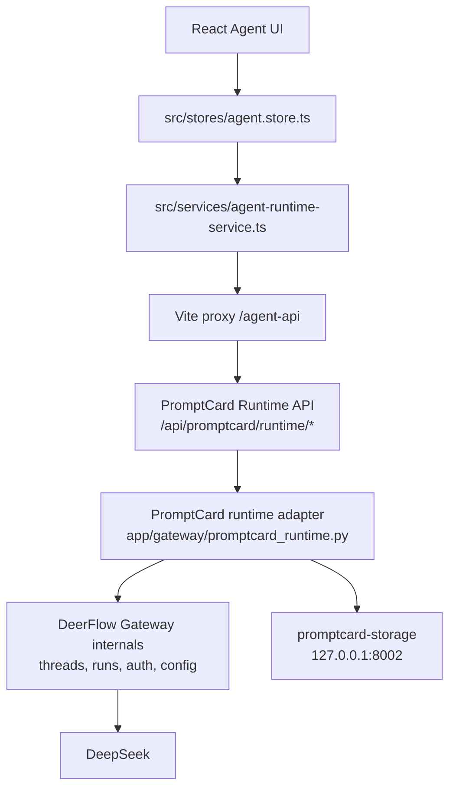

# Agent Runtime Boundary

PromptCard-Manager owns a small runtime boundary API in front of the DeerFlow-derived Agent Runtime. The frontend should treat DeerFlow internals as private implementation detail.

## Boundary Layers

## Public PromptCard API

Frontend code calls only these PromptCard-owned endpoints through `/agent-api`:

- `GET /promptcard/runtime/status`
- `POST /promptcard/runtime/bootstrap`
- `GET /promptcard/runtime/catalog`
- `POST /promptcard/runtime/messages`

The older DeerFlow routes under `/api/threads`, `/api/models`, `/api/tools`, `/api/skills`, `/api/agents`, and `/api/v1/auth` remain available for compatibility and internal adapter use, but new PromptCard UI work should not couple directly to them.

## Responsibility Split

- Frontend store: UI state, active thread id, visible messages, pending proposals.
- Frontend service: HTTP calls to the PromptCard boundary and legacy proposal parser compatibility only.
- PromptCard adapter: PMAgent prompt construction, Prompt Library snapshot loading, DeerFlow thread/run orchestration, assistant text extraction, proposal parsing, and workspace-id validation.
- DeerFlow internals: auth/session, thread/run persistence, model execution, skills, tools, and sandbox/runtime plumbing.
- Storage service: durable Prompt Library and project JSON persistence.

## Proposal Safety

The adapter validates model-returned workspace instructions before they reach the UI:

- `workspace_card_update` keeps only updates whose `cardId` exists in the workspace snapshot when a snapshot is available.
- `storyboard_update` rejects unknown `sequenceId` or `rowId` when those ids are known.
- `workspace_card_create` requires a draft type and content.
- `prompt_library_write_proposal` remains a proposal flow; direct library writes still require explicit approval elsewhere.

## Local Runtime Contract

`npm.cmd run dev:with-agent` starts or reuses:

- storage service on `127.0.0.1:8002`
- Agent Runtime on `127.0.0.1:8001`
- Vite frontend on `localhost:3000` with strict port behavior

Background service logs live under `logs/`.
