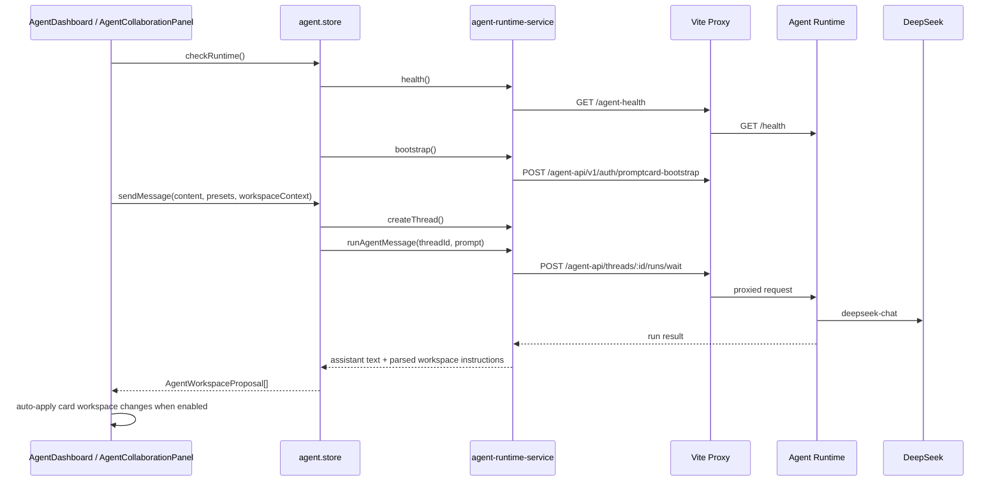

# Agent Runtime Integration

## Overview

PromptCard-Manager integrates with a DeerFlow-derived Agent Runtime as an optional local service. This document covers PromptCard-Manager's integration boundary, not DeerFlow's full internal architecture.

The frontend talks to the runtime through `agent-runtime-service.ts`. Vite proxies requests to a Python backend running on `127.0.0.1:8001`.

## Vite Proxy Routes

The frontend uses these local routes:

- `/agent-health` proxies to `http://127.0.0.1:8001/health`.
- `/agent-api` proxies to `http://127.0.0.1:8001/api`.

This keeps browser calls same-origin during development and avoids hard-coding runtime URLs throughout the UI.

## Frontend Service API Shape

`agent-runtime-service.ts` wraps:

- health checks
- auth setup status
- transparent bootstrap auth
- initialize/login/me helpers
- model catalog
- skill catalog
- tool catalog
- Agent catalog
- thread creation
- run-and-wait Agent execution
- Prompt library snapshot construction
- Agent workspace instruction parsing
- Prompt library proposal parsing

The current run path uses `assistant_id: "lead_agent"` and model context `deepseek-chat` with thinking disabled.

`agent.store.sendMessage()` returns the `AgentWorkspaceProposal[]` parsed from the latest Agent response. This allows embedded collaboration surfaces to apply card workspace changes immediately while still preserving the parsed proposal records in Agent store state.

## Card Workspace Collaboration

The card builder right rail contains one two-page panel:

- `结构化卡片输入`: the structured preset/card input page powered by `CreativeMode`.
- `Agent 协作`: a chat-style collaboration page powered by `AgentCollaborationPanel`.

For `card-workspace` mode, `AgentCollaborationPanel` can run with `autoApplyWorkspaceChanges`. In that mode:

- user messages are sent with the current workspace snapshot from `buildCardWorkspaceContext()`
- the Agent may reply conversationally without JSON when it needs clarification
- card mutations must be returned as `workspace_card_update` or `workspace_card_create` JSON instructions
- the frontend applies those card workspace instructions directly through the card store
- the chat stream adds a short applied-status message such as `已更新 2 张卡片`

The Agent prompt explicitly tells the model not to invent `cardId` values and to use only IDs from the workspace snapshot for updates.

## Auth and CSRF

The service includes cookies on runtime calls and sends `X-CSRF-Token` when a `csrf_token` cookie is present. The dashboard expects transparent bootstrap behavior, not a visible second login form.

## Local Runtime Configuration

`agent-runtime/config.yaml` configures:

- `deepseek-chat` using `langchain_deepseek:ChatDeepSeek`
- DeepSeek base URL `https://api.deepseek.com`
- vision disabled
- token usage enabled
- local sandbox provider with host bash disabled
- selected tool groups and tools
- skills path
- agents API enabled
- SQLite DeerFlow data directory
- tool search enabled
- loop detection enabled

## Local Scripts and Secrets

The local scripts read a DeepSeek-style API key, extract the key, and export it as `DEEPSEEK_API_KEY` for the Python runtime. Resolution order is:

1. `PROMPTCARD_AGENT_API_KEY_FILE`
2. `F:\.Agent-PromptCardManager\API-Key.txt`
3. `F:\.FinalProject\API-Key.txt`

The key must never be printed, committed, or copied into documentation.

The scripts also keep generated runtime dependencies and caches outside the repo where possible:

- `UV_PROJECT_ENVIRONMENT` points under `%LOCALAPPDATA%\PromptCardAgentRuntime\.venv`
- `UV_CACHE_DIR` points under the system temp directory
- `DEER_FLOW_HOME` points under `agent-runtime/.deer-flow`

## Current Safe Capability Model

The PromptCard-Manager runtime config exposes a conservative tool surface:

- web tools such as fetch/image search when dependencies are available
- read-only file tools: `ls`, `read_file`, `glob`, `grep`
- PromptCard tools for Prompt library search/read/propose-write
- subagent support through runtime context flags

Card workspace changes can be auto-applied in the embedded collaboration panel. Prompt library writes still remain proposals requiring user approval.

## Roadmap / Not Yet Implemented

- Full DeerFlow internals are not documented here.
- Direct host bash access is not enabled.
- Direct file write tools are not enabled as a user-facing capability.
- Direct skill management writes are not exposed as a safe PromptCard-Manager workflow.
- Production deployment and multi-user auth policy for the Agent Runtime are not finalized.
