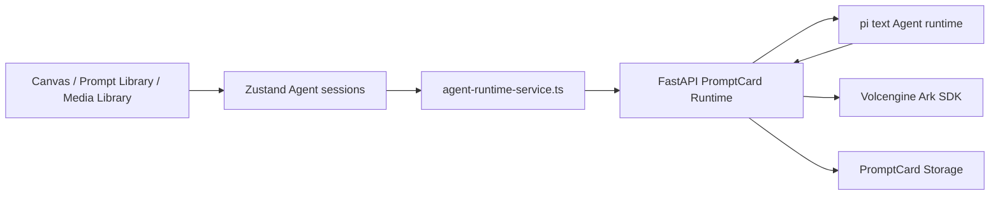

# Text Agent Runtime Boundary

PromptCard uses a small, product-owned boundary around a focused text Agent. DeerFlow and LangGraph are not part of the maintained runtime.

## Architecture

The split is deliberate:

- The Python Gateway owns browser session/CSRF handling, model connections, keyring credentials, Storage access, image generation, and the Ark SDK.
- The Node text runtime owns the pi agent loop, bounded session memory, Prompt Library search, and proposal tools.
- The frontend owns user approval and applies proposals through existing Canvas or Prompt Library state handlers.
- Image generation remains an independent Gateway module and does not depend on pi.

## Minimal Closed Loop

The first product milestone is:

1. Build and maintain the Prompt media library.
2. Generate images from Canvas prompts.
3. Use the text Agent to analyze prompts and complete or write prompts.

The text Agent supports the third step without becoming a general-purpose autonomous Agent.

## Canvas Contract

- When the active Canvas selection is one text node, the Agent may return only a `free_canvas_text_update` proposal for that exact node.
- When no text node is selected, the Agent may return only a `free_canvas_text_create` proposal.
- The Agent may use the bounded Prompt Library snapshot as writing reference.
- The frontend must show Apply and Reject controls. No Agent response writes to Canvas automatically.

## Prompt Library Contract

The Prompt Library Agent may search the provided snapshot and emit only additive `prompt_library_write_proposal` records with `operation: "create"`. Update, overwrite, archive, and delete are outside the Agent tool surface.

## Media Analysis Contract

The Media Library's existing analysis entry calls `POST /api/promptcard/runtime/media-analysis`.

- MVP input is one explicitly selected image asset.
- The Gateway loads that asset from PromptCard Storage and passes only that image to the multimodal text model.
- Supported actions are style analysis, free-form analysis, and reverse prompt analysis.
- Video analysis is deferred. The request boundary is intentionally media-item-scoped so video can be added later without changing Canvas or image-generation contracts.

## Safety And Coupling Rules

- Browser code calls only `/agent-api/promptcard/runtime/*`.
- Gateway-to-pi and pi-to-Gateway calls require `X-PromptCard-Internal-Token`.
- Credentials remain in the operating-system keyring; the browser and pi runtime never receive them.
- pi tools produce proposals only. They have no filesystem, shell, provider credential, Canvas write, or Storage write capability.
- Session reuse is rejected when `sessionKey`, `projectId`, or `mode` changes.
- Model calls use the `chat.primary` assignment and the Volcengine Ark Python SDK.

## Local Runtime Contract

`npm.cmd run dev:with-agent` starts or reuses four processes and writes schema version 2 to `logs/dev-runtime.json`:

- Vite frontend
- PromptCard Storage
- Python Gateway
- pi text Agent

The manifest includes `textAgentUrl` and `textAgentHealthUrl` in addition to the existing frontend, Gateway, and Storage URLs.
