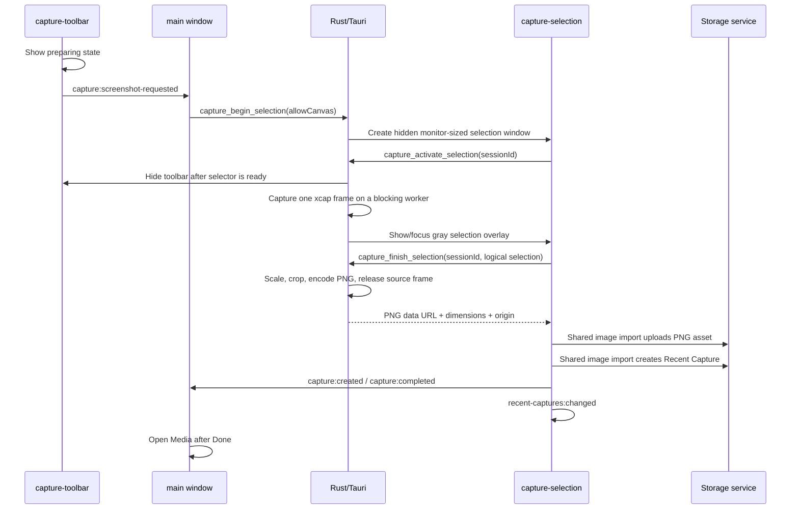

# Native Screenshot Capture

## Status

Implemented for the Windows desktop dev shell. Automated frontend, Rust, capability, production-build, and release-build checks pass. Manual Windows validation is still required for single display, dual display, mixed-DPI, clipboard, local-save, and free-canvas placement. macOS and Linux are not yet validated.

## Purpose

The floating toolbar provides a narrow screenshot path into Recent Captures without invoking the browser/WebView screen-share picker. The capture target is the display containing the toolbar, so the user does not choose a monitor on every capture.

The native capture layer intentionally does not cover recording or asset cleanup. Prompt registration, batch review, clipboard intake, and Canvas reuse are implemented by the application/storage layer after the selected image has become a Recent Capture.

## Runtime Flow



The three windows load the same frontend bundle but have separate routes:

| Window | Route | Responsibility |
| --- | --- | --- |
| `main` | default | Starts a native session and receives completed capture events. |
| `capture-toolbar` | `?window=capture-toolbar` | Starts drag, shows capture preparation, and emits the screenshot intent. |
| `capture-selection` | `?window=capture-selection&session=<id>` | Activates the prepared native session, draws the selection UI, uploads the returned PNG, creates the Recent Capture, and exposes post-capture actions. |

## Native Session Contract

The Rust implementation in `src-tauri/src/lib.rs` owns a `CaptureSessionStore` with exactly one optional session. Its phase is `WaitingForSelector`, `Capturing`, or `Ready`. A session contains only:

- an opaque session ID;
- the uncropped `xcap` frame for the toolbar display;
- capture timestamp;
- display-friendly name for provenance.

`capture_begin_selection` refuses a second active session, records the toolbar monitor centre, and creates a hidden, transparent, always-on-top, taskbar-hidden selector window restricted to that monitor's logical bounds. The selector invokes `capture_activate_selection` only after its React page has loaded. Activation hides the toolbar, captures the frame with `xcap` on Tauri's blocking worker, stores the frame in memory, and then explicitly shows and focuses the gray selector. This ordering prevents both toolbar pixels and selector pixels from entering the source frame without leaving an uninitialized transparent window on top.

If the selector never activates or native capture does not become ready within 30 seconds, the watchdog clears the matching session, closes the selector, and restores the toolbar. Native capture stage timings are written to `logs/desktop-shell.log` for diagnosis.

The complete frame is process memory only. It is never written to the asset store, supplied to the selection window, or persisted as Base64. `capture_finish_selection` accepts only logical selection coordinates, scales and clamps them to the original frame dimensions, enforces a two-pixel minimum crop, encodes the crop as PNG, and releases the session frame before returning the result.

## DPI And Coordinate Mapping

Tauri supplies the toolbar monitor's physical position and size plus scale factor. The selector window is positioned and sized in logical coordinates. The browser selector submits its client width and height with the drag rectangle. Rust maps each edge independently:

```text
nativeX = round(logicalX / selectorLogicalWidth * nativeFrameWidth)
nativeY = round(logicalY / selectorLogicalHeight * nativeFrameHeight)
```

This separates the selector's WebView scale from the original `xcap` frame scale and is the required path for mixed-DPI displays. Coordinates are clamped to the surface before cropping; reverse drags are normalized by the frontend.

## Permissions

The custom permissions are defined in `src-tauri/permissions/native-screenshot.toml` and assigned by window capability:

| Window | Allowed native command | Deliberately excluded |
| --- | --- | --- |
| `main` | `capture_begin_selection` | Selection completion/cancellation and selector-only flow. |
| `capture-selection` | `capture_activate_selection`, `capture_finish_selection`, `capture_cancel_selection` | Git update commands, filesystem access, and arbitrary main-window controls. |
| `capture-toolbar` | No native capture command; may emit to `main` and listen for the native restore event. | Session creation, asset writes, updates, Git commands, and direct window hiding. |

The selector needs Tauri event emission only to notify the main window after a successful save or explicit canvas placement. Asset upload and Recent Capture creation remain browser calls to the existing local storage API.

## Persistence And Provenance

The selector converts the returned PNG data URL to a `File`, calls `storage.assets.upload`, and then calls `storage.recentCaptures.create`. The durable record keeps the existing screenshot shape:

- `kind: "screenshot"`
- `status: "recent"`
- `contentType: "image/png"`
- physical `assetId`, pixel dimensions, byte size, and `capturedAt`

The capture `origin` adds diagnostic provenance:

```json
{
  "type": "floating-toolbar",
  "engine": "xcap",
  "monitor": "Display 1",
  "selection": { "x": 160, "y": 120, "width": 1280, "height": 720 }
}
```

`recent-captures:changed` refreshes the Media inbox. A saved screenshot can be copied or downloaded only from a user-clicked action. **Place on canvas** is available only when a Free Canvas project is active; it reuses the durable asset and does not register the capture in Prompt Library. Later explicit registration also reuses this same `assetId` in Prompt `meta.media`.

If asset upload succeeds but creation of the Recent Capture fails, the selector reports a persistence error and leaves the uploaded asset in place for diagnosis. No cleanup API is introduced by this feature.

## Failure And Cleanup Rules

- Toolbar or monitor lookup, native capture, selector activation, or selector-window creation failure: do not create a usable session; restore the toolbar and clear its preparing state.
- Selector readiness/native-capture timeout: after 30 seconds, clear only the matching session, close the selector, and restore the toolbar.
- Cancel button, Escape, or selector close: clear the session, close the selector, and restore/focus the toolbar.
- Invalid or too-small selection: clear the session and restore the toolbar.
- PNG encoding failure: close the selector and restore the toolbar.
- Upload, Recent Capture creation, clipboard, or local-save failure: display an error and do not report success. The user can close the selector to restore the toolbar.

## Verification

- Rust tests cover coordinate conversion, crop boundaries, invalid minimum selections, no-active-session errors, and session cleanup.
- Frontend tests cover logical-to-native coordinate conversion, native origin metadata, toolbar preparation, visible selector masking, routing, and capability isolation.
- `npm.cmd test -- --run`, `npm.cmd run lint`, `npm.cmd run build`, `cargo test`, and `cargo build --release` have passed for this implementation.

Run the remaining desktop checks on Windows before treating this as fully accepted:

1. Single display: ensure the hidden toolbar is absent from the output image.
2. Dual display and mixed DPI: start capture from each display and confirm the crop matches the drag rectangle.
3. Cancel, Escape, selector close, and native-error paths: confirm the toolbar returns.
4. Save: confirm the item appears in Recent Captures and remains after restart.
5. Copy and local save: paste into another application and open the saved PNG.
6. Free Canvas: place a capture, reload the project, and confirm the image remains.
