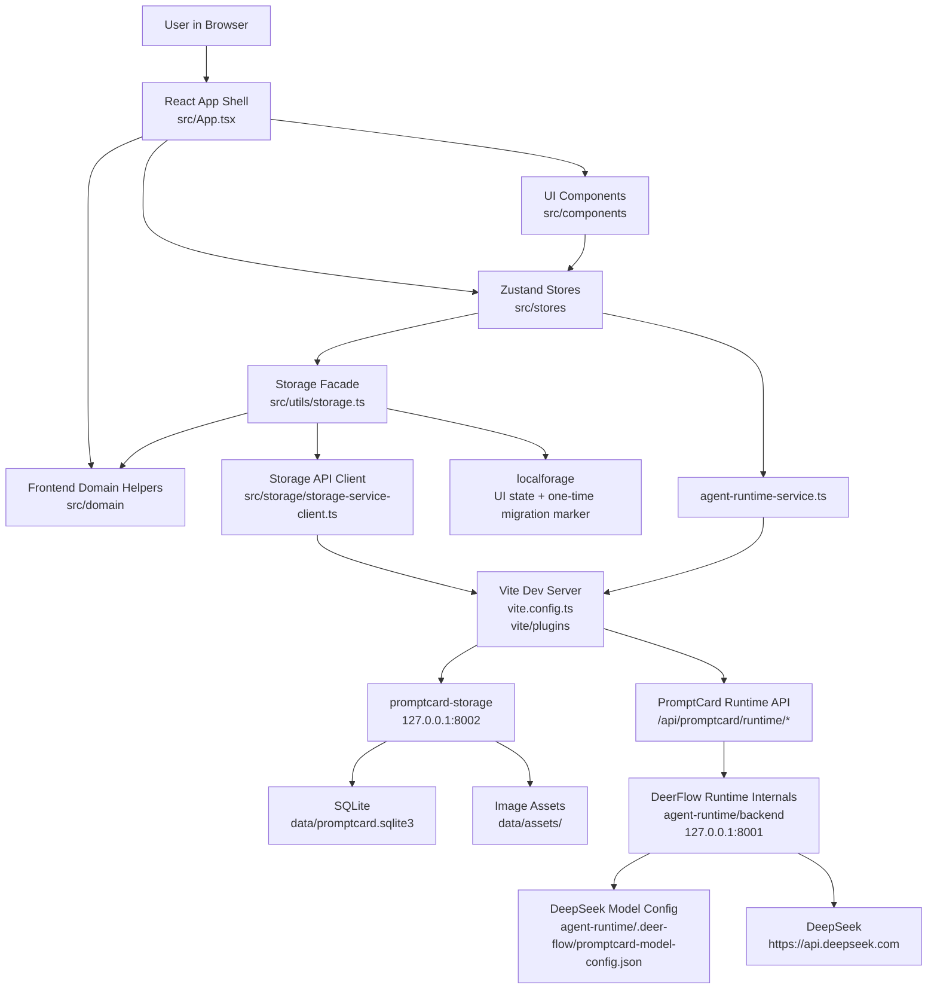

# System Architecture

## Overview

PromptCard-Manager is a local-first prompt building application with an optional Agent Runtime. The frontend is a Vite, React, TypeScript, Tailwind, and Zustand app. Project and Prompt Library durable data is owned by the local `promptcard-storage` service, which writes SQLite records under `data/` and exposes revision-aware HTTP APIs.

The optional Agent Runtime is a Python service mounted under `agent-runtime/`. The frontend does not call it directly. Instead, Vite proxies runtime traffic through stable frontend routes so the browser can keep one origin during development.

## Runtime Topology

## Major Modules

- **Application shell**: `src/App.tsx` owns top-level navigation, project mode switching, builder selection, and cross-store orchestration. Large screen surfaces live under `src/components/app/`.
- **Frontend components**: `src/components/` contains the app shell screens, Prompt library, card editor pieces, creative mode, settings panels, and Agent dashboard.
- **Frontend domain helpers**: `src/domain/` owns pure project normalization, storyboard row/sequence operations, and three-stage field definitions/output builders.
- **State stores**: `src/stores/` owns card workspace state, Prompt library presets, Agent runtime state, and related ordering/persistence helpers.
- **Storage facade and adapters**: `src/utils/storage.ts` preserves the app-facing storage API; `src/storage/storage-service-client.ts` calls the local storage service for project and Prompt Library durable writes; project normalization is delegated to `src/domain/projects/`.
- **Local storage service**: `promptcard_storage/` owns revision-aware project and Prompt Library persistence. `SqliteStore` is the CRUD and transaction facade; internal initializer, asset, and backup collaborators own one-time JSON migration, image files/diagnostics, and consistent snapshots.
- **Agent service layer**: `src/services/agent-runtime-service.ts` is a thin client for the PromptCard Runtime Boundary under `/agent-api/promptcard/runtime/*`, including message routing, catalog/status reads, and DeepSeek model configuration.
- **Development middleware**: `vite/plugins/promptcard-dev-storage.ts` exposes local-only endpoints for Prompt library data, project data, and dev server shutdown; `vite.config.ts` wires those plugins into Vite.
- **Agent Runtime**: `agent-runtime/` contains the PromptCard boundary router/adapter plus DeerFlow-derived internals, DeepSeek model configuration, public skills, ToolUse catalog, and scripts for local runtime testing.

## Data Flows

### Project Flow

Projects are represented by `IPromptProject`. Card projects persist `pages` and `currentPage`; storyboard projects persist a normalized `storyboard` structure; three-stage projects persist `threeStage`. The frontend loads and saves projects through `storage.projects`, which delegates to `/storage-api/projects` and no longer merges durable project data from browser storage after migration.

### Prompt Library Flow

Prompt presets use the `IPreset` compatibility contract. The `preset.store` remains the UI state layer, but durable create/update/reorder/delete/usage-count operations go through `/storage-api/presets`. Empty-library seeding is handled by the storage service.

### Agent Proposal Flow

The Agent dashboard and every `AIChatbotBox` send user content plus optional workspace context to `/agent-api/promptcard/runtime/messages`. The backend builds the PMAgent prompt, adds a bounded Prompt Library snapshot, runs DeerFlow with the configured DeepSeek model, extracts assistant text, validates workspace ids, and returns normalized proposals. Prompt Library writes remain pending until the user approves or rejects them in the UI.

Workspace surfaces share the same runtime and differ by context plus permission scope:

- Prompt Library Agent uses `prompt-library-agent`.
- Card, storyboard, and three-stage Chatbox surfaces use `workspace-chatbot-agent`.

Three-stage Chatbox proposals use `three_stage_field_update` and are constrained to legal fields in the active three-stage workspace context.

### Agent Model Config Flow

The Agent Dashboard model service page calls the PromptCard Runtime Boundary instead of writing browser-local AI settings:

- `GET /agent-api/promptcard/runtime/model-config`
- `PUT /agent-api/promptcard/runtime/model-config`
- `POST /agent-api/promptcard/runtime/model-config/test`

The backend persists the DeepSeek-only configuration to `agent-runtime/.deer-flow/promptcard-model-config.json`, masks API keys in responses, and merges saved values into the active runtime model settings. The browser never sends test requests directly to DeepSeek.

### Local Storage Service Flow

In development, Vite proxies storage traffic to `promptcard-storage`:

- `/storage-api/projects/*`
- `/storage-api/presets/*`
- `/storage-api/migrations/browser-cache`
- `/storage-api/assets/*`
- `/storage-api/health`

The old `GET /__promptcard/presets` and `GET /__promptcard/projects` routes remain as read-only compatibility middleware. Their `PUT` forms return `410`; the dev shutdown endpoint remains local-only.

## Roadmap / Not Yet Implemented

- Full DeerFlow architecture documentation is not part of the current PromptCard-Manager integration boundary.
- Prompt library Agent writes still require proposal approval before the frontend commits them to storage.
- Production deployment and multi-user auth policy for the storage service are not finalized.
