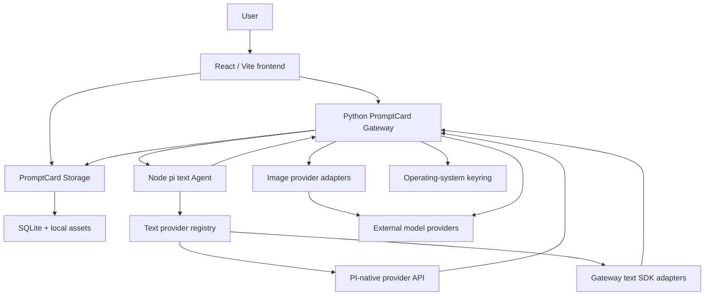
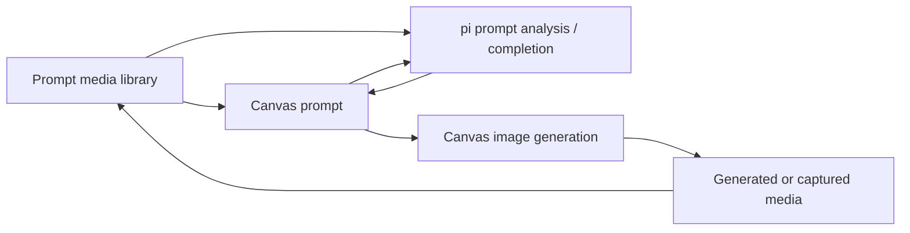

# System Architecture

## Overview

PromptCard-Manager is a local-first prompt and visual-production application. Durable projects, Prompt Library items, media assets, and image-generation history belong to PromptCard Storage. Text-Agent orchestration is intentionally separated from provider access and from frontend writes.

## Runtime Topology

## Ownership

- Frontend: interaction state, Canvas selection, pending proposal UI, explicit Apply/Reject actions, and existing Canvas/image-generation components.
- PromptCard Storage: projects, Prompt Library, media assets, captures, image conversations, immutable runs, placements, and derivatives.
- Python Gateway: browser session and CSRF boundary, model catalog/connections/assignments, keyring access, secure PI-native forwarding, SDK-backed text adapters, media loading, and the independent image-generation lifecycle.
- pi text runtime: bounded conversation state, PI provider collection, prompt orchestration, Prompt Library search, and proposal-only tools.

## Minimal Closed Loop

## Text-Agent Flow

1. A Canvas, Prompt Library, or Media Library surface sends a bounded request through `agent-runtime-service.ts`.
2. Vite proxies `/agent-api` to the Python Gateway.
3. The Gateway authenticates the browser request and forwards it to pi using an internal token.
4. pi can search only the supplied Prompt Library snapshot and can emit only tools allowed by the request policy.
5. pi resolves the non-secret `chat.primary` descriptor into its provider collection.
6. PI-native models stream through the credential-injecting Gateway proxy; SDK-backed models use the separate Gateway text-adapter registry.
7. The Gateway validates the proposal again.
8. The frontend displays Apply/Reject. No response mutates durable data automatically.

## Canvas Proposal Rules

- Selected text node: update that exact node only.
- No selected text node: create a new text node only.
- Prompt Library: additive preset creation only.
- Media analysis: read-only response, one selected image, no proposals.

## Image-Generation Isolation

Image generation remains a separate Gateway module using `image.primary`. Image models never enter the PI text provider collection or the text-SDK registry. It does not depend on pi sessions or text-Agent availability. Existing Storage schema v5 conversations, runs, placements, original assets, derivatives, and Recent Capture behavior remain unchanged.

## Local Port Discovery

`scripts/dev-port-runtime.ps1` writes schema version 2 to `logs/dev-runtime.json`, including:

- frontend URL and port;
- Python Gateway URL and health URL;
- pi text Agent URL and health URL;
- Storage URL and health URL.

Browser code continues to use `/agent-api` and `/storage-api`; only launch/proxy configuration knows concrete ports.

## Deferred

- video media analysis;
- durable pi session history;
- production multi-user authentication;
- broader script/storyboard proposal tools.
