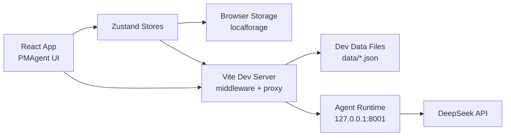

# PMAgent Technical Documentation

This documentation set describes the current PMAgent implementation for developers taking over the project. It is intentionally split by architecture area instead of being kept in a single large document.

## Documentation Map

- [System Architecture](./01-system-architecture.md) explains the runtime topology, major modules, and cross-module data flows.
- [Frontend Application](./02-frontend-application.md) explains the React application shell, screens, navigation, and component ownership.
- [State and Storage](./03-state-and-storage.md) explains Zustand stores, local persistence, dev file persistence, and core schemas.
- [Prompt Library](./04-prompt-library.md) explains the `IPreset` contract, Prompt library behavior, and Agent write proposal safety.
- [Agent Runtime Integration](./05-agent-runtime-integration.md) explains the current DeerFlow integration boundary, frontend service API, local scripts, and safe capability model.
- [Development and Operations](./06-development-and-operations.md) explains local commands, runtime hygiene, dev server control, and troubleshooting.
- [Testing and Quality](./07-testing-and-quality.md) explains current test coverage and recommended verification flows.

## Current Architecture at a Glance

PMAgent is a Vite + React + TypeScript application. Most product state is managed with Zustand stores and persisted in browser storage through `localforage`. In development, Vite middleware also exposes file-backed endpoints for project and Prompt library data.

The Agent Runtime is optional at app startup. When it is running, the frontend reaches it through Vite proxy routes and uses it for DeepSeek-backed Agent runs, runtime catalog discovery, and Prompt library write proposals.

## Main Local Entrypoints

- `npm.cmd run dev` starts the frontend only.
- `npm.cmd run dev:with-agent` starts the frontend and Agent Runtime helper flow.
- `npm.cmd run agent:dev` starts the Agent Runtime only.
- `npm.cmd run agent:check` validates Agent Runtime config loading.
- `npm.cmd run build` runs TypeScript compilation and Vite production build.
- `npm.cmd run test -- --run` runs the Vitest suite once.

## Documentation Policy

These documents describe current code truth. Planned or incomplete capabilities are labeled as **Roadmap / Not Yet Implemented**. Existing legacy documents remain in place and are not rewritten by this documentation set.
