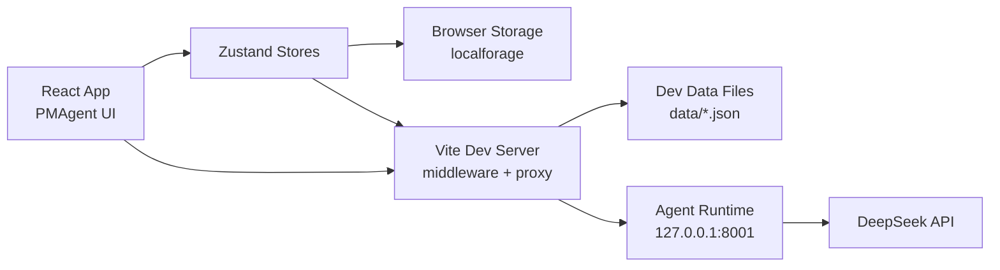

# PMAgent Technical Documentation

> **Archived legacy snapshot.** This file describes an earlier browser-storage/DeerFlow architecture and is retained only for historical context. It is not the current implementation contract. Start from the [maintained documentation index](../../README.md).

The maintained documentation is split by architecture area instead of being kept in a single large document.

## Documentation Map

- [System Architecture](../../architecture/system-architecture.md) explains the runtime topology, major modules, and cross-module data flows.
- [Frontend Application](../../frontend/app-shell.md) explains the React application shell, screens, navigation, and component ownership.
- [State and Storage](../../frontend/state-management.md) explains Zustand stores, durable boundaries, and core schemas.
- [Prompt Library](../../frontend/prompt-library.md) explains the `IPreset` contract, Prompt Library behavior, and Agent proposal safety.
- [Agent Runtime Integration](../../backend/agent-runtime.md) explains the maintained Gateway/pi boundary, frontend service API, local scripts, and safe capability model.
- [Development and Operations](../../operations/local-development.md) explains local commands, runtime hygiene, development service control, and troubleshooting.
- [Testing and Quality](../../quality/testing-strategy.md) explains current test coverage and recommended verification flows.

## Current Architecture at a Glance

PMAgent is a Vite + React + TypeScript application. Most product state is managed with Zustand stores and persisted in browser storage through `localforage`. In development, Vite middleware also exposes file-backed endpoints for project and Prompt library data.

The Agent Runtime is optional at app startup. When it is running, the frontend reaches it through Vite proxy routes and uses it for DeepSeek-backed Agent runs, runtime catalog discovery, and Prompt library write proposals.

```mermaid
flowchart LR
  Browser["React App<br/>PMAgent UI"]
  Stores["Zustand Stores"]
  Localforage["Browser Storage<br/>localforage"]
  Vite["Vite Dev Server<br/>middleware + proxy"]
  DataFiles["Dev Data Files<br/>data/*.json"]
  AgentRuntime["Agent Runtime<br/>127.0.0.1:8001"]
  DeepSeek["DeepSeek API"]

  Browser --> Stores
  Stores --> Localforage
  Stores --> Vite
  Vite --> DataFiles
  Browser --> Vite
  Vite --> AgentRuntime
  AgentRuntime --> DeepSeek
```

## Main Local Entrypoints

- `npm.cmd run dev` starts the frontend only.
- `npm.cmd run dev:with-agent` starts the frontend and Agent Runtime helper flow.
- `npm.cmd run agent:dev` starts the Agent Runtime only.
- `npm.cmd run agent:check` validates Agent Runtime config loading.
- `npm.cmd run build` runs TypeScript compilation and Vite production build.
- `npm.cmd run test -- --run` runs the Vitest suite once.

## Documentation Policy

This archived body records the code truth at the time it was written. It must not be used as a current API, persistence, Agent, or operations contract; follow the maintained pages linked above.
