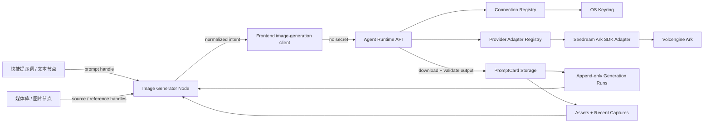

# Doubao Seedream 5.0 Pro 画布图片节点与模型管理重构实施计划

> **For agentic workers:** REQUIRED SUB-SKILL: Use superpowers:subagent-driven-development (recommended) or superpowers:executing-plans to implement this plan task-by-task. Steps use checkbox (`- [ ]`) syntax for tracking.

**Goal:** 在当前 PromptCard 画布项目模式中交付可真实运行的 Doubao Seedream 5.0 Pro 图片生成节点，打通快捷提示词、媒体资产、参考图、智能改图、区域重绘、永久生成历史、安全凭据与可替换的模型管理体系。

**Architecture:** 保持 ReactFlow 负责画布交互，新增类型化图片生成节点和端口；浏览器只提交规范化的生成意图，不接触 API Key。Agent Runtime 后端负责模型连接、操作系统凭据库、Seedream 适配器与官方 Ark SDK 调用；PromptCard Storage 负责追加式生成历史、输出资产和媒体库闭环。模型节点绑定 `connectionId + modelId`，通用能力清单与供应商适配器隔离 UI 和 Seedream 私有参数，为后续切换模型保留稳定槽位。

**Tech Stack:** React 18.3.1、TypeScript 5.9.3、Vite 5.4.21、@xyflow/react 12.11.0、Zustand 4.5.7、FastAPI、SQLite、Python 3.12、`volcengine-python-sdk[ark]==5.0.36`、`keyring==25.7.0`、pytest、Vitest、Playwright。

## Global Constraints

- 只在当前仓库和当前分支 `plan/seedream-image-node-integration` 内实施；禁止 worktree、临时克隆和将依赖或构建输出放到 C:。
- 实施前从本计划分支再创建同仓库功能分支；每个任务遵循测试先失败、最小实现、测试通过、检查 diff、提交的循环。
- 不改动 `threeStage.meta.freeCanvas`；本期唯一目标是 `IPromptProject.freeCanvas`。
- 浏览器、项目 JSON、PromptCard SQLite、日志、错误响应、生成历史都不得出现明文 API Key。
- 生成历史是追加式永久记录：节点删除、项目进入回收站或项目被永久删除都不自动删除历史和其输出资产。只有后续独立的“数据抹除”管理功能可以显式清除；本期不提供清除入口。
- Seedream 5.0 Pro 每次请求只生成一张图；不伪造多图、流式进度、4K、原生 mask 或取消能力。
- `@参考图` 是应用层语法，不直接透传给模型 API；应用将稳定引用编译为有序 `image[]` 和提示词中的“图1/图2”。
- 区域重绘采用官方点/框提示词语义（归一化到 0–999），不把它声明为供应商原生 mask API。
- Agent Runtime 的 `app` 层可以调用供应商 SDK；`packages/harness` 不得导入 `app`，本期不修改 harness 依赖方向。
- 根据后端仓库约束，后端行为变化必须同步更新根 `README.md`、根 `CLAUDE.md`、`agent-runtime/backend/README.md` 和 `agent-runtime/backend/CLAUDE.md` 中相关章节。

---

## 1. 已确认事实与范围

### 1.1 当前仓库事实

- 目标画布数据在 `src/models/PromptHistory.model.ts` 的 `IPromptProject.freeCanvas`，当前节点仅有 `text | image | arrow`。
- `src/domain/free-canvas/free-canvas-project.ts` 会把未知节点降级为空文本节点，因此必须先升级持久化类型和归一化，再渲染新节点。
- `src/components/canvas/FreeCanvasBuilderScreen.tsx` 当前只有一个 ReactFlow node type，连线只校验自连与重复边，边未持久化 handle、输入角色或顺序。
- 快捷提示词来自 `src/domain/prompt-library/quick-messages.ts`，图片经 `src/components/canvas/canvas-image-assets.ts` 上传到 PromptCard Storage。
- 现有“媒体库”实际由 `recent_captures` 驱动；生成结果必须同时拥有 asset 与 `purpose: generatedResult` 的 recent capture。
- 项目使用完整 JSON payload 与 revision 乐观锁保存；永久历史不能只放在项目 JSON 中。
- 当前模型配置是 DeepSeek 单例，并把 `apiKey` 明文写入 `DEER_FLOW_HOME/promptcard-model-config.json`；该实现必须迁移并停止写明文。
- 桌面启动顺序为 PowerShell `beforeDevCommand` 先启动 Python 服务，再启动 Tauri；因此 Tauri Stronghold 无法向已启动的 Python SDK安全注入密钥。本期采用 Python `keyring` 直连操作系统凭据库。

### 1.2 Seedream 5.0 Pro 能力边界

| 能力 | 一期实现 | 适配规则 |
|---|---:|---|
| 文生图 | 是 | `prompt`，无参考图 |
| 单图改图 | 是 | 1 张 source image |
| 多图全能参考 | 是 | 总参考图上限 10，稳定排序后传 `image[]` |
| `@` 引用 | 是 | 应用 token 绑定 `refId`，编译为“图N” |
| 点选局部修改 | 是 | 编译 `<point>x y</point>`，坐标 0–999 |
| 框选局部修改 | 是 | 编译 `<bbox>x1 y1 x2 y2</bbox>`，坐标 0–999 |
| 原生 mask | 否 | 能力清单保留 `mask` 枚举，Seedream manifest 为 false |
| 分辨率 | 1K、2K | 不展示 4K；支持官方比例预设与合法自定义宽高 |
| 一次多张 | 否 | 单次 run 单输出；“再次生成”创建新 run |
| 流式进度 | 否 | 状态仅 queued/running/succeeded/failed |
| 输出 | PNG/JPEG | URL 响应立即下载到本地 asset；不依赖 24 小时临时 URL |

### 1.3 非目标

- 不在一期接入第二个真实图片供应商。
- 不把聊天 Agent、图片生成和视频生成强行合并成一个请求模型。
- 不实现云端账号同步、团队共享、计费充值、批量并发队列、任务取消或历史物理删除。
- 不重构无关画布节点、快捷提示词编辑器或全部媒体库信息架构。

## 2. 目标架构与边界



### 2.1 职责划分

| 层 | 负责 | 不负责 |
|---|---|---|
| React/ReactFlow | 端口、连线、参数编辑、`@` token、区域标记、状态展示 | 保存密钥、调用 Ark、信任远程 URL |
| Agent Runtime | 连接管理、密钥引用、能力校验、SDK 调用、结果下载编排 | 永久保存二进制资产、把供应商对象直接暴露给前端 |
| PromptCard Storage | 追加式 run、资产、recent capture、备份与引用诊断 | 供应商鉴权、模型调用 |
| Provider Adapter | 通用意图到 Seedream SDK参数、错误归一化 | UI 状态、项目持久化 |

### 2.2 模型可替换槽位

前端节点只持久化：

```ts
interface ImageModelBinding {
  connectionId: string;
  modelId: string;
}
```

通用模型目录由后端返回：

```ts
type ModelModality = 'chat' | 'image';
type ImageGenerationMode = 'generate' | 'edit' | 'region-edit';

interface ImageModelCapabilities {
  modes: ImageGenerationMode[];
  maxReferenceImages: number;
  mentionStrategy: 'ordered-image-labels' | 'native-named-reference';
  regionInputs: Array<'point' | 'bbox' | 'mask'>;
  resolutions: Array<'1K' | '2K' | '4K'>;
  aspectRatios: string[];
  outputCount: { min: number; max: number };
  streaming: boolean;
}

interface ModelCatalogEntry {
  providerId: string;
  modelId: string;
  displayName: string;
  modality: ModelModality;
  capabilities: ImageModelCapabilities | ChatModelCapabilities;
}
```

Seedream manifest 固定声明 `modelId: doubao-seedream-5-0-pro-260628`、最大 10 图、1K/2K、单输出、非流式、point/bbox。

## 3. 数据契约

### 3.1 画布节点与类型化边

在 `src/models/PromptHistory.model.ts` 增加：

```ts
type FreeCanvasNodeKind = 'text' | 'image' | 'arrow' | 'image-generator';
type ImageInputRole = 'prompt' | 'source-image' | 'reference-image';

interface IFreeCanvasImageGeneratorNode extends IFreeCanvasNodeBase {
  kind: 'image-generator';
  mode: 'generate' | 'edit' | 'region-edit';
  binding: ImageModelBinding;
  settings: {
    resolution: '1K' | '2K';
    aspectRatio: 'smart' | '1:1' | '4:3' | '3:4' | '16:9' | '9:16' | '3:2' | '2:3' | '21:9' | 'custom';
    width?: number;
    height?: number;
    outputFormat: 'png' | 'jpeg';
    watermark: boolean;
  };
  promptDocument: PromptDocument;
  regions: ImageRegion[];
  activeRunId?: string;
  primaryAssetId?: string;
}

interface IFreeCanvasEdge {
  id: string;
  source: string;
  target: string;
  sourceHandle?: string;
  targetHandle?: ImageInputRole;
  inputOrder?: number;
  referenceId?: string;
  label?: string;
  createdAt: number;
}
```

约束：`prompt` 0..1、`source-image` 0..1、`reference-image` 0..10；参考图的 `inputOrder` 必须在目标节点内唯一且连续，删除/重连后重新编号。

### 3.2 结构化 `@` 提示词

```ts
type PromptSegment =
  | { type: 'text'; text: string }
  | { type: 'reference'; referenceId: string; label: string };

interface PromptDocument {
  version: 1;
  segments: PromptSegment[];
}
```

显示 label 可以随资源标题变化，但 `referenceId` 不变。生成前根据类型化边的 `inputOrder` 建立 `referenceId -> 图N` 映射；失效 token 阻止提交并明确提示，不静默删词。

### 3.3 区域标记

```ts
type ImageRegion =
  | { id: string; referenceId: string; kind: 'point'; x: number; y: number }
  | { id: string; referenceId: string; kind: 'bbox'; x1: number; y1: number; x2: number; y2: number };
```

持久化坐标统一为 0..999 整数。UI 缩放、DPI、裁剪只影响显示换算，不改存储语义。点/框必须位于图像范围内，bbox 必须满足 `x1 < x2 && y1 < y2`。

### 3.4 永久生成历史

PromptCard Storage schema v3 新增 `image_generation_runs`，一条点击对应一条不可替换的记录：

```ts
type GenerationRunState = 'queued' | 'running' | 'succeeded' | 'failed';

interface ImageGenerationRun {
  id: string;
  projectId: string;
  nodeId: string;
  connectionId: string;
  providerId: string;
  modelId: string;
  state: GenerationRunState;
  requestSnapshot: ImageGenerationIntent;
  providerRequestId?: string;
  outputAssetIds: string[];
  usage?: { inputImages?: number; generatedImages?: number; outputTokens?: number; totalTokens?: number };
  error?: { code: string; message: string; retryable: boolean };
  createdAt: number;
  startedAt?: number;
  finishedAt?: number;
}
```

数据库列至少包含 `id`、`project_id`、`node_id`、`connection_id`、`provider_id`、`model_id`、`state`、`created_at`、`started_at`、`finished_at`、`payload_json`，并建立 `(project_id, created_at DESC)`、`(node_id, created_at DESC)` 索引。

永久含义：

- 创建后只允许状态机更新 `queued -> running -> succeeded|failed`，禁止覆盖 request snapshot、模型身份和创建时间。
- 不提供 DELETE route；节点或项目删除不级联 run。
- `outputAssetIds` 被资产诊断器视为强引用，防止输出文件成为 orphan。
- 备份必须同时包含 schema v3、runs 和被引用 assets。
- 历史查询支持按 project、node、cursor 分页；默认 50，最大 100，避免一次加载全量永久数据。

### 3.5 模型管理数据

非敏感连接配置仍存 `DEER_FLOW_HOME`，文件改为 `promptcard-model-connections.json`：

```ts
interface ModelConnection {
  id: string;
  providerId: 'deepseek' | 'volcengine-ark';
  displayName: string;
  apiBase: string;
  credentialRef: string;
  enabled: boolean;
  createdAt: number;
  updatedAt: number;
  lastTest?: { ok: boolean; checkedAt: number; message: string };
}

interface ModelAssignment {
  slot: 'chat.primary' | 'image.primary';
  connectionId: string;
  modelId: string;
}
```

密钥以 `serviceName = dev.promptcard.manager.shell`、`username = connection:<uuid>` 存入 OS keyring。配置和接口只返回 `credentialConfigured: boolean` 与固定掩码 `••••••••`，不返回首尾字符。

## 4. API 契约

### 4.1 Agent Runtime 模型管理

| Method | Path | 行为 |
|---|---|---|
| GET | `/api/promptcard/runtime/model-catalog` | 返回内置 provider/model manifest |
| GET | `/api/promptcard/runtime/model-connections` | 返回非敏感连接列表 |
| POST | `/api/promptcard/runtime/model-connections` | 创建连接；请求中的 credential 直接写 keyring |
| PUT | `/api/promptcard/runtime/model-connections/{id}` | 更新元数据；credential 省略表示不变，空字符串表示删除 |
| POST | `/api/promptcard/runtime/model-connections/{id}/test` | 后端取 keyring secret 并执行最小供应商探测 |
| GET | `/api/promptcard/runtime/model-assignments` | 返回槽位绑定 |
| PUT | `/api/promptcard/runtime/model-assignments/{slot}` | 校验连接、模型和 modality 后写入 |

所有连接写接口沿用现有本地认证边界；新增服务端 allowlist：DeepSeek 默认只允许 `https://api.deepseek.com`，Ark 默认只允许 `https://ark.cn-beijing.volces.com/api/v3`。开发者自定义 base URL 必须显式开启高级开关，且只允许 HTTPS、公网域名、无 userinfo、无 query/fragment，解析后拒绝 loopback、link-local、private、multicast 和保留地址。

### 4.2 Agent Runtime 图片生成

`POST /api/promptcard/runtime/image-generations` 请求：

```json
{
  "runId": "run_uuid",
  "projectId": "project_id",
  "nodeId": "node_id",
  "binding": {
    "connectionId": "connection_uuid",
    "modelId": "doubao-seedream-5-0-pro-260628"
  },
  "mode": "region-edit",
  "promptDocument": {
    "version": 1,
    "segments": [
      { "type": "text", "text": "保留主体材质，将" },
      { "type": "reference", "referenceId": "ref_product", "label": "产品" },
      { "type": "text", "text": "背景改为雾蓝色" }
    ]
  },
  "inputs": [
    { "referenceId": "ref_product", "role": "source-image", "assetId": "asset_1", "order": 0 }
  ],
  "regions": [
    { "id": "region_1", "referenceId": "ref_product", "kind": "bbox", "x1": 120, "y1": 80, "x2": 860, "y2": 720 }
  ],
  "settings": {
    "resolution": "2K",
    "aspectRatio": "1:1",
    "outputFormat": "png",
    "watermark": true
  }
}
```

响应只返回本地持久化结果：

```json
{
  "run": { "id": "run_uuid", "state": "succeeded", "outputAssetIds": ["asset_uuid"] },
  "asset": { "id": "asset_uuid", "contentType": "image/png", "width": 2048, "height": 2048 },
  "recentCapture": { "id": "capture_uuid", "purpose": "generatedResult" }
}
```

请求是同步非流式的一期实现，但 run 状态先写 `queued`、SDK 前写 `running`，任何终态都落库；浏览器断开不撤销 run。

### 4.3 PromptCard Storage 历史接口

| Method | Path | 行为 |
|---|---|---|
| POST | `/api/image-generation-runs` | 创建 queued run，重复 id 返回 409 |
| PATCH | `/api/image-generation-runs/{id}/state` | 仅允许合法状态迁移与终态字段 |
| GET | `/api/image-generation-runs?projectId=&nodeId=&cursor=&limit=` | 按创建时间倒序分页 |
| GET | `/api/image-generation-runs/{id}` | 返回单条完整快照 |

该接口不接受 secret、远程输出 URL 或任意文件路径。Agent Runtime 使用现有 storage service client 访问它。

## 5. 安全设计与威胁模型

| 威胁 | 控制 |
|---|---|
| WebView/XSS 窃取 API Key | secret 不进入前端；CORS 仅本地可信 origin；响应永不回显 secret |
| 明文落盘 | keyring 25.7.0；JSON 只存 `credentialRef`；旧明文迁移成功后原子重写并删除 key |
| 日志泄露 | 集中 redaction；异常只保留供应商 request id、归一化 code，不记录 header/完整 SDK对象 |
| 自定义 base URL SSRF | HTTPS、host allowlist、DNS/IP 分类校验、禁重定向到非许可主机 |
| 供应商结果 URL SSRF | 只接受 HTTPS；首个 URL 与每次 redirect 都验证 Volcengine CDN allowlist；限制响应字节数、超时、content type、图像解码尺寸 |
| 恶意参考文件 | 只通过 assetId 读取存储服务；验证 MIME、实际图像解码、单图大小和总图数量 |
| 重放/重复点击 | 前端生成 runId；Storage 唯一键提供幂等边界；重复 POST 返回现有终态或 409，不发第二次模型请求 |
| 跨项目引用 | 生成前确认输入 asset 与当前项目/媒体记录可访问；run 的 projectId/nodeId 与请求上下文一致 |
| 历史无限增长 | 用户明确要求永久保留；采用分页、索引、备份容量提示，不自动清理 |
| 旧配置迁移失败 | 先写 keyring并读回验证，再写新配置，最后移除旧 `apiKey`；任一步失败保留原文件并返回可恢复错误 |
| 无可用系统 keyring | 禁止保存 credential，UI 显示平台错误；不降级为明文文件或 localStorage |

密钥生命周期：

1. 前端创建/更新连接时 secret 仅存在于受控密码输入框和一次 HTTPS/localhost API 请求体内。
2. 后端立即调用 `keyring.set_password`，再清空局部变量引用；配置只写 `credentialRef`。
3. SDK 调用前按 ref 读取，直接传 `Ark(api_key=...)`，不设置进程级环境变量。
4. 测试、错误、审计只记录 connectionId/providerId/modelId/requestId。
5. 删除连接时先检查 assignment/node 引用；确认无引用后删除 keyring entry，再删除非敏感配置。

## 6. 文件责任图

### 前端新增

- `src/domain/models/model-management.ts`：provider、catalog、connection、assignment 契约。
- `src/domain/image-generation/image-generation.ts`：通用意图、能力校验、run 类型。
- `src/domain/image-generation/prompt-compiler.ts`：结构化 `@` token 到通用有序引用文本。
- `src/domain/image-generation/regions.ts`：坐标归一化与验证。
- `src/services/model-management-client.ts`：通用模型管理 API。
- `src/services/image-generation-client.ts`：生成与历史 API。
- `src/components/canvas/nodes/ImageGeneratorNode.tsx`：节点壳、handles、状态与结果。
- `src/components/canvas/image-generation/ImageGeneratorInspector.tsx`：模式、尺寸、模型、生成动作。
- `src/components/canvas/image-generation/ReferencePromptEditor.tsx`：`@` token 编辑器。
- `src/components/canvas/image-generation/RegionEditorDialog.tsx`：点/框区域编辑。
- `src/components/settings/ModelManagementPanel.tsx`：连接、模型和 slot 管理。
- 对应 `.test.ts` / `.test.tsx` 文件。

### 前端修改

- `src/models/PromptHistory.model.ts`
- `src/domain/free-canvas/free-canvas-project.ts`
- `src/components/canvas/FreeCanvasBuilderScreen.tsx`
- `src/storage/storage-service-client.ts`
- `src/features/media/capture-canvas-placement.ts`
- `src/components/AgentDashboard.tsx`
- `src/services/agent-runtime-service.ts`
- `src/App.tsx`

### Agent Runtime 新增

- `agent-runtime/backend/app/gateway/model_management/contracts.py`
- `agent-runtime/backend/app/gateway/model_management/catalog.py`
- `agent-runtime/backend/app/gateway/model_management/connection_store.py`
- `agent-runtime/backend/app/gateway/model_management/credential_store.py`
- `agent-runtime/backend/app/gateway/model_management/migration.py`
- `agent-runtime/backend/app/gateway/image_generation/contracts.py`
- `agent-runtime/backend/app/gateway/image_generation/prompt_compiler.py`
- `agent-runtime/backend/app/gateway/image_generation/service.py`
- `agent-runtime/backend/app/gateway/image_generation/result_fetcher.py`
- `agent-runtime/backend/app/gateway/image_generation/providers/base.py`
- `agent-runtime/backend/app/gateway/image_generation/providers/volcengine_seedream.py`
- `agent-runtime/backend/app/gateway/routers/model_management.py`
- `agent-runtime/backend/app/gateway/routers/image_generation.py`
- 对应 `agent-runtime/backend/tests/` 测试。

### PromptCard Storage 新增/修改

- 新增 `promptcard_storage/image_runs.py`
- 修改 `promptcard_storage/store.py`
- 修改 `promptcard_storage/app.py`
- 修改 `promptcard_storage/assets.py`
- 新增 `promptcard_storage/tests/test_image_runs.py`
- 修改 `promptcard_storage/tests/test_assets.py`
- 修改 schema/backup 相关测试。

## 7. 分阶段实施任务

### Task 1: 固化通用模型目录、连接和图片生成领域契约

**Files:**

- Create: `src/domain/models/model-management.ts`
- Create: `src/domain/models/model-management.test.ts`
- Create: `src/domain/image-generation/image-generation.ts`
- Create: `src/domain/image-generation/image-generation.test.ts`

- [ ] **Step 1: 写失败测试——Seedream manifest 与模型 slot 校验**

覆盖：`image.primary` 不能绑定 chat 模型；Seedream 只允许 1K/2K、最多 10 图、单输出；`region-edit` 必须有 source image 和至少一个 point/bbox。

- [ ] **Step 2: 运行测试确认失败**

Run: `npm.cmd test -- src/domain/models/model-management.test.ts src/domain/image-generation/image-generation.test.ts`

Expected: FAIL，模块尚不存在。

- [ ] **Step 3: 实现最小领域类型、Seedream manifest 和纯函数校验器**

校验返回稳定错误码，如 `missing_prompt`、`too_many_references`、`unsupported_resolution`、`missing_region`，UI 文案不写入领域层。

- [ ] **Step 4: 运行测试与类型检查**

Run: `npm.cmd test -- src/domain/models/model-management.test.ts src/domain/image-generation/image-generation.test.ts`

Run: `npm.cmd run typecheck`

Expected: PASS。

- [ ] **Step 5: 提交**

```bash
git add src/domain/models src/domain/image-generation
git commit -m "feat: define provider-neutral image model contracts"
```

### Task 2: 升级自由画布持久化类型、节点归一化和类型化边

**Files:**

- Modify: `src/models/PromptHistory.model.ts`
- Modify: `src/domain/free-canvas/free-canvas-project.ts`
- Modify: `src/domain/free-canvas/free-canvas-project.test.ts`
- Create: `src/domain/free-canvas/image-generator-connections.ts`
- Create: `src/domain/free-canvas/image-generator-connections.test.ts`

- [ ] **Step 1: 写失败测试——新节点 round-trip 不降级**

覆盖 generator node 的 mode/binding/settings/promptDocument/regions/activeRunId/primaryAssetId；旧 text/image/arrow payload 保持兼容。

- [ ] **Step 2: 写失败测试——端口基数和参考图顺序**

覆盖第二条 prompt 边被拒绝、第 11 张参考图被拒绝、删除中间参考边后 `inputOrder` 重排、非图片节点不能连接图片端口。

- [ ] **Step 3: 运行目标测试确认失败**

Run: `npm.cmd test -- src/domain/free-canvas/free-canvas-project.test.ts src/domain/free-canvas/image-generator-connections.test.ts`

Expected: FAIL，新 kind 和字段未识别。

- [ ] **Step 4: 实现 schema vNext 归一化与纯函数连接验证**

不修改三阶段画布 schema；缺失新字段的 generator payload 使用明确默认值，损坏 binding 返回安全默认节点并记录 validation warning，不降级为 text。

- [ ] **Step 5: 重跑测试与类型检查**

Run: `npm.cmd test -- src/domain/free-canvas/free-canvas-project.test.ts src/domain/free-canvas/image-generator-connections.test.ts`

Run: `npm.cmd run typecheck`

Expected: PASS。

- [ ] **Step 6: 提交**

```bash
git add src/models/PromptHistory.model.ts src/domain/free-canvas
git commit -m "feat: persist typed image generator canvas nodes"
```

### Task 3: 建立追加式永久生成历史和资产强引用

**Files:**

- Create: `promptcard_storage/image_runs.py`
- Create: `promptcard_storage/tests/test_image_runs.py`
- Modify: `promptcard_storage/store.py`
- Modify: `promptcard_storage/app.py`
- Modify: `promptcard_storage/assets.py`
- Modify: `promptcard_storage/tests/test_assets.py`
- Modify: `promptcard_storage/tests/test_backup.py`

- [ ] **Step 1: 写失败测试——schema v2 到 v3 原地迁移**

断言已有 projects/presets/recent_captures 不变，新增 run 表与两个索引，`schema_migrations` 记录 version 3。

- [ ] **Step 2: 写失败测试——追加、状态机和幂等**

断言重复 run id 为 409；只允许 queued→running→terminal；terminal 不可回退；snapshot 不可被 patch 修改；不存在 DELETE route。

- [ ] **Step 3: 写失败测试——永久语义与分页**

断言删除节点/项目 payload 不影响 run；项目永久删除后 run 仍可按 projectId 查询；cursor 稳定分页且 limit 最大 100。

- [ ] **Step 4: 写失败测试——历史输出保护资产**

断言只被成功 run 引用的 asset 不出现在 orphan diagnostics；备份包含数据库和该 asset。

- [ ] **Step 5: 运行测试确认失败**

Run: `python -m pytest promptcard_storage/tests/test_image_runs.py promptcard_storage/tests/test_assets.py promptcard_storage/tests/test_backup.py -q`

Expected: FAIL，schema/API 尚不存在。

- [ ] **Step 6: 实现 schema v3、run store、route 和资产引用扫描**

`image_runs.py` 负责 normalize、状态转换和分页；`store.py` 只编排数据库；`app.py` 只做 HTTP 映射。run payload 禁止 secret/remoteUrl/path 字段。

- [ ] **Step 7: 重跑全套 storage 测试**

Run: `python -m pytest promptcard_storage/tests -q`

Expected: PASS。

- [ ] **Step 8: 提交**

```bash
git add promptcard_storage
git commit -m "feat: persist append-only image generation history"
```

### Task 4: 引入 OS Keyring 并建立安全凭据抽象

**Files:**

- Modify: `agent-runtime/backend/pyproject.toml`
- Modify: `agent-runtime/backend/uv.lock`
- Create: `agent-runtime/backend/app/gateway/model_management/credential_store.py`
- Create: `agent-runtime/backend/tests/test_credential_store.py`

- [ ] **Step 1: 在当前仓库环境锁定依赖**

Run from `agent-runtime/backend`: `uv add "keyring==25.7.0"`

Expected: `.venv` 与 `.uv-cache` 仍位于当前 F: 工作区，`uv.lock` 记录精确版本。

- [ ] **Step 2: 写失败测试——secret 只进入 keyring backend**

注入内存 fake backend，覆盖 set/get/delete、不可用 backend、空 secret、稳定 service/username 命名；断言异常和 repr 不含 secret。

- [ ] **Step 3: 运行测试确认失败**

Run: `uv run pytest tests/test_credential_store.py -q`

Expected: FAIL，credential store 尚不存在。

- [ ] **Step 4: 实现 `CredentialStore` 协议与 `SystemKeyringCredentialStore`**

禁止文件 fallback；`keyring.errors.KeyringError` 归一化为 `credential_store_unavailable`；提供依赖注入以便测试。

- [ ] **Step 5: 重跑测试与 lint**

Run: `uv run pytest tests/test_credential_store.py -q`

Run: `uv run ruff check app/gateway/model_management tests/test_credential_store.py`

Expected: PASS。

- [ ] **Step 6: 提交**

```bash
git add agent-runtime/backend/pyproject.toml agent-runtime/backend/uv.lock agent-runtime/backend/app/gateway/model_management agent-runtime/backend/tests/test_credential_store.py
git commit -m "feat: store model credentials in the system keyring"
```

### Task 5: 将 DeepSeek 单例重构为通用连接、目录和 assignment

**Files:**

- Create: `agent-runtime/backend/app/gateway/model_management/contracts.py`
- Create: `agent-runtime/backend/app/gateway/model_management/catalog.py`
- Create: `agent-runtime/backend/app/gateway/model_management/connection_store.py`
- Create: `agent-runtime/backend/app/gateway/model_management/migration.py`
- Create: `agent-runtime/backend/app/gateway/routers/model_management.py`
- Create: `agent-runtime/backend/tests/test_model_connections.py`
- Create: `agent-runtime/backend/tests/test_model_config_migration.py`
- Modify: `agent-runtime/backend/app/gateway/app.py`
- Modify: `agent-runtime/backend/app/gateway/promptcard_runtime.py`
- Modify: `agent-runtime/backend/app/gateway/routers/promptcard_runtime.py`
- Modify: `agent-runtime/backend/tests/test_model_config.py`

- [ ] **Step 1: 写失败测试——目录与 CRUD 不回显 secret**

覆盖 DeepSeek/Ark provider、chat/image manifest、创建/更新/测试/删除连接、slot modality 校验、响应和日志序列化不含请求 secret。

- [ ] **Step 2: 写失败测试——旧明文配置原子迁移**

给定旧 `promptcard-model-config.json`：先写 keyring并读回；生成新连接与 `chat.primary`；删除 JSON 中 `apiKey`。模拟 keyring失败时旧文件字节级不变。

- [ ] **Step 3: 运行测试确认失败**

Run: `uv run pytest tests/test_model_connections.py tests/test_model_config_migration.py tests/test_model_config.py -q`

Expected: FAIL，新路由/迁移器不存在。

- [ ] **Step 4: 实现 connection store 与只读 catalog**

连接配置使用原子临时文件替换；写入前校验 providerId、base URL 和唯一 id；assignment 不能引用 disabled/missing connection。

- [ ] **Step 5: 实现一次性旧配置迁移和兼容读取窗口**

`promptcard_runtime.py` 改为从 `chat.primary` 解析当前聊天模型并只在内存注入 secret；旧 `/model-config` 路由暂时转换到新 connection 以兼容现有 UI，标注内部弃用但不删除。

- [ ] **Step 6: 重跑测试**

Run: `uv run pytest tests/test_model_connections.py tests/test_model_config_migration.py tests/test_model_config.py -q`

Run: `uv run ruff check app/gateway/model_management app/gateway/promptcard_runtime.py app/gateway/routers/model_management.py`

Expected: PASS。

- [ ] **Step 7: 提交**

```bash
git add agent-runtime/backend/app/gateway agent-runtime/backend/tests
git commit -m "refactor: replace singleton model config with connections and slots"
```

### Task 6: 安装 Ark SDK 并实现 Seedream 供应商适配器

**Files:**

- Modify: `agent-runtime/backend/pyproject.toml`
- Modify: `agent-runtime/backend/uv.lock`
- Create: `agent-runtime/backend/app/gateway/image_generation/contracts.py`
- Create: `agent-runtime/backend/app/gateway/image_generation/prompt_compiler.py`
- Create: `agent-runtime/backend/app/gateway/image_generation/providers/base.py`
- Create: `agent-runtime/backend/app/gateway/image_generation/providers/volcengine_seedream.py`
- Create: `agent-runtime/backend/tests/test_seedream_prompt_compiler.py`
- Create: `agent-runtime/backend/tests/test_seedream_provider.py`

- [ ] **Step 1: 锁定官方 SDK**

Run from `agent-runtime/backend`: `uv add "volcengine-python-sdk[ark]==5.0.36"`

Expected: 可导入 `from volcenginesdkarkruntime import Ark`，lockfile 精确固定 5.0.36。

- [ ] **Step 2: 写失败测试——`@` 与区域提示词编译**

固定输入顺序，断言 reference token 编译为“图1/图2”；point/bbox 编译为对应图片标签后的官方 tag；缺失 referenceId、重复 order、越界坐标明确失败。

- [ ] **Step 3: 写失败测试——SDK 参数映射**

用 fake Ark client 断言：`model`、`prompt`、`image`、`size`、`output_format`、`response_format='url'`、`watermark` 精确传递；不传 4K、stream、sequential 或 mask 字段。

- [ ] **Step 4: 运行测试确认失败**

Run: `uv run pytest tests/test_seedream_prompt_compiler.py tests/test_seedream_provider.py -q`

Expected: FAIL，适配器尚不存在。

- [ ] **Step 5: 实现 provider protocol、compiler 和 Seedream adapter**

Ark client 通过 factory 注入，测试不访问网络；供应商异常归一化为 `ProviderError(code, message, retryable, request_id)`，message 去除 header/body 中疑似密钥。

- [ ] **Step 6: 重跑测试与 lint**

Run: `uv run pytest tests/test_seedream_prompt_compiler.py tests/test_seedream_provider.py -q`

Run: `uv run ruff check app/gateway/image_generation tests/test_seedream_*.py`

Expected: PASS。

- [ ] **Step 7: 提交**

```bash
git add agent-runtime/backend/pyproject.toml agent-runtime/backend/uv.lock agent-runtime/backend/app/gateway/image_generation agent-runtime/backend/tests/test_seedream_prompt_compiler.py agent-runtime/backend/tests/test_seedream_provider.py
git commit -m "feat: add Seedream Ark SDK provider adapter"
```

### Task 7: 实现安全的生成编排、结果本地化和终态落库

**Files:**

- Create: `agent-runtime/backend/app/gateway/image_generation/result_fetcher.py`
- Create: `agent-runtime/backend/app/gateway/image_generation/service.py`
- Create: `agent-runtime/backend/app/gateway/routers/image_generation.py`
- Create: `agent-runtime/backend/tests/test_image_generation_service.py`
- Create: `agent-runtime/backend/tests/test_image_result_fetcher.py`
- Modify: `agent-runtime/backend/app/gateway/app.py`
- Modify: `agent-runtime/backend/app/gateway/deps.py`

- [ ] **Step 1: 写失败测试——完整成功状态机**

fake Storage 和 fake provider：创建 queued、更新 running、调用一次 SDK、验证并下载输出、上传 asset、创建 generatedResult recent capture、更新 succeeded；断言响应不含 remote URL。

- [ ] **Step 2: 写失败测试——所有失败都有永久终态**

覆盖 credential 缺失、能力校验失败、SDK 429/5xx、URL 拒绝、下载超时、图片解码失败、asset upload 失败；已创建 run 最终必须 failed，错误不含 secret。

- [ ] **Step 3: 写失败测试——SSRF 和下载预算**

拒绝 HTTP、localhost、私网 IP、DNS rebinding 结果、跨 allowlist redirect、非图片 MIME、超过 25 MB、像素炸弹；允许官方 CDN HTTPS 主机。

- [ ] **Step 4: 运行测试确认失败**

Run: `uv run pytest tests/test_image_generation_service.py tests/test_image_result_fetcher.py -q`

Expected: FAIL，service/fetcher 尚不存在。

- [ ] **Step 5: 实现 orchestrator 与 result fetcher**

顺序必须是“先持久化 run，再外部调用”；使用 httpx 独立超时和 redirect hook；下载到内存受限 buffer 后解码验证，再传 PromptCard Storage，不写临时明文/远程文件。

- [ ] **Step 6: 添加每连接并发限制**

一期每个 connection 最多 2 个 running 请求，超限返回 `generation_busy` 且 run 进入 failed/retryable；不引入持久队列。

- [ ] **Step 7: 重跑测试和 Agent Runtime 全套测试**

Run: `uv run pytest tests/test_image_generation_service.py tests/test_image_result_fetcher.py -q`

Run: `uv run pytest tests -q`

Expected: PASS。

- [ ] **Step 8: 提交**

```bash
git add agent-runtime/backend/app/gateway agent-runtime/backend/tests
git commit -m "feat: orchestrate secure persistent image generations"
```

### Task 8: 重做前端模型管理服务和设置面板

**Files:**

- Create: `src/services/model-management-client.ts`
- Create: `src/services/model-management-client.test.ts`
- Create: `src/components/settings/ModelManagementPanel.tsx`
- Create: `src/components/settings/ModelManagementPanel.test.tsx`
- Modify: `src/services/agent-runtime-service.ts`
- Modify: `src/components/AgentDashboard.tsx`
- Modify: `src/App.tsx`

- [ ] **Step 1: 写失败测试——前端 API 契约**

断言连接响应没有 `apiKey` 字段；更新未填写密码不会清空 key；显式“删除凭据”才发送空 credential；slot 与 model catalog 分开加载。

- [ ] **Step 2: 写失败组件测试——通用连接 UI**

覆盖连接列表、provider、模型能力、凭据状态、连接测试、`chat.primary`/`image.primary` 选择；密码输入离开页面后清空，不进入 localStorage/Zustand 持久态。

- [ ] **Step 3: 运行测试确认失败**

Run: `npm.cmd test -- src/services/model-management-client.test.ts src/components/settings/ModelManagementPanel.test.tsx`

Expected: FAIL，新服务/组件不存在。

- [ ] **Step 4: 实现 client 和面板，替换 DeepSeek 专用文案**

保留旧 service 方法作为短期 façade，内部转调通用连接 API，避免同一提交破坏聊天 Agent。

- [ ] **Step 5: 重跑测试、类型检查**

Run: `npm.cmd test -- src/services/model-management-client.test.ts src/components/settings/ModelManagementPanel.test.tsx`

Run: `npm.cmd run typecheck`

Expected: PASS。

- [ ] **Step 6: 提交**

```bash
git add src/services src/components/settings src/components/AgentDashboard.tsx src/App.tsx
git commit -m "feat: add provider-neutral model management UI"
```

### Task 9: 在 ReactFlow 中渲染真实图片生成节点与类型化 handles

**Files:**

- Create: `src/components/canvas/nodes/ImageGeneratorNode.tsx`
- Create: `src/components/canvas/nodes/ImageGeneratorNode.test.tsx`
- Create: `src/components/canvas/image-generation/ImageGeneratorInspector.tsx`
- Create: `src/components/canvas/image-generation/ImageGeneratorInspector.test.tsx`
- Modify: `src/components/canvas/FreeCanvasBuilderScreen.tsx`

- [ ] **Step 1: 写失败测试——节点外观和端口**

断言 prompt/source/reference 三个唯一 target handle、image output handle、当前模型、尺寸、状态、结果缩略图和历史入口可见。

- [ ] **Step 2: 写失败测试——连接校验接入 UI**

断言 UI 调用 Task 2 的纯函数；无效连接不落 project state；有效 reference edge 生成稳定 referenceId/inputOrder。

- [ ] **Step 3: 运行测试确认失败**

Run: `npm.cmd test -- src/components/canvas/nodes/ImageGeneratorNode.test.tsx src/components/canvas/image-generation/ImageGeneratorInspector.test.tsx`

Expected: FAIL，新 node type 尚未注册。

- [ ] **Step 4: 实现节点、inspector 和 nodeTypes 注册**

`FreeCanvasBuilderScreen.tsx` 只负责装配，不把 SDK参数或提示词编译逻辑塞回大组件。

- [ ] **Step 5: 重跑测试和画布回归测试**

Run: `npm.cmd test -- src/components/canvas src/domain/free-canvas`

Run: `npm.cmd run typecheck`

Expected: PASS。

- [ ] **Step 6: 提交**

```bash
git add src/components/canvas src/domain/free-canvas
git commit -m "feat: render typed image generator canvas node"
```

### Task 10: 实现快捷提示词连线和结构化 `@` 多图引用

**Files:**

- Create: `src/domain/image-generation/prompt-compiler.ts`
- Create: `src/domain/image-generation/prompt-compiler.test.ts`
- Create: `src/components/canvas/image-generation/ReferencePromptEditor.tsx`
- Create: `src/components/canvas/image-generation/ReferencePromptEditor.test.tsx`
- Modify: `src/components/canvas/FreeCanvasBuilderScreen.tsx`
- Modify: `src/domain/prompt-library/quick-messages.ts`

- [ ] **Step 1: 写失败测试——连接输入到 prompt snapshot**

文本节点/快捷提示词连接后作为基础 prompt；本地节点 override 与连线输入的优先级明确为“节点编辑器显式内容优先，否则读取上游文本快照”。生成 run 保存最终 snapshot，之后上游修改不篡改历史。

- [ ] **Step 2: 写失败测试——`@` 菜单和 token 稳定性**

只列出已连接 source/reference 图片；选择后插入 reference segment；断开图片后 token 标记失效并阻止生成；重排边后 token 身份不变但编译后的图号更新。

- [ ] **Step 3: 运行测试确认失败**

Run: `npm.cmd test -- src/domain/image-generation/prompt-compiler.test.ts src/components/canvas/image-generation/ReferencePromptEditor.test.tsx`

Expected: FAIL。

- [ ] **Step 4: 实现纯函数 compiler 与受控 token editor**

不依赖 contentEditable DOM HTML 作为存储格式；组件只编辑 `PromptDocument`。

- [ ] **Step 5: 重跑测试**

Run: `npm.cmd test -- src/domain/image-generation/prompt-compiler.test.ts src/components/canvas/image-generation/ReferencePromptEditor.test.tsx`

Run: `npm.cmd run typecheck`

Expected: PASS。

- [ ] **Step 6: 提交**

```bash
git add src/domain/image-generation src/components/canvas/image-generation src/components/canvas/FreeCanvasBuilderScreen.tsx src/domain/prompt-library/quick-messages.ts
git commit -m "feat: compile connected prompts and named image references"
```

### Task 11: 实现尺寸选择和 Seedream 能力驱动的参数 UI

**Files:**

- Modify: `src/components/canvas/image-generation/ImageGeneratorInspector.tsx`
- Modify: `src/components/canvas/image-generation/ImageGeneratorInspector.test.tsx`
- Create: `src/domain/image-generation/size-validation.ts`
- Create: `src/domain/image-generation/size-validation.test.ts`

- [ ] **Step 1: 写失败测试——比例/分辨率组合**

覆盖 smart、1:1、4:3、3:4、16:9、9:16、3:2、2:3、21:9、custom；Seedream 不出现 4K；custom 满足总像素 921600–4624220、比例 1/16–16。

- [ ] **Step 2: 运行测试确认失败**

Run: `npm.cmd test -- src/domain/image-generation/size-validation.test.ts src/components/canvas/image-generation/ImageGeneratorInspector.test.tsx`

Expected: FAIL。

- [ ] **Step 3: 实现 capability-driven controls**

UI 从 catalog manifest 读取能力，不写死“所有图片模型都有 2K”；切换模型后若原设置无效，要求用户确认可见的新默认值，不静默提交旧值。

- [ ] **Step 4: 重跑测试**

Run: `npm.cmd test -- src/domain/image-generation/size-validation.test.ts src/components/canvas/image-generation/ImageGeneratorInspector.test.tsx`

Expected: PASS。

- [ ] **Step 5: 提交**

```bash
git add src/domain/image-generation src/components/canvas/image-generation
git commit -m "feat: add capability-driven image size controls"
```

### Task 12: 实现智能改图和点/框区域重绘编辑器

**Files:**

- Create: `src/domain/image-generation/regions.ts`
- Create: `src/domain/image-generation/regions.test.ts`
- Create: `src/components/canvas/image-generation/RegionEditorDialog.tsx`
- Create: `src/components/canvas/image-generation/RegionEditorDialog.test.tsx`
- Modify: `src/components/canvas/image-generation/ImageGeneratorInspector.tsx`

- [ ] **Step 1: 写失败测试——显示坐标到 0–999 的可逆换算**

覆盖不同缩放、横竖图、DPI、反向拖框、边界 clamp；round-trip 误差不超过 1。

- [ ] **Step 2: 写失败组件测试——模式与工具**

edit 模式要求 source image；region-edit 开启 point/bbox 工具、撤销/重做、删除标记；Seedream 不显示 mask/画笔。

- [ ] **Step 3: 运行测试确认失败**

Run: `npm.cmd test -- src/domain/image-generation/regions.test.ts src/components/canvas/image-generation/RegionEditorDialog.test.tsx`

Expected: FAIL。

- [ ] **Step 4: 实现区域纯函数和 dialog**

复用现有图片预览/缩放样式，region 绑定稳定 referenceId；切换 source image 时旧 region 标为失效，需用户清理或重新绑定。

- [ ] **Step 5: 重跑测试与类型检查**

Run: `npm.cmd test -- src/domain/image-generation/regions.test.ts src/components/canvas/image-generation/RegionEditorDialog.test.tsx`

Run: `npm.cmd run typecheck`

Expected: PASS。

- [ ] **Step 6: 提交**

```bash
git add src/domain/image-generation src/components/canvas/image-generation
git commit -m "feat: add Seedream point and box region editing"
```

### Task 13: 打通生成动作、永久历史、节点结果和媒体库

**Files:**

- Create: `src/services/image-generation-client.ts`
- Create: `src/services/image-generation-client.test.ts`
- Create: `src/components/canvas/image-generation/GenerationHistoryPanel.tsx`
- Create: `src/components/canvas/image-generation/GenerationHistoryPanel.test.tsx`
- Modify: `src/components/canvas/nodes/ImageGeneratorNode.tsx`
- Modify: `src/components/canvas/image-generation/ImageGeneratorInspector.tsx`
- Modify: `src/storage/storage-service-client.ts`
- Modify: `src/features/media/capture-canvas-placement.ts`
- Modify: `src/App.tsx`

- [ ] **Step 1: 写失败测试——生成前 snapshot 与单击防重**

点击时冻结 prompt、连接输入、regions、settings、binding，生成 UUID runId；running 时禁用同节点重复点击；失败后“重试”创建新 runId，不覆盖旧 run。

- [ ] **Step 2: 写失败测试——成功结果闭环**

响应 asset 更新节点 `primaryAssetId/activeRunId`，recent capture 以 generatedResult 出现在媒体库，可再次拖入画布成为普通 image node 或下一节点参考图。

- [ ] **Step 3: 写失败测试——永久历史 UI 分页**

按节点/项目查看成功和失败 run；展示模型、尺寸、时间、prompt snapshot、输入缩略图、错误；滚动加载下一页，不提供删除按钮。

- [ ] **Step 4: 运行测试确认失败**

Run: `npm.cmd test -- src/services/image-generation-client.test.ts src/components/canvas/image-generation/GenerationHistoryPanel.test.tsx src/features/media/capture-canvas-placement.test.ts`

Expected: FAIL。

- [ ] **Step 5: 实现 client、状态机和历史面板**

节点展示 idle/validating/running/succeeded/failed，不显示虚假百分比；保存项目只记录当前选择结果，所有 run 由 Storage 独立持久化。

- [ ] **Step 6: 重跑目标测试与项目保存回归**

Run: `npm.cmd test -- src/services/image-generation-client.test.ts src/components/canvas/image-generation/GenerationHistoryPanel.test.tsx src/features/media/capture-canvas-placement.test.ts src/domain/projects/project-save-coordinator.test.ts`

Run: `npm.cmd run typecheck`

Expected: PASS。

- [ ] **Step 7: 提交**

```bash
git add src/services src/components/canvas src/storage src/features/media src/App.tsx
git commit -m "feat: close the image generation history and media loop"
```

### Task 14: 更新启动检查、文档和安全回归

**Files:**

- Modify: `scripts/check-agent-runtime.ps1`
- Modify: `scripts/start-agent-runtime.ps1`
- Modify: `scripts/start-dev-with-agent.test.ts`
- Modify: `README.md`
- Modify: `CLAUDE.md`
- Modify: `agent-runtime/backend/README.md`
- Modify: `agent-runtime/backend/CLAUDE.md`
- Create: `docs/architecture/image-generation-and-model-management.md`

- [ ] **Step 1: 写失败启动测试——不再要求明文 DeepSeek key 文件**

断言服务可以在没有 `API-Key.txt` 时启动到“模型未配置”状态；不再解析 `sk-` 并写进环境变量；keyring/Ark SDK 缺失时 check 给出明确修复命令。

- [ ] **Step 2: 运行脚本测试确认失败**

Run: `npm.cmd test -- scripts/start-dev-with-agent.test.ts scripts/app-startup.test.ts`

Expected: FAIL，现脚本仍强制读取 API-Key.txt。

- [ ] **Step 3: 修改启动脚本和运行时检查**

移除硬编码 `F:\.Agent-PromptCardManager\API-Key.txt` / `F:\.FinalProject\API-Key.txt` 读取；保持服务无凭据可健康启动，只有模型调用返回 `credential_missing`。

- [ ] **Step 4: 写架构与运维文档**

记录数据流、keyring 平台要求、连接迁移、备份/恢复、永久历史容量、Seedream 限制、常见错误、如何新增第二个 provider adapter。

- [ ] **Step 5: 扫描 secret 泄露模式**

Run: `git grep -n -E 'apiKey["'"']?\s*[:=].*(sk-|secret)|ARK_API_KEY|DEEPSEEK_API_KEY' -- ':!*.lock' ':!docs/superpowers/plans/*'`

Expected: 仅允许测试 fixture、供应商 SDK 参数注入和明确文档示例；生产配置写盘、日志、前端持久态无命中。

- [ ] **Step 6: 重跑启动测试**

Run: `npm.cmd test -- scripts/start-dev-with-agent.test.ts scripts/app-startup.test.ts`

Expected: PASS。

- [ ] **Step 7: 提交**

```bash
git add scripts README.md CLAUDE.md agent-runtime/backend/README.md agent-runtime/backend/CLAUDE.md docs/architecture
git commit -m "docs: document secure image generation operations"
```

### Task 15: 端到端验收、迁移演练与发布门禁

**Files:**

- Create: `tests/e2e/image-generation-node.spec.ts`
- Create: `tests/e2e/model-management.spec.ts`
- Modify: `playwright.config.ts`（仅当现有项目配置需要注册新测试目录）

- [ ] **Step 1: 写 mock-provider E2E**

测试路径：创建 Ark 连接 → 绑定 image.primary → 新建 generator node → 连接快捷提示词与 2 张参考图 → 插入 `@` token → 选 2K/比例 → 点/框标记 → 生成 → 节点显示输出 → 历史出现 run → 媒体库可复用。

- [ ] **Step 2: 写失败与重启恢复 E2E**

模拟 provider 失败后永久记录 failed；重启前端/服务后历史仍存在，成功输出 asset 仍可打开；删除项目后按 projectId 查询历史仍存在。

- [ ] **Step 3: 运行完整前端测试**

Run: `npm.cmd test`

Run: `npm.cmd run typecheck`

Run: `npm.cmd run build`

Expected: PASS，无新 warning。

- [ ] **Step 4: 运行完整 Python 测试**

Run: `python -m pytest promptcard_storage/tests -q`

Run from `agent-runtime/backend`: `uv run pytest tests -q`

Run from `agent-runtime/backend`: `uv run ruff check app tests`

Expected: PASS。

- [ ] **Step 5: 运行 Rust 测试和桌面启动检查**

Run: `cargo test --manifest-path src-tauri/Cargo.toml`

Run: `npm.cmd run agent:check`

Expected: PASS。

- [ ] **Step 6: 运行 Playwright**

Run: `npx.cmd playwright test tests/e2e/model-management.spec.ts tests/e2e/image-generation-node.spec.ts`

Expected: PASS，并保存失败时截图/trace 到当前仓库的 Playwright 输出目录。

- [ ] **Step 7: 使用真实 Ark 凭据进行人工 smoke test**

仅由用户在设置面板输入真实 key；验证一次文生图、一次双图参考、一次 bbox 局部修改。检查日志、run JSON、项目 JSON、SQLite 导出均无 key，输出关闭网络后仍能打开。

- [ ] **Step 8: 迁移演练**

复制当前用户 profile 到当前仓库 F: 内的测试 profile，执行 v2→v3 与旧模型配置迁移，验证备份可恢复。不得在 C: 或系统临时目录创建副本。

- [ ] **Step 9: 最终 diff 和 placeholder 检查**

Run: `git diff --check`

Run: `git grep -n -E 'TODO|TBD|FIXME|placeholder|NotImplemented' -- src promptcard_storage agent-runtime/backend/app agent-runtime/backend/tests tests/e2e`

Expected: 无本功能遗留占位；已有无关命中逐项确认未由本次引入。

- [ ] **Step 10: 最终提交**

```bash
git add tests/e2e playwright.config.ts
git commit -m "test: verify Seedream canvas generation end to end"
```

## 8. 验收标准

### 功能

- 用户能在自由画布创建图片生成节点，并连接一个提示词、一个 source image 和最多 10 张参考图。
- `@` 只引用已连接图片，重排后仍指向同一资产，实际请求使用正确“图N”顺序。
- 支持文生图、单/多图智能改图、point/bbox 区域修改；不显示 Seedream 不支持的 4K/mask/stream。
- 成功输出立即进入本地 asset、节点结果和媒体库，可作为后续节点参考图。
- 每次点击产生独立 run；成功、失败、重试都永久保留且重启可见。

### 安全

- 明文 key 只短暂存在于密码输入和后端内存；不进入前端 state persistence、JSON、SQLite、日志和错误响应。
- 旧 DeepSeek 明文配置迁移成功后不再包含 `apiKey`；失败时不破坏旧配置。
- OS keyring 不可用时拒绝保存，不降级明文。
- 自定义 base URL 和远程结果下载均通过 SSRF 防护、HTTPS、allowlist、重定向复验和大小/MIME/像素限制。

### 可替换性

- UI 只依赖 model catalog capabilities 和通用 generation intent。
- Seedream 私有 SDK 字段只存在于 `volcengine_seedream.py`。
- 添加第二个图片 provider 时无需修改画布节点数据结构、history schema 或 `@` token 格式。

### 数据完整性

- Storage schema v2→v3 原地迁移且备份/恢复通过。
- project/node 删除不删除 runs；历史引用的 assets 不被 orphan 诊断或清理。
- project save revision conflict 不会丢失已完成 run；run 与 project JSON 是独立一致性边界。

## 9. 发布与回滚策略

1. 以隐藏 feature flag `imageGenerationNodeV1` 合入，先启用模型管理迁移和只读 catalog。
2. schema v3 与历史 API 上线后开启 mock provider E2E；确认旧项目加载无变化。
3. 开启 Seedream 节点入口，但真实生成仅在 `image.primary` 有有效连接时可用。
4. 观察本地错误码分布、平均调用时长、asset upload 失败和 keyring 可用性；日志只记匿名技术字段。
5. 若供应商调用出现问题，关闭节点入口即可；已创建 run/history/assets 保持可读。
6. 不把 schema 降回 v2。代码回滚必须保留 v3 表的向前兼容读取，避免永久历史丢失。

## 10. 官方依据

- 火山方舟图片生成 API：[官方文档](https://www.volcengine.com/docs/82379/1541523?lang=zh)；本地归档 `F:/下载/火山方舟_图片生成 API_1783663598.pdf`。
- Seedream 5.0 Pro 使用指南与区域指代：[官方文档](https://www.volcengine.com/docs/82379/2582775?lang=zh)。
- 火山引擎 Ark Python SDK 安装：[官方文档](https://www.volcengine.com/docs/82379/1541595?lang=zh)。
- 官方 PyPI 包：[`volcengine-python-sdk` 5.0.36](https://pypi.org/project/volcengine-python-sdk/)，提供 `ark` extra。
- Python 系统凭据库：[`keyring` 25.7.0](https://pypi.org/project/keyring/)，支持 Windows Credential Locker、macOS Keychain 与 Linux Secret Service/KWallet。
- ReactFlow 多 handles：[官方 Handles 文档](https://reactflow.dev/learn/customization/handles)。
- ReactFlow 连接验证：[官方 Validation 示例](https://reactflow.dev/examples/interaction/validation)。
- Tauri Stronghold：[官方插件文档](https://v2.tauri.app/plugin/stronghold/)。本项目因 Python 服务先于 Tauri 启动，一期不采用 Stronghold 双轨存储。

## 11. 实施时的最终自检清单

- [ ] 每个新增行为都有先失败后通过的测试证据。
- [ ] 没有把 secret 写到项目、SQLite、日志、环境持久文件或前端 store。
- [ ] 没有把供应商 SDK 类型泄漏到前端领域层。
- [ ] 没有修改 `threeStage.meta.freeCanvas`。
- [ ] 没有创建 worktree、临时克隆或 C: 上的依赖/缓存/构建输出。
- [ ] 生成历史无自动删除路径，输出资产受到强引用保护。
- [ ] Seedream UI 与请求没有 4K、mask、stream、groups、sequential 等不支持参数。
- [ ] 根与后端 README/CLAUDE 同步更新。
- [ ] 全部 TypeScript、Python、Rust、Playwright 验证通过。
- [ ] `git diff --check` 和 secret/placeholder 扫描通过。
