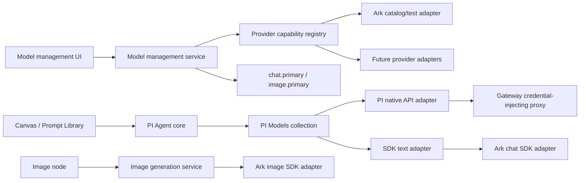

# Extensible Model Provider Discovery Design

**Date:** 2026-07-17

**Status:** Approved for implementation

## Goal

Restore persisted model connections and make model discovery, categorized binding, and text invocation extensible without coupling the PI text Agent to Ark or mixing chat models into image-generation selectors.

## Product requirements

- Recover the previously saved connection state from the former `.deer-flow` runtime directory without exposing or rewriting its credential.
- Avoid the startup authentication race that currently makes the model panel report a credential error before the local runtime session is bootstrapped.
- A provider connection represents an account, API base URL, and credential. It is not itself a chat or image binding.
- Bindings remain modality-specific: `chat.primary` and `image.primary`.
- The text-model menu is grouped first by integration family:
  - `PI 原生`
  - `方舟 SDK`
- The image-model menu is grouped first by SDK family. The first supported family is `方舟 SDK`.
- Image selectors must never expose chat-only models.
- Text invocation and image generation remain separate runtime modules.
- Future PI-native providers and future SDK adapters must be additive registrations, not new conditionals inside Agent or Canvas code.

## Findings that shape the design

The installed `@earendil-works/pi-ai` 0.80.8 package supports provider collections through `createModels()` and `createProvider()`, dynamic model discovery through `fetchModels` and `Models.refresh()`, and API-specific stream implementations. The text Agent should use that provider collection instead of a hard-coded `Model<'promptcard-ark-proxy'>` and Ark-named stream function.

Ark inference API keys can invoke model IDs, while Ark management APIs that list account foundation models and endpoints are OpenAPI management operations using signed AK/SK credentials. The current connection form stores an inference API key. This implementation therefore defines connection model discovery as an assignable provider catalog returned through a provider adapter. It does not pretend that an inference API key can enumerate private account endpoints. A later management-credential capability can add AK/SK endpoint discovery without changing assignment contracts.

## Architecture



### 1. Provider capability registry

The Gateway owns a provider registry. Each provider definition declares:

- provider identity and default API base;
- supported modality entries;
- menu integration group per modality;
- connection probe strategy;
- model discovery strategy;
- optional text SDK adapter identifier;
- optional image SDK adapter identifier.

The registry produces normalized model descriptors. UI and assignment validation consume only normalized descriptors and do not inspect Ark model IDs.

### 2. Connection-scoped model discovery

Add:

`GET /api/promptcard/runtime/model-connections/{connectionId}/models`

Response:

```json
{
  "connectionId": "uuid",
  "providerId": "volcengine-ark",
  "models": [
    {
      "id": "doubao-seed-2-0-lite-260215",
      "providerId": "volcengine-ark",
      "displayName": "Doubao Seed 2.0 Lite",
      "modality": "chat",
      "integrationGroup": {
        "id": "volcengine-ark-sdk",
        "displayName": "方舟 SDK",
        "kind": "sdk"
      },
      "source": "provider-catalog",
      "assignable": true,
      "capabilities": {
        "input": ["text", "image"],
        "toolCalling": true
      }
    }
  ]
}
```

The endpoint returns models for the selected connection's provider. The frontend still performs a final strict modality filter for each slot.

`source` is explicit:

- `provider-catalog`: maintained supported catalog, including the current Ark API-key connection behavior;
- `remote`: returned by a provider's authenticated discovery API;
- `cached`: previously discovered remote result.

### 3. Categorized binding

Catalog providers and models carry integration-group metadata. The menu does not infer categories from provider names.

Initial mapping:

| Provider | Chat group | Image group |
| --- | --- | --- |
| DeepSeek | PI 原生 | none |
| Volcengine Ark | 方舟 SDK | 方舟 SDK |

The chat selector groups only `modality === 'chat'`. The image selector groups only `modality === 'image'`. A provider that has both modalities can reuse one connection, but the assignments remain independent.

### 4. PI text runtime

Replace the hard-coded Ark model and `createArkProxyStream` use with a small text provider runtime:

- a `Models` collection created by `createModels()`;
- provider registrations created through `createProvider()`;
- `resolveAssignedTextModel()` to fetch the current `chat.primary` descriptor from the Gateway and select the corresponding PI model;
- the Agent receives the resolved model and `models.stream` as its stream function.

Two text integration paths are registered:

- `PI 原生`: uses PI's API implementation and a Gateway credential-injecting forwarding boundary, so the external provider credential remains inside Python;
- `方舟 SDK`: uses a provider-neutral PI custom API adapter that calls the Gateway's SDK text endpoint, which dispatches to the Ark chat adapter.

Agent code knows neither Ark nor DeepSeek. Adding another PI-native provider registers a PI provider definition. Adding another SDK registers a Gateway SDK adapter and a PI provider definition.

### 5. Image runtime isolation

The existing image-generation service and provider interface remain the only image invocation path. No image request is routed through PI Agent or the text provider registry. Model management may share provider metadata and credentials, but invocation adapters remain separate.

### 6. Persistence recovery

At model-management startup, run an idempotent legacy-state migration:

- source: sibling `.deer-flow/promptcard-model-connections.json`;
- destination: `.promptcard-runtime/promptcard-model-connections.json`;
- copy missing connections by ID;
- copy an assignment only when the destination slot is unassigned;
- preserve connection IDs so existing OS-keyring references continue to resolve;
- never copy a secret into JSON;
- never overwrite newer destination state.

### 7. Startup authentication

The model panel must load protected model endpoints only after runtime bootstrap succeeds. Authentication failures during bootstrap are represented as runtime initialization failures, not provider credential failures. A successful bootstrap triggers a single model-management reload.

## Error contracts

New errors use the existing structured detail shape:

```json
{
  "code": "model_discovery_failed",
  "message": "The provider model catalog could not be loaded.",
  "action": "retry_model_discovery",
  "retryable": true,
  "field": "connectionId"
}
```

Required new codes:

- `model_discovery_unsupported`
- `model_discovery_failed`
- `text_provider_unsupported`

## Verification

- Backend tests cover idempotent old-state migration, Ark catalog discovery, provider-specific probe behavior, provider mismatch, and modality validation.
- Frontend tests cover delayed load after bootstrap and grouped chat/image selectors with no cross-modality leakage.
- Text runtime tests prove that Agent construction resolves a model through the PI provider collection and contains no Ark-specific model constant.
- Existing Canvas and image-generation tests remain green.
- A local smoke test confirms the recovered Ark connection appears, chat and image bindings remain separate, and the saved credential is still reported as configured.

## Non-goals

- Adding Ark management AK/SK fields or enumerating private account endpoints.
- Moving image generation into PI.
- Adding providers beyond the existing DeepSeek and Volcengine Ark surfaces.
- Changing Canvas node data formats or image-generation request contracts.
